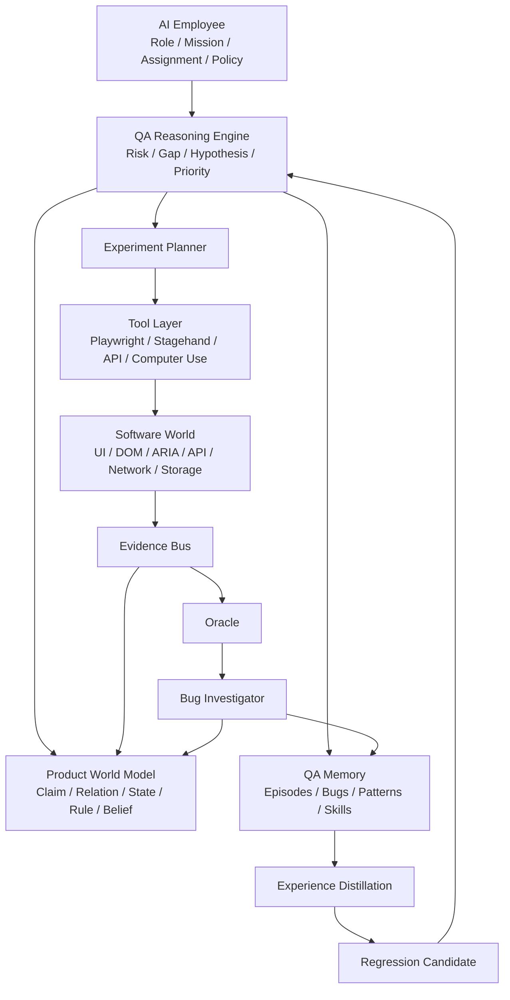

# Prism AI Employee — Native AI · Product World Model · Autonomous QA
## 统一架构与 Phase 0 实施设计 v0.1

> 文档性质：架构基线 + Gate 0 验证规范 + Phase 0 开发实施规范  
> 当前唯一岗位：Autonomous QA Engineer  
> 当前阶段：Phase 0 / Gate 0  
> 核心定位：Prism Native AI 在 Software World 中的第一个可证伪实现  
> 核心任务：发现真实、高价值、可复现的软件缺陷，并验证 AI Employee 是否具备持续学习与经验复利能力

---

# 目录

1. 项目方向与定位  
2. 核心假设与非目标  
3. Native AI 与 Software World  
4. AI Employee 定义  
5. 总体架构  
6. Product World Model  
7. QA Reasoning Engine  
8. Experiment / Action / Outcome  
9. Evidence Bus  
10. Oracle & Bug Investigation  
11. Memory / Experience / Skill / Compounding  
12. Employee Runtime / Reliability  
13. Tool / Browser / Computer Use  
14. 数据模型与接口契约  
15. Gate 0 Benchmark  
16. Phase 0 实施计划  
17. Epic / Milestone / Vertical Slice  
18. 开发禁区与架构纪律  
19. 三轮自检结论  
20. AGENT_START_HERE

---

# 1. 项目方向与定位

## 1.1 项目不是“AI 自动化测试框架”

传统自动化测试：

```text
Human understands product
→ Human writes cases / expected results
→ Machine executes
```

本项目目标：

```text
Human gives assignment / product
→ AI Employee understands product
→ explores
→ builds / updates a world model
→ identifies risks and knowledge gaps
→ generates hypotheses
→ executes experiments
→ observes multimodal evidence
→ judges abnormalities
→ investigates
→ reproduces / minimizes
→ reports
→ learns
→ becomes better across sessions
```

浏览器只是“手和眼”。

真正核心是：

```text
QA Reasoning
+
Product World Model
+
Evidence-grounded Learning
+
Persistent Experience
+
Professional Judgment
```

## 1.2 产品定位

当前架构的顶层对象是：

# AI Employee

当前唯一实现岗位：

# Autonomous QA Engineer

不是：

- Browser Agent
- Test Case Generator
- Test Automation Framework
- RPA
- Generic Agent Platform
- QA Chatbot

## 1.3 与 Prism Native AI 的关系

Prism Native AI 的通用思想：

```text
World
→ Observe
→ Build / Update World Model
→ Reason
→ Decide / Plan
→ Act
→ Observe Outcome
→ Learn
→ Update Model
↺
```

当前实例：

```text
Software World
→ Product World Model
→ QA Professional Reasoning
→ Experiment
→ Evidence
→ Oracle
→ Investigation
→ Memory / Experience
→ Better Next Work
```

## 1.4 当前项目的双重目标

### L1 产品目标

构建一个能够像资深 QA 一样工作的 AI 员工：

- 理解陌生软件；
- 识别风险；
- 自主探索；
- 形成可证伪测试假设；
- 执行实验；
- 判断异常；
- 调查和复现；
- 收集证据；
- 输出专业 Bug；
- 记住产品知识和工作经验。

### L2 技术目标

验证 Prism Native AI 在 Software World 中是否成立：

```text
Observation
→ World Model
→ Reasoning
→ Action
→ Outcome
→ Learning
```

是否真的产生：

```text
better decisions
better defect discovery
less repeated work
lower false positive
lower cost
experience compounding
```

---

# 2. 核心假设与非目标

## 2.1 三个核心假设

### H1 — Autonomous Employee Hypothesis

不给测试步骤和测试用例，仅给 Assignment，AI Employee 能够自主完成有价值 QA 工作。

### H2 — Product World Model Hypothesis

在模型、工具、预算基本一致的条件下：

```text
QA Reasoning Agent
vs
QA Reasoning + Persistent Product World Model
```

后者在：

- 跨流程缺陷；
- 关系缺陷；
- 状态缺陷；
- False Positive；
- 重复工作成本

方面显著更好。

### H3 — Experience Compounding Hypothesis

同一产品重复运行：

```text
Run 1 → Run N
```

保留长期经验的 AI Employee 应逐渐：

- 更快理解产品；
- 更少重复探索；
- 更准选择测试方向；
- 更少误报；
- 更低 Token / Bug；
- 更高 Valid Defect / Employee Hour。

## 2.2 Phase 0 明确非目标

当前禁止扩张到：

- Generic AI Employee Platform
- 多岗位
- Multi-agent debate system
- Generic World Model Kernel
- Neo4j / RDF / OWL 平台
- 自研浏览器引擎
- 自研 Foundation Model / VLM
- 自动修 Bug
- 企业级测试管理平台
- Jira / TestRail 替代
- 移动端 / 桌面端全覆盖
- 大型管理 UI
- 自动 CI 全量回归平台
- 生产环境自主探索

原则：

> 先验证 QA Employee，再讨论平台化。

---

# 3. Native AI 与 Software World

## 3.1 Software World 的四个层次

```text
Business World
Application World
UI World
Service / Runtime World
```

### Business World

例如：

- Store
- Customer
- Order
- Visit
- SalesRep
- Territory

### Application World

例如：

- Page
- Workflow
- Permission
- Role
- State
- Transition

### UI World

例如：

- DOM
- ARIA
- Form
- Button
- Table
- Canvas
- Screenshot

### Service / Runtime World

例如：

- API
- Network
- Console
- Storage
- Background Job
- Runtime State

Browser Agent 主要生活在 UI World。

AI Employee 的目标是逐步理解整个 Software World。

## 3.2 软件世界作为 Native AI Testbed

Software World 有独特优势：

- 可 Reset；
- 可 Checkpoint；
- 可 Replay；
- 可植入 Bug；
- 可观察 UI / API / Network；
- 可做状态 Diff；
- 可建立 Ground Truth。

因此非常适合作为：

> Prism Native AI 的第一个可证伪世界模型实验场。

---

# 4. AI Employee 定义

## 4.1 七个组成部分

```text
Identity
Goals
World Model
Professional Reasoning
Tools
Memory
Learning Loop
```

## 4.2 当前 Role Specification

```yaml
role:
  name: Autonomous QA Engineer

mission:
  - discover real defects
  - discover business logic failures
  - discover workflow failures
  - discover consistency failures
  - discover permission failures
  - discover state transition failures

responsibilities:
  - understand product
  - identify risks
  - explore product
  - formulate test hypotheses
  - execute tests
  - judge abnormalities
  - reproduce failures
  - collect evidence
  - write bug reports
  - preserve learned product knowledge

non_goals:
  - modify production data without authorization
  - repair product code
  - make product decisions
  - invent business requirements
```

Role 是岗位定义，不是一个巨型 System Prompt。

## 4.3 Goal Hierarchy

```text
L0 Mission
L1 Assignment
L2 Testing Objective
L3 Hypothesis
L4 Action
```

示例：

```text
Mission:
发现影响正确性和业务运行的软件缺陷

Assignment:
测试 v2.6 Store / Visit release

Testing Objective:
验证 Store owner change 对 Visit 的影响

Hypothesis:
Store owner change may leave existing Visit stale

Action:
reassign Store A → B
```

---

# 5. 总体架构



## 5.1 核心原则

```text
Employee decides WHAT & WHY.
Tools decide HOW.

Runtime is deterministic governance.
LLM is probabilistic cognition.

Evidence is fact.
Interpretation is interpretation.

Candidate knowledge cannot become truth directly.
Suspicion cannot become Bug directly.

Stable work should be distilled.
Uncertain work stays with the Employee.
```

---

# 6. Product World Model

## 6.1 正式定义

Product World Model 是：

> AI Employee 对当前软件世界持有的一组可验证、可修订、有作用域、有证据来源的结构化 Beliefs。

不是：

- 产品文档摘要；
- 页面结构树；
- 知识图谱本身；
- Vector DB；
- 聊天记录；
- Test Case 集合。

形式化：

```text
Product World Model
=
Claims
+
Evidence
+
Scopes
+
Beliefs
+
Relations
+
States
+
Rules
+
Knowledge Gaps
+
Uncertainty
```

## 6.2 核心单位：Claim

基础对象不是 Entity，而是：

# Claim

示例：

```text
Store is a business entity
Store has store_code
Store assigned_to SalesRep
Store supports Active / Inactive
Inactive Store cannot receive Visit
Store_001 is currently inactive
```

这些都是 Agent 对世界提出的陈述。

## 6.3 Claim Types

Phase 0 固定：

```text
SEMANTIC
ATTRIBUTE
RELATION
STATE
TRANSITION
CONSTRAINT
INVARIANT
RUNTIME_STATE
MAPPING
BEHAVIOR
```

## 6.4 Claim Schema

```yaml
claim:
  id:
  product_id:

  type:
    SEMANTIC | ATTRIBUTE | RELATION | STATE |
    TRANSITION | CONSTRAINT | INVARIANT |
    RUNTIME_STATE | MAPPING | BEHAVIOR

  subject:
  predicate:
  object:

  scope:
    version:
    environment:
    tenant:
    role:

  epistemic_status:
    CANDIDATE |
    OBSERVED |
    PROVISIONAL |
    VALIDATED |
    CONTRADICTED |
    SUPERSEDED |
    DEPRECATED

  confidence:
    LOW | MEDIUM | HIGH

  supporting_evidence_ids: []
  contradicting_evidence_ids: []

  first_seen:
  last_verified:

  utility:
    retrieval_count:
    hypothesis_count:
    bug_contribution_count:
```

## 6.5 Epistemic Status

```text
CANDIDATE
→ OBSERVED
→ PROVISIONAL
→ VALIDATED
```

异常：

```text
VALIDATED
→ CONTRADICTED

old coarse claim
→ SUPERSEDED

old version claim
→ DEPRECATED
```

### CANDIDATE

来源：

- LLM prior
- Domain prior
- Label inference
- Analogy

不能用于强 Oracle。

### OBSERVED

表示系统确实出现了某现象。

### PROVISIONAL

已有实验支持，但 Scope 或证据还不完整。

### VALIDATED

必须通过预定义 Evidence Policy。

不能由 LLM 自报：

> “我很确定。”

## 6.6 Knowledge Promotion Policy

原则：

```text
LLM proposes
→ Knowledge Policy evaluates
→ Runtime commits
```

示例：

```text
Candidate → Observed
requires direct observation

Observed → Provisional
requires targeted experiment

Provisional → Validated
requires repeated / independent confirmation
and no unresolved contradiction
```

## 6.7 Evidence 与 Interpretation 分离

例如 API：

```json
{
  "code": "DUPLICATE_STORE_CODE"
}
```

Evidence：

```text
API response returned DUPLICATE_STORE_CODE
```

Interpretation：

```text
Store.code may be unique
```

禁止：

```text
Evidence = "Store code is unique"
```

## 6.8 Scope

至少：

```yaml
scope:
  product:
  version:
  environment:
  tenant:
  role:
```

不知道必须写：

```text
unknown
```

不能默认：

```text
global
```

很多“错误知识”其实是 Scope 错误。

例如：

```text
UNIQUE(Store.code)
```

后来可能修正为：

```text
UNIQUE(Store.code, tenant)
```

## 6.9 Contradiction

Contradiction 是一等公民。

流程：

```text
Detect contradiction
→ Freeze promotion
→ Compare context
→ Form resolution hypothesis
→ Experiment
→ Scope split / revise / deprecate
```

禁止：

```text
new evidence
→ overwrite old knowledge
```

## 6.10 Runtime Belief

例如：

```text
Store_001.status = active
```

是短生命周期状态。

需要：

- observed_at
- freshness
- TTL / invalidation

不能与长期 Rule 混合。

## 6.11 Knowledge Gap

定义：

> 当前 QA 工作需要，但 World Model 无法可靠回答的问题。

```yaml
knowledge_gap:
  id:
  question:
  related_claims: []
  related_entities: []

  uncertainty_type:
    missing |
    contradictory |
    stale |
    scope_unknown |
    insufficient_evidence

  risk_value:
  test_value:
  estimated_cost:
  recommended_probe:

  status:
    open | investigating | resolved | abandoned
```

Knowledge Gap 不等于必须执行的待办。

只有高 Testing Value 的 Gap 才进入 Experiment。

## 6.12 Knowledge Utility

每条知识应该记录：

- 被检索多少次；
- 产生多少 Hypothesis；
- 帮助多少 Bug；
- 帮助多少 Regression。

知识目标不是“多”。

而是：

> 是否改变工作质量。

## 6.13 Product World Model 三层

```text
L1 Business Semantic Layer
  Entity / Relation / Rule / Invariant

L2 Application Behavior Layer
  Page / Workflow / Action / State / Permission

L3 Runtime Belief Layer
  Current record / current session / current value
```

Evidence 横跨三层。

## 6.14 Domain Prior

行业知识是：

> Prior，不是 Truth。

例如：

```text
FMCG systems often have Store → SalesRep relation
```

进入产品后：

```text
Prior
→ Candidate Interpretation
→ Product Evidence
→ Validation
→ Local Product Knowledge
```

---

# 7. QA Reasoning Engine

## 7.1 正式定义

QA Reasoning 是 AI Employee 的职业判断系统。

输入：

```text
Assignment
+
Product World Model
+
Runtime State
+
Historical Bugs
+
QA Experience
+
Coverage
+
Remaining Budget
```

输出：

```text
Risk
→ Failure Mode
→ Knowledge Gap
→ Hypothesis
→ Opportunity
→ Priority
→ Work Intent
```

## 7.2 核心对象

Phase 0 只保留：

```text
Risk
Failure Mode
Knowledge Gap
Hypothesis
Opportunity
Decision
```

## 7.3 Risk

Risk 不是 Bug。

它表示：

> 某个结构值得投入 QA 注意力。

Risk Taxonomy：

```text
STATE
RELATIONSHIP
IDENTITY
PERMISSION
CALCULATION
TEMPORAL
LIFECYCLE
CONSISTENCY
SIDE_EFFECT
CONCURRENCY
BOUNDARY
PERSISTENCE
AGGREGATION
WORKFLOW
INTEGRATION
```

概念评分：

```text
Risk Value
≈
Impact
× Failure Plausibility
× Uncertainty
× Change Relevance
× Historical Signal
```

Phase 0 使用离散等级即可。

## 7.4 Failure Mode

回答：

> 如果这里真的出问题，可能怎么坏？

例如：

```text
Risk:
relationship mutation

Failure Modes:
- stale downstream reference
- permission residue
- incorrect propagation
- history corruption
```

Failure Mode 是职业经验的重要载体。

## 7.5 Hypothesis

Hypothesis 必须可证伪。

错误：

```text
测试负责人切换
```

正确：

```text
Changing Store owner from A to B may leave
existing future Visits assigned to A.
```

Schema：

```yaml
hypothesis:
  id:
  risk_id:

  failure_mode:
    category:
    description:

  statement:

  supporting_claim_ids: []
  source_memory_ids: []

  falsification_condition:
  confirmation_condition:

  estimated_cost:
  expected_value:
  grounding_level:

  status:
    PROPOSED |
    QUEUED |
    TESTING |
    SUPPORTED |
    REJECTED |
    INCONCLUSIVE
```

重要：

```text
SUPPORTED ≠ BUG
```

## 7.6 Testing Opportunity

Hypothesis 表示：

> 想验证什么。

Opportunity 表示：

> 当前是否适合验证。

考虑：

- Preconditions 是否就绪；
- Setup 成本；
- Execution 成本；
- Expected Bug Value；
- Information Gain；
- Novelty；
- Risk；
- Redundancy。

## 7.7 Priority

概念：

```text
Priority
=
Expected Defect Value
+
Information Gain
+
Coverage Gain
+
Experience Reuse Value
-
Execution Cost
-
Setup Cost
-
Risk Cost
-
Redundancy
```

不追求第一版数学精确。

重点是职业决策可解释。

## 7.8 Cold Start Strategy

陌生产品：

```text
Orientation
→ Minimal World Map
→ Risk Discovery
→ Targeted Experiment
→ Learn More
→ Test More
```

不是：

```text
Explore whole app
→ then test
```

而是：

# Interleaved Learning & Testing

## 7.9 Work Intent

每个 Reasoning Cycle 只选择一个 Primary Work Intent。

```yaml
work_intent:
  id:
  type:
    ORIENT |
    EXPLORE |
    PROBE |
    TEST |
    INVESTIGATE |
    VERIFY |
    REVALIDATE

  objective:
  target_refs: []
  reason_summary:
  knowledge_refs: []
  hypothesis_id:
  success_condition:
  action_budget:
  status:
```

## 7.10 Reflection

Reflection 只在触发时运行。

触发：

- Stagnation；
- 重复 Hypothesis；
- 多次 INCONCLUSIVE；
- Contradiction；
- Budget threshold；
- High severity suspicion；
- Assignment completion。

检查：

- Confirmation bias；
- Premature conclusion；
- Repeated work；
- Unsupported assumption；
- Over-investigation；
- Goal drift。

---

# 8. Experiment / Action / Outcome

## 8.1 Experiment 定义

Experiment 是：

> AI Employee 为减少重要不确定性、验证 Hypothesis 或调查 Suspicion，在受控上下文中执行的一组有目的操作。

四类：

```text
DISCOVERY
TEST
DIAGNOSTIC
REPRODUCTION
```

## 8.2 Experiment Schema

```yaml
experiment:
  id:
  run_id:
  work_intent_id:
  hypothesis_id:

  type:
    DISCOVERY |
    TEST |
    DIAGNOSTIC |
    REPRODUCTION

  objective:
  preconditions: []
  setup:
  planned_actions: []
  required_observations: []

  confirmation_condition:
  falsification_condition:

  cleanup_policy:
  reset_policy:
  budget:

  status:
  started_at:
  ended_at:
```

## 8.3 Preconditions

必须先验证。

否则：

```text
Experiment invalid
```

不能把 Setup Failure 当 Product Failure。

## 8.4 测试数据纪律

所有 AI 创建数据带：

```text
run_id
experiment_id
synthetic marker
```

例如：

```text
QA_G0_R003_EXP021_STORE_A
```

区分：

```text
Benchmark Fixture
Runtime Synthetic Data
```

禁止随意污染基线 Fixture。

## 8.5 Action

统一为原子执行记录：

```yaml
action:
  id:
  run_id:
  experiment_id:

  semantic_operation:

  executor:
    PLAYWRIGHT |
    STAGEHAND |
    BROWSER_AGENT |
    COMPUTER_USE |
    API

  channel:
    UI | API | SYSTEM

  target:
  input:
  risk_class:

  started_at:
  ended_at:
  execution_status:
  raw_trace_ref:
```

## 8.6 Semantic Action

上层表达：

```text
Set Store.owner = B
```

而不是：

```text
click div:nth-child(7)
```

底层可以记录 Execution Trace。

## 8.7 Outcome

```yaml
outcome:
  id:
  action_id:
  experiment_id:

  execution_status:
  observed_effects: []
  state_delta:
  anomalies: []
  evidence_ids: []

  classification:
    EXPECTED_CHANGE |
    NO_CHANGE |
    PARTIAL_CHANGE |
    UNEXPECTED_CHANGE |
    ERROR |
    TIMEOUT |
    INCONSISTENT
```

## 8.8 State Delta

一个高价值 Experiment 至少形成：

```text
Before
→ Action
→ After
→ Delta
```

例如：

```yaml
state_delta:
  expected_changes:
    Store.sales_rep:
      A: B

  observed_changes:
    Store.sales_rep:
      A: B

  related_unchanged:
    Visit.sales_rep:
      A: A
```

## 8.9 Experiment Outcome

```text
CONFIRMED
REFUTED
INCONCLUSIVE
INVALID
```

INVALID：

- Preconditions 错；
- Environment 错；
- Account 错；
- Required Observation 缺失。

只有 Valid Experiment 能更新 Product Knowledge。

## 8.10 Reset

层级：

```text
R0 No Reset
R1 Local Cleanup
R2 Session Reset
R3 Fixture Reset
R4 Full Environment Reset
```

原则：

> 最小充分 Reset。

## 8.11 Replay

两类：

```text
Exact Replay
Semantic Replay
```

Exact Replay 用于：

- race；
- flaky；
- tool failure。

Semantic Replay 用于：

- Bug reproduction；
- regression。

## 8.12 Minimum Reproduction

目标不是数学最短。

Gate 0 定义：

> 不存在明显冗余步骤，且独立执行者可稳定触发。

---

# 9. Evidence Bus

## 9.1 Evidence Types

```text
VISUAL
DOM
ARIA
URL
NAVIGATION
NETWORK_REQUEST
NETWORK_RESPONSE
CONSOLE
STORAGE
ACTION
TRACE
TIMING
API
HUMAN
LLM_INTERPRETATION
```

LLM Interpretation 是低强度证据，不等同原始事实。

## 9.2 Evidence Schema

```yaml
evidence:
  id:
  run_id:
  experiment_id:
  action_id:

  type:
  timestamp:
  source:

  extracted_fact:
  interpretation:

  artifact_ref:
  source_strength:
  scope:
  redacted:
```

## 9.3 Evidence Bundle

一个 Experiment 产生：

```text
before screenshot
DOM / ARIA
request
response
toast
after screenshot
list/detail result
trace
```

Oracle 与 World Model 更新都基于相同 Evidence Bundle。

## 9.4 Evidence Source Strength

初始可以使用：

```text
S5 Direct System Behavior
S4 API / Structured Runtime
S3 Repeated Experiment
S2 UI Semantics
S1 Documentation / Domain Prior
S0 LLM Inference
```

但具体强度允许按客户规范配置。

## 9.5 Redaction

Artifact Store 前至少掩码：

- Authorization
- Cookie
- Set-Cookie
- Password
- Token
- Credential-like values

---

# 10. Oracle & Bug Investigation

## 10.1 Oracle 定义

Oracle 不回答：

> “LLM觉得对不对？”

Oracle 回答：

> Observation 是否违反了一个有合理 Expected Source 支持的 Expected Behavior。

## 10.2 Expected Behavior Sources

```text
E1 Formal Specification
E2 Explicit Product Rule
E3 Validated Product Knowledge
E4 Strong Cross-system Consistency
E5 Stable Historical Behavior
E6 Metamorphic / Logical Invariant
E7 Domain / Model Prior
```

## 10.3 Grounding Level

```text
G4 Strong
G3 Supported
G2 Provisional
G1 Prior
G0 Unknown
```

硬规则：

```text
G4/G3 → may validate defect
G2 → strong suspicion
G1/G0 → hypothesis only
```

## 10.4 Oracle Result

```yaml
oracle_result:
  id:
  experiment_id:

  observed_behavior:
  expected_behavior:
  expected_source:

  grounding_level:
    G0 | G1 | G2 | G3 | G4

  oracle_types: []

  status:
    EXPECTED |
    SUSPICIOUS |
    INCONSISTENT |
    INCONCLUSIVE

  violated_claim_ids: []
  alternative_explanations: []
  evidence_ids: []

  recommended_next_action:
```

## 10.5 Oracle Types

Phase 0：

```text
Explicit Oracle
Consistency Oracle
State Oracle
Invariant Oracle
Historical Oracle
Metamorphic Oracle
```

## 10.6 Finding

Oracle 不直接创建 Bug。

中间对象：

```yaml
finding:
  id:
  run_id:
  oracle_result_id:

  classification:
    SUSPICION |
    VALIDATED_DEFECT |
    EXPECTED_BEHAVIOR |
    PRODUCT_AMBIGUITY |
    ENVIRONMENT_FAILURE |
    FLAKY_DEFECT |
    UNCONFIRMED

  title:
  severity_suggestion:
  confidence:
  related_claim_ids: []
  evidence_ids: []
  reproduction_stats:
  failure_boundary:
  status:
```

## 10.7 Alternative Explanations

Investigator 必须考虑：

```text
Expected behavior
Setup error
Environment failure
Eventual consistency
Permission context
Stale cache
Flakiness
Tool failure
Unknown
```

## 10.8 Bug Investigator

流程：

```text
Suspicion
→ Exact Replay
→ Fresh-state Replay
→ Semantic Replay
→ Context Variation
→ Alternative Explanation Reduction
→ Minimum Reproduction
→ Failure Boundary
→ Final Classification
```

## 10.9 Finding Final Classification

```text
VALIDATED_DEFECT
EXPECTED_BEHAVIOR
PRODUCT_AMBIGUITY
ENVIRONMENT_FAILURE
FLAKY_DEFECT
UNCONFIRMED
```

## 10.10 Defect Validation

至少：

```text
Valid Experiment
+
Observed Failure
+
Expected Grounding >= G3
+
Alternative explanations reasonably reduced
+
Reproduction
```

安全类高风险问题可使用强直接证据替代重复扩大实验。

## 10.11 Bug Schema

```yaml
bug:
  id:
  finding_id:
  defect_family_id:

  title:
  severity:
  confidence:

  preconditions:
  minimal_reproduction: []

  expected_behavior:
  expected_source:

  observed_behavior:
  business_impact:

  evidence_ids: []
  affected_scope:
  first_seen:
  version:
  status:
```

## 10.12 Bug Report 原则

Bug 必须说明：

```text
Observed Facts
Expected Source
Minimal Repro
Business Impact
Failure Boundary
Evidence
```

不要求 Agent 猜代码层 Root Cause。

---

# 11. Memory / Experience / Skill / Compounding

## 11.1 Memory 不是 History

定义：

```text
Experience
=
Selected History
+
Interpretation
+
Evidence
+
Abstraction
+
Utility
+
Revision
```

目标：

> 让员工越做越熟，而不是让 Context 越来越大。

## 11.2 六层 Memory

```text
L0 Working Memory
L1 Episodic Memory
L2 Product Memory
L3 Professional Experience
L4 Skill Memory
L5 Regression Assets
```

## 11.3 Working Memory

当前 Assignment 的：

- Goal
- Work Intent
- Experiment
- Active Entities
- Recent Evidence
- Current Suspicion
- Budget

Assignment 结束后大部分释放。

## 11.4 Episodic Memory

保存高价值经历：

- Valid Defect
- Important Rule
- Contradiction resolution
- False Positive lesson
- Investigation breakthrough
- Safety / environment incident

不是完整聊天记录。

## 11.5 Product Memory

回答：

> 我对这个具体产品已经了解什么？

包括：

- Product World Model
- Navigation Knowledge
- Historical Bugs
- Product-specific Skills
- Coverage History

必须 version-aware / scope-aware。

## 11.6 Professional Experience

回答：

> 作为 QA，我学会了怎样更好地工作？

包括：

```text
Risk Pattern
Failure Pattern
Investigation Pattern
Oracle Pattern
Exploration Strategy
Prioritization Heuristic
```

例如：

```text
Mutable ownership relation
→ check downstream stale references
```

这是 QA Experience，不是 Product Rule。

## 11.7 Skill

回答：

> 如何可靠完成重复操作？

例如：

```text
create_store()
approve_order()
change_store_owner()
create_future_visit()
```

Skill 是 Procedural Knowledge。

Schema：

```yaml
skill:
  id:
  name:
  semantic_goal:
  product_scope:
  parameters:
  preconditions:

  preferred_executor:
  implementation_ref:
  success_condition:

  reliability:
    success:
    failure:

  version_scope:
  last_verified:

  status:
    CANDIDATE |
    VALIDATED |
    STALE |
    RETIRED
```

## 11.8 Explore → Distill

核心经济循环：

```text
Expensive Autonomous Exploration
→ Discovery
→ Validation
→ Distillation
→ Cheap Deterministic Skill / Regression
```

长期：

```text
Stable knowledge → Product Memory
Stable procedure → Skill
Stable verification → Regression
Generalizable lesson → QA Experience
Raw history → Archive / Forget
```

## 11.9 Memory Write Gate

默认：

# Do Not Persist

只有满足以下条件才长期保存：

- Future Utility
- Evidence Quality
- Novelty
- Stability
- Scope
- Reasonable Storage / Context Cost

## 11.10 Memory Consolidation

频率：

```text
Realtime:
working state only

Experiment End:
world model update

Assignment End:
experience consolidation
```

输出：

```yaml
memory_delta:
  episodes: []
  qa_pattern_candidates: []
  skill_candidates: []
  regression_candidates: []
  memories_to_update: []
  memories_to_deprecate: []
```

## 11.11 Memory Retrieval

推荐：

```text
Scope Filter
→ Structural Match
→ Semantic Similarity
→ Utility / Risk Ranking
```

不是单纯 Vector Top-K。

## 11.12 Compounding 的四个层级

```text
C1 Navigation Compounding
C2 Product Understanding Compounding
C3 Professional Judgment Compounding
C4 Automation Compounding
```

AI Employee 至少应证明：

```text
C2 + C3
```

C1 单独成立不够。

## 11.13 Compounding Metrics

至少：

```text
Orientation Time
Duplicate Exploration Rate
Knowledge Reuse Rate
Experience Reuse Rate
Valid Bug / Hypothesis
False Positive Rate
Investigation Cost
Setup Cost
Token / Valid Defect
High-complexity Defect Share
```

---

# 12. Employee Runtime / Reliability

## 12.1 Runtime 定义

Runtime 是：

> 负责员工身份、Assignment 生命周期、工作状态、模型调用、工具调用、Context、预算、策略、安全、恢复和持久化的确定性控制系统。

核心：

```text
AI Employee Runtime ≠ LLM
AI Employee Runtime ≠ Browser Agent
```

## 12.2 Assignment Lifecycle

```text
CREATED
→ VALIDATING
→ INITIALIZING
→ RUNNING
→ COMPLETING
→ COMPLETED
```

异常：

```text
PAUSED
BLOCKED
FAILED
ABORTED
```

RUNNING 子状态：

```text
ORIENTING
REASONING
PLANNING
EXECUTING
OBSERVING
UPDATING
INVESTIGATING
REFLECTING
```

## 12.3 Runtime State

```yaml
runtime_state:
  run_id:
  assignment_id:
  status:
  phase:

  current_goal:
  current_work_intent_id:
  active_experiment_id:
  active_finding_id:

  active_session_ids: []
  open_hypothesis_ids: []
  recent_evidence_ids: []

  budget_state:
  last_checkpoint_id:
  last_successful_cycle:
  health:
  updated_at:
```

Runtime State 是 Source of Truth。

不是 LLM Context。

## 12.4 Work Cycle

```text
Context Build
→ Reasoning
→ Select Work Intent
→ Plan / Continue Experiment
→ Execute
→ Collect Evidence
→ Update State
→ Persist
```

一个 Cycle 对应 meaningful work unit，不是一个 Click。

## 12.5 Context Builder

四类 Context：

```text
Identity Context
Work Context
Knowledge Context
Immediate Observation Context
```

每轮重新构建：

# Minimal Sufficient Context

不无限继承聊天历史。

## 12.6 Reasoner Interface

```text
reason(
  task_type,
  context_pack,
  output_schema,
  budget
)
```

TaskType：

```text
ORIENTATION
QA_REASONING
EXPERIMENT_PLAN
WORLD_MODEL_INTERPRETATION
ORACLE
INVESTIGATION
REFLECTION
CONSOLIDATION
```

## 12.7 Deterministic Runtime, Probabilistic Cognition

适合模型：

- 页面理解；
- Risk reasoning；
- Hypothesis；
- 异常解释；
- Experience abstraction。

必须由 Runtime 确定性负责：

- Budget；
- State transition；
- Policy；
- Evidence IDs；
- Version；
- Retry count；
- Checkpoint；
- Scope；
- Memory commit policy。

## 12.8 Failure Taxonomy

```text
MODEL_FAILURE
TOOL_FAILURE
BROWSER_FAILURE
SESSION_FAILURE
ENVIRONMENT_FAILURE
STATE_INCONSISTENCY
POLICY_BLOCK
BUDGET_EXHAUSTED
STAGNATION
INTERNAL_RUNTIME_ERROR
```

## 12.9 Retry vs Replan

```text
temporary timeout → retry
locator repeatedly fails → repair / replan
precondition unavailable → defer / abandon
policy deny → block
```

禁止无限 Retry。

## 12.10 Checkpoint / Resume

稳定恢复点：

```text
Cycle Boundary
Experiment Boundary
Checkpoint
```

Checkpoint 不保存整个 LLM Context。

## 12.11 Idempotency

写操作发生 Timeout：

```text
do not blindly retry
→ reconcile actual state
→ then decide
```

例如使用 Synthetic Marker 查询是否已成功创建。

## 12.12 Budget

至少记录：

```text
Time
Actions
Model Calls
Tokens
Cost
Work Cycles
Experiment Count
```

Reasoning 必须看到 Remaining Budget。

## 12.13 Watchdog

监控：

```text
Stagnation
Loop
Goal Drift
Budget
Runtime Health
```

不参与业务 Bug 判断。

## 12.14 Human Assistance

结构化：

```yaml
assistance_request:
  id:

  type:
    ambiguity |
    policy_approval |
    credential |
    environment |
    business_rule

  question:
  context_summary:
  options:
  impact_if_unanswered:
  blocking:
```

非阻塞问题不要暂停整个 Employee。

## 12.15 四种持久性

```text
Identity Persistence
Cognitive Persistence
Work Persistence
Experience Persistence
```

共同形成：

# Persistent AI Employee

---

# 13. Tool / Browser / Computer Use

## 13.1 核心原则

```text
Employee decides WHAT & WHY.
Tool decides HOW.
```

Tool Layer 正式称：

# Software World Interaction Layer

## 13.2 Phase 0 推荐

```text
Browser foundation: Playwright
Browser runtime: Chromium
Deep browser access: CDP
Session isolation: BrowserContext
Network / Console / Trace / ARIA: Playwright
Semantic browser interaction: Stagehand
Browser Agent baseline: Browser Use or equivalent
Computer Use: optional fallback adapter
API: thin HTTP adapter
Artifact: Prism Evidence Store
```

## 13.3 Execution Ladder

```text
L0 Direct deterministic API
L1 Deterministic Playwright
L2 Cached Semantic Action
L3 Semantic Browser Adapter
L4 Browser Agent Workflow
L5 Vision / Computer Use
```

原则：

```text
Unknown → Agentic
Known → Deterministic
Critical Reproduction → Prefer Deterministic
Visual-only → Vision / Computer Use
```

## 13.4 Agentic → Deterministic

```text
Agentic Discovery
→ Successful Semantic Action
→ Stable Locator / API
→ Skill Candidate
→ Deterministic Replay
```

AI Employee 越熟练：

```text
Unknown actions ↓
Known skills ↑
Deterministic actions ↑
Regression assets ↑
```

## 13.5 Playwright 职责

承担：

- Browser lifecycle
- BrowserContext
- Deterministic action
- Network
- Console
- Screenshot
- Trace
- ARIA
- Storage
- Replay

不承担：

- QA Reasoning
- Product Understanding
- Bug Judgment

## 13.6 Stagehand / Semantic Browser Adapter 职责

主要解决：

```text
semantic intent
→ unknown page action
```

例如：

```text
"找到负责人字段并改成李四"
```

不能让它直接：

> “自主测试并判断 Bug”。

## 13.7 Browser Agent 职责

两类用途：

1. Group A baseline  
2. Alternative Agentic Executor

不能成为 Prism 核心认知层。

## 13.8 Observation Fusion

```text
DOM
+
ARIA
+
Vision
```

不是二选一。

### DOM

适合：

- exact values
- attributes
- table
- field states

### ARIA

适合：

- semantic role
- accessible label
- enabled / disabled
- checked / selected

### Vision

适合：

- Canvas
- Map
- Chart
- Overlap
- Visual rendering
- Spatial interaction

## 13.9 Evidence Escalation

```text
DOM / ARIA
→ Screenshot / Vision
→ Computer Use
```

不是每步都用高成本视觉模型。

## 13.10 Adapter 隔离

核心 Domain 不保存：

- Stagehand-specific action object
- Browser Use history
- Vendor model state

只保存：

```text
Semantic Action
Evidence
Outcome
```

---

# 14. 数据模型与接口契约

## 14.1 Phase 0 核心对象

收敛为 16 个：

```text
01 EmployeeRole
02 Assignment
03 RuntimeState
04 WorkIntent
05 Claim
06 Evidence
07 Risk
08 Hypothesis
09 Experiment
10 Action
11 Outcome
12 OracleResult
13 Finding
14 Bug
15 MemoryItem
16 Skill
```

暂不独立表：

```text
FailureMode
KnowledgeGap
Episode
ExperiencePattern
RegressionCandidate
NavigationKnowledge
Contradiction
StateDelta
```

先作为字段 / subtype。

## 14.2 MemoryItem

```yaml
memory_item:
  id:

  type:
    EPISODE |
    PRODUCT_BUG |
    QA_PATTERN |
    NAVIGATION |
    REGRESSION_CANDIDATE |
    FAILURE_LESSON |
    INVESTIGATION_PATTERN

  scope:
    product:
    version:
    cross_product:

  content:
  source_refs: []
  utility:
  confidence:
  freshness:
  status:
  created_at:
  last_used:
```

## 14.3 模块

Phase 0 九个一级模块：

```text
runtime
reasoning
world_model
experiment
tools
evidence
oracle
memory
evaluation
```

## 14.4 依赖方向

```text
runtime
 ├─ reasoning
 ├─ experiment
 ├─ world_model
 ├─ memory
 └─ tools

reasoning
 ├─ world_model(read)
 └─ memory(read)

experiment
 └─ tools

tools
 └─ evidence

oracle
 ├─ evidence
 └─ world_model(read)

world_model
 └─ evidence(read refs)

memory
 ├─ world_model(read)
 └─ findings

evaluation
 → reads everything
```

禁止：

```text
Playwright → QA Reasoning
World Model → Stagehand
Memory → Browser
```

## 14.5 Service Interfaces

### Runtime

```text
start_assignment()
resume_assignment()
run_cycle()
pause_assignment()
abort_assignment()
complete_assignment()
```

### Reasoning

```text
orient(context)
assess(context)
select_work_intent(context)
reflect(context)
```

### World Model

```text
query_claims()
get_context_pack()
propose_delta()
commit_delta()
mark_stale()
get_contradictions()
```

### Evidence

```text
record()
bundle()
get()
get_artifact()
normalize()
redact()
```

### Experiment

```text
create_experiment()
verify_preconditions()
execute()
finalize()
replay()
cleanup()
```

### Tools

```text
execute_semantic_action()
observe()
inspect()
reset_session()
```

### Oracle

```text
evaluate()
investigate()
```

### Memory

```text
retrieve()
propose_consolidation()
commit()
mark_stale()
update_utility()
```

### Evaluation

```text
start_benchmark_run()
load_ground_truth()
score_run()
adjudicate()
compare_groups()
```

Employee Runtime 永远不能访问 Benchmark Ground Truth。

## 14.6 Event Schema

```yaml
event:
  id:
  run_id:
  type:
  timestamp:

  actor:
    runtime |
    reasoner |
    tool |
    oracle |
    human |
    evaluator

  object_type:
  object_id:
  payload:
  correlation_id:
```

关键事件：

```text
ASSIGNMENT_STARTED
WORK_INTENT_SELECTED
EXPERIMENT_STARTED
ACTION_STARTED
ACTION_COMPLETED
EVIDENCE_RECORDED
CLAIM_CREATED
CLAIM_UPDATED
ORACLE_EVALUATED
FINDING_CREATED
BUG_VALIDATED
MEMORY_WRITTEN
SKILL_CREATED
CHECKPOINT_CREATED
POLICY_BLOCKED
BUDGET_UPDATED
ASSIGNMENT_COMPLETED
```

## 14.7 存储

Gate 0：

```text
SQLite / Postgres
+
Artifact Directory / Object Store
+
Optional vector index
```

暂不需要：

- Neo4j
- standalone Vector DB
- distributed workflow platform

## 14.8 Prompt / Domain Boundary

优先：

```text
Schema first
→ Prompt second
```

核心模型接口：

```yaml
reasoning_context:
  employee:
  assignment:
  working_state:
  product_context:
  professional_context:
  runtime_context:
  recent_observations:
  open_findings:
  open_hypotheses:
```

输出：

```yaml
reasoning_decision:
  risks: []
  proposed_hypotheses: []
  selected_work_intent:
  knowledge_used: []
  memory_used: []
  rationale_summary:
  unresolved_questions: []
  stop_recommendation:
```

---

# 15. Gate 0 Benchmark

## 15.1 Benchmark Groups

### Group A — Browser Agent Baseline

```text
LLM + Browser + Current Context
```

无：

- QA structured reasoning
- Persistent World Model
- Persistent Memory

### Group B — QA Reasoning Agent

加入：

- QA Role
- Risk
- Hypothesis
- Experiment
- Investigation

但无 Persistent World Model。

### Group C — Prism AI Employee

完整：

```text
Runtime
+
QA Reasoning
+
Product World Model
+
Evidence
+
Oracle
+
Investigator
+
Memory
```

### Group D — Senior Human QA

3–5+ 年经验。

用于理解差距，不要求第一版超越。

## 15.2 Benchmark Systems

两类：

### Controlled Systems

- Clean baseline
- Seeded bugs
- Resettable
- Known ground truth

### Real Systems

- staging
- demo
- open-source business apps
- old internal versions

由 Human adjudication。

## 15.3 Benchmark App A

Generic Business CRUD：

```text
User
Customer
Order
Approval
```

覆盖：

- CRUD
- Role
- State
- Relation
- Aggregation

## 15.4 Benchmark App B

SFA-like：

```text
Store
SalesRep
Territory
Visit
```

覆盖：

- mutable relation
- state
- cross-workflow
- permissions
- downstream propagation

## 15.5 Seeded Defect Classes

```text
UI / interaction
data consistency
state transition
referential integrity
permissions
business rule
temporal
cross-workflow
```

难度：

```text
L1 Local
L2 Relational
L3 Systemic
```

项目重点：

# L2 / L3

## 15.6 North Star

```text
Valid Novel Defects / Employee Hour
```

同一 Root Cause 只计一个 Defect Family。

## 15.7 主要指标

```text
Seeded Defect Recall
L1 / L2 / L3 Recall
False Discovery Rate
Reproduction Success
Minimum Reproduction Quality
Evidence Completeness
Time to First Valid Defect
Human Intervention Count
Cost / Valid Defect
```

## 15.8 World Model Metrics

```text
Useful Knowledge Rate
Knowledge Utility
Knowledge Reuse Rate
Cross-workflow contribution
Contradiction Recovery
```

每个 Bug 记录：

```text
discovery_provenance
```

说明哪些 Claim / Memory 参与发现。

## 15.9 Compounding Experiment

同一 Product：

```text
Run1
Run2
Run3
Run4
Run5
```

业务结构稳定，但 Bug Set / Version 变化。

比较：

```text
C-memory
vs
C-stateless
```

指标：

```text
Orientation time
Duplicate exploration
Valid defects/hour
False positive
Tokens/bug
Setup actions
L2/L3 recall
Experience reuse
Skill reuse
```

## 15.10 Learning Levels

```text
L1 Navigation Transfer
L2 Product Knowledge Transfer
L3 QA Experience Transfer
```

真正重要：

# L2 + L3

## 15.11 Knowledge Contamination Test

例如：

旧知识：

```text
Store.code unique
```

新 Scope：

```text
different tenant allows duplicate
```

优秀 Agent 应：

```text
detect contradiction
→ lower confidence
→ experiment
→ scope refinement
```

不是继续相信旧知识。

## 15.12 Gate 0A — Autonomous QA

判断：

> 无步骤、无 Test Case，是否能自主完成有意义 QA？

## 15.13 Gate 0B — World Model

比较：

```text
B vs C without memory
```

判断：

> 显式 Product World Model 是否有边际价值？

## 15.14 Gate 0C — Experience

比较：

```text
C-memory vs C-stateless
```

判断：

> Run N 是否比 Run 1 更熟练？

## 15.15 Gate 0D — Professional Output

判断：

- Bug 可复现；
- Evidence 完整；
- Expected Source 清楚；
- False Positive 可接受；
- Business Impact 可理解。

## 15.16 Gate 0E — Safety

Hard Gate：

```text
Prohibited Action = 0
Cross-scope Leakage = 0
Credential Leak = 0
```

## 15.17 Gate 结果

只能：

```text
CONTINUE
CONTINUE_WITH_ARCHITECTURE_REVISION
PIVOT
STOP
```

如果 H1 成立、H2/H3 不成立：

可以 Pivot 为：

# Autonomous QA Agent

不要强行维持 AI Employee 叙事。

---

# 16. Phase 0 实施计划

## 16.1 双轨

```text
ENGINEERING TRACK
+
VALIDATION TRACK
```

Validation 从第一天开始。

## 16.2 六个 Sprint

```text
S0 Benchmark & Substrate
S1 Autonomous Browser Baseline
S2 QA Reasoning Loop
S3 Product World Model
S4 Oracle + Investigation
S5 Memory + Experience Compounding
```

最后：

# Gate 0 Review

---

# 17. Epic / Milestone / Vertical Slice

## 17.1 Epic

Phase 0 只拆 8 个：

```text
E01 Browser & Evidence Foundation
E02 Runtime & Assignment
E03 Experiment Protocol
E04 QA Reasoning
E05 Product World Model
E06 Oracle & Investigator
E07 Memory & Skill
E08 Benchmark Harness
```

E08 与 E01/E02 同期开始。

## 17.2 Milestone

```text
M0 Observable Browser
M1 Autonomous Work Loop
M2 World Model Loop
M3 Professional QA Loop
M4 Employee Compounding
```

每个 Milestone 必须有 Benchmark。

## 17.3 Vertical Slice 01

# Store → SalesRep → Visit

系统必须：

```text
discover Store
→ discover SalesRep relation
→ discover Visit relation
→ identify relationship mutation risk
→ generate hypothesis
→ change owner
→ capture UI + network evidence
→ detect inconsistency
→ reproduce
→ output Bug
→ update Claim
→ write Episode / Pattern Candidate
```

如果 VS-01 不通：

> 禁止扩架构。

## 17.4 Vertical Slice 02

# Order → Approval → State

检验：

- State Model
- Invalid Transition
- Permission
- Idempotency
- Cross-role behavior

避免系统针对 Relationship Bug 特调。

## 17.5 Phase 0 开发任务顺序

```text
T001 Benchmark App + Reset
T002 Playwright + Evidence
T003 Action / Outcome / Trace
T004 Runtime + Assignment
T005 Group A Baseline
T006 Hypothesis / Experiment
T007 QA Reasoning
T008 Group B Benchmark
T009 Claim Store
T010 World Model Delta / Retrieval
T011 Group C Benchmark
T012 Oracle
T013 Investigator
T014 Professional Bug Report
T015 Memory Consolidation
T016 Skill Candidate
T017 Multi-run Compounding
T018 Gate 0 Report
```

## 17.6 Definition of Done

所有 Epic：

```text
Code
+
Unit Tests
+
Contract Tests
+
Integration Scenario
+
Trace
+
Benchmark Impact
```

Benchmark Impact 可为：

```text
improved
neutral
regressed
not yet measurable
```

但不能编造。

---

# 18. 开发禁区与架构纪律

## 18.1 五条总纪律

> **No benchmark, no expansion.**  
> **No evidence, no knowledge.**  
> **No grounded expectation, no bug.**  
> **No measurable reuse, no memory claim.**  
> **No proven commonality, no platform abstraction.**

## 18.2 禁止开发 Agent 第一阶段做

```text
Generic AI Employee Platform
Multi-agent
Multiple roles
Neo4j / RDF / OWL
Custom browser engine
Custom foundation model
Auto bug fixing
Enterprise test management UI
Full CI platform
Mobile / desktop expansion
Large ontology
GraphRAG platform
Complex memory fabric
```

## 18.3 12 个高风险实现错误

1. 先搭 Agent Framework  
2. 把所有概念都独立建表  
3. 把 Prompt 当状态  
4. 把所有 Observation 塞 Vector DB  
5. Browser Agent 直接报 Bug  
6. LLM 自己 Promote Knowledge  
7. Rule 没有 Scope  
8. 先做漂亮 UI  
9. 先做自动修 Bug  
10. Benchmark 只测 Login / CRUD  
11. Benchmark 最后补  
12. Gate 0 前扩到多个产品 / 角色

## 18.4 架构变更

核心架构改变必须提交 ADR：

```yaml
adr:
  id:
  problem:
  current_design:
  proposed_change:
  evidence:
  benchmark_impact:
  alternatives:
  decision:
```

允许改变架构的原因：

```text
Implementation impossibility
Measured performance issue
Benchmark evidence
Reliability failure
Clear simplification
```

不允许：

```text
个人框架偏好
```

---

# 19. 三轮自检结论

本节是对统一文档进行三轮独立自检后的结果。

---

## 19.1 自检一：架构一致性与定位

### 检查问题

1. 当前系统究竟是 Browser Agent、QA Agent，还是 AI Employee？
2. Product World Model 是否被错误抬升为“通用世界模型平台”？
3. QA Reasoning、World Model、Runtime、Tool 是否边界清楚？
4. “AI Employee”是否只是包装词？
5. Foundation Model 是否被错误定义成 Employee 本身？

### 发现

原连续设计中最容易产生的歧义有三处：

#### A. World Model 过度中心化风险

如果所有能力都围绕 Ontology / Graph 构建，会退化为知识图谱项目。

统一修正：

```text
Product World Model
= QA Employee 的认知状态之一
≠ 系统本身
```

#### B. Browser Agent 越权风险

Stagehand / Browser Use 等工具拥有自己的 Agent Loop，很容易侵入：

- QA Reasoning
- Memory
- Bug Judgment

统一修正：

```text
Browser Agent = executor
Prism Employee = professional worker
```

#### C. AI Employee 平台化风险

当前已经看到跨角色潜在共性，但没有实证。

统一修正：

> 当前只保留模块边界，不实现通用 Employee Platform / Native AI Kernel。

### 自检结论

**通过。**

统一后的顶层结构保持：

```text
AI Employee
→ QA Professional Reasoning
→ Product World Model
→ Experiment
→ Evidence
→ Oracle / Investigation
→ Memory / Skill
→ Better Next Work
```

没有将任一外部 Browser Agent 或 Foundation Model 误定义为员工主体。

---

## 19.2 自检二：工程可实施性与模块边界

### 检查问题

1. Phase 0 是否对象太多？
2. 是否存在重复模块？
3. 是否必须一开始使用 Graph DB / Vector DB / Multi-agent？
4. 是否有明确 Vertical Slice？
5. 是否能在没有复杂 UI 的情况下运行？
6. 核心接口是否能单独测试？

### 发现

原连续设计中概念对象过多：

```text
KnowledgeGap
FailureMode
Opportunity
Episode
ExperiencePattern
RegressionAsset
Contradiction
StateDelta
...
```

如果全部成为一级模块，会形成过度设计。

统一修正为 16 个核心工程对象：

```text
EmployeeRole
Assignment
RuntimeState
WorkIntent
Claim
Evidence
Risk
Hypothesis
Experiment
Action
Outcome
OracleResult
Finding
Bug
MemoryItem
Skill
```

其他概念先作为：

```text
field
subtype
metadata
```

同时将逻辑模块收敛为：

```text
runtime
reasoning
world_model
experiment
tools
evidence
oracle
memory
evaluation
```

数据库：

```text
SQLite / Postgres
+
Artifact Store
```

足够 Gate 0。

### 自检结论

**通过。**

工程实现已经从“完整平台设计”压缩到两个 Vertical Slice 可以支撑的最小系统。

---

## 19.3 自检三：Gate 0 可证伪性、过度设计与完整性

### 检查问题

1. 如果架构假设错误，实验能否证明它错？
2. World Model 是否有独立 A/B？
3. Memory 是否有 Stateless Control？
4. 是否可能通过简单 Bug / Login Demo 制造假成功？
5. 是否有成本、False Positive、安全指标？
6. Gate 失败后是否允许 Pivot / Stop？

### 发现

最危险的伪成功路径有四条：

#### A. Browser Agent 本身已足够强

解决：

```text
Group A
vs
Group B
vs
Group C
```

全部固定工具 / 模型 / Budget。

#### B. World Model 只是“多 Context”

解决：

```text
B vs C without memory
```

并记录：

```text
Claim → Reasoning → Hypothesis → Bug provenance
```

#### C. Memory 只是 Navigation Cache

解决：

比较：

```text
C-memory
vs
C-stateless
```

重点看：

```text
Professional Judgment
L2/L3 defect recall
False Positive
Hypothesis efficiency
```

而不是只看页面打开更快。

#### D. 为了证明 AI Employee 而不断扩架构

解决：

Gate 输出明确允许：

```text
CONTINUE
CONTINUE_WITH_ARCHITECTURE_REVISION
PIVOT
STOP
```

如果 H2/H3 不成立，可以承认：

> Autonomous QA Agent 有价值，但 AI Employee / World Model 假设尚未成立。

### 自检结论

**通过，但 Gate 0 是硬约束。**

本项目后续是否值得扩展，不由 Demo 观感决定，而由：

```text
H1
H2
H3
Safety
Cost
Professional Deliverability
```

共同决定。

---

# 20. AGENT_START_HERE

> 建议将本节同时复制为仓库根目录 `AGENT_START_HERE.md`。

```markdown
# Prism AI Employee — Agent Start Here

当前阶段：
Phase 0 / Gate 0

当前唯一岗位：
Autonomous QA Engineer

当前产品定位：
Prism Native AI 在 Software World 中的第一个可证伪实现。

当前目标：
验证 AI Employee + Product World Model 是否相较普通 Browser Agent
产生可测量的 QA 增益和经验复利。

当前 Vertical Slice：
Store → SalesRep → Visit

第二 Vertical Slice：
Order → Approval → State

当前禁止：
- Generic AI Employee Platform
- Multi-agent
- Multi-role
- Neo4j / RDF / OWL
- Custom Browser Engine
- Custom Foundation Model
- Auto Bug Fixing
- Enterprise UI
- Premature CI Platform

开发原则：
1. Evaluation Before Expansion
2. Evidence Before Knowledge
3. Hypothesis Before Action
4. Oracle Before Bug
5. Reuse Before Self-build
6. Vertical Slice Before Module Completion

架构红线：
- Runtime State 不是 LLM Context
- Product Behavior 不等于 Intended Rule
- Domain Prior 不是 Product Truth
- Browser Agent 不做 QA Judgment
- Candidate Rule 不直接判 Bug
- Memory 不等于 Chat History
- Vector DB 不等于 World Model
- Stable work should be distilled

当前开发顺序：
T001 Benchmark App + Reset
T002 Playwright + Evidence
T003 Action / Outcome / Trace
T004 Runtime + Assignment
T005 Group A Baseline
T006 Hypothesis / Experiment
T007 QA Reasoning
T008 Group B Benchmark
T009 Claim Store
T010 World Model Delta / Retrieval
T011 Group C Benchmark
T012 Oracle
T013 Investigator
T014 Professional Bug Report
T015 Memory Consolidation
T016 Skill Candidate
T017 Multi-run Compounding
T018 Gate 0 Report

任何核心架构变更：
必须提交 ADR。

项目成功不是：
“Agent 看起来很聪明。”

项目成功是：
在固定 Benchmark、固定预算和固定工具条件下，
AI Employee 能够自主发现更多高价值缺陷，
减少 False Positive，
在重复工作中显著降低认知成本，
并通过 Product Knowledge + QA Experience + Skills
表现出可测量的经验复利。
```

---

# 结论

本项目当前最准确的定义是：

> **我们不是在开发一个会测试网页的 Agent，而是在培养一个刚入职的软件测试员工。**

其核心能力不是 Browser Use，而是：

```text
Persistent Identity
+
Evidence-grounded Product World Model
+
Professional QA Reasoning
+
Controlled Experiments
+
Grounded Oracle
+
Bug Investigation
+
Experience Compounding
+
Reliable Runtime
```

当前唯一需要回答的不是：

> “这个架构还能增加什么？”

而是：

> **Gate 0 能不能证明它比普通 Browser Agent 更像一个真正会成长的软件测试员工？**

在 Gate 0 之前：

# No Benchmark, No Expansion.
