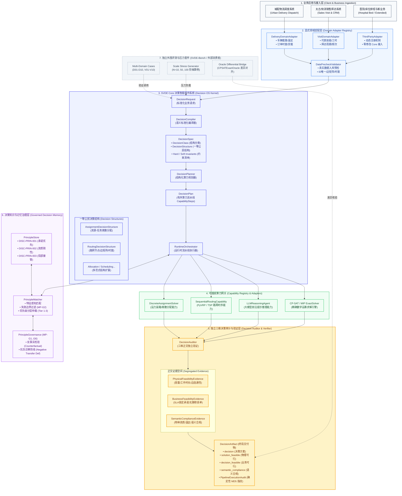

# SVDE Core Framework — 产品架构设计与技术全景规范 (v1.0)
**Document ID:** SVDE-PRODUCT-ARCHITECTURE-SPEC-V1.0  
**Date:** 2026-08-24  
**Classification:** Canonical Product Architecture & Engineering Blueprint  
**Status:** **APPROVED & GOVERNED (Enterprise Decision Intelligence OS Baseline)**  

---

## 1. 框架定位与设计哲学

**语义验证决策引擎（Semantic Validated Decision Engine, SVDE）** 是一个面向企业复杂运营调度的 **决策智能操作系统（Enterprise Decision Intelligence Operating System, Decision OS）**：

```
[SVDE 不是什么]                       [SVDE 是什么]
• 不是单体运筹优化求解器 (OR Solver)   • 声明式决策语义编译器 (Decision Compiler)
• 不是通用的 Chat 智能体工作流平台      • 可扩展的多步算力流水线路由器 (Capability Router)
• 不是某个特定领域的排班/分派小工具     • 物理/业务/语义正交独立的三维决策审计器 (Decision Auditor)
                                      • 带失效边界与抗负迁移的组织经验治理系统 (Governed Memory)
```

### 核心架构公理：
$$\text{DecisionRequest} \xrightarrow[\text{DomainAdapter}]{\text{Compile}} \text{DecisionSpec} \xrightarrow[\text{CapabilityRouting}]{\text{Plan}} \text{DecisionPlan} \xrightarrow[\text{PipelineExec}]{\text{Runtime}} \text{DecisionResult} \xrightarrow[\text{3D Audit}]{\text{Audit}} \text{DecisionArtifact}$$

---

## 2. 产品架构全景图 (Product Architecture Flowchart)



---

## 3. 架构分层与核心职责矩阵

| 架构层级 | 核心组件 | 关键职责与设计原则 |
| :--- | :--- | :--- |
| **1. 业务接入层 (Client Layer)** | 城配物流 / 太古快消 / 医疗排班 | 负责接收业务侧真实诉求，通过标准 API 发送 `DecisionRequest`，不感知底层数学模型与求解算力。 |
| **2. 显式领域适配层 (Domain Adapters)** | `DomainAdapters` + `DataPrecheckValidator` | **领域翻译与数据防线**：负责将异构业务对象翻译为通用 `NormalizedEntity`。在数据进入决策链前强制执行 6 项预检（ID 唯一、非负数值、时窗合法、边矩阵完整、Depot 明确、禁隐式时间），杜绝脏数据入库。 |
| **3. 决策操作系统内核 (Decision OS Core)** | `Compiler` $\rightarrow$ `Planner` $\rightarrow$ `Runtime` | **SVDE Core 调度中枢**：根据一等公民结构契约（分配/路由）构建有序算力流水线（`CapabilitySteps`），执行与具体领域词汇彻底解耦的纯净调度。 |
| **4. 可插拔算力网关 (Capability Registry)** | `CapabilityRegistry` (CP-SAT/LLM/VRP) | **计算算力插件池**：通过统一 `CapabilityContract` 接口即插即用，承接实际的数学规划、启发式求解、大模型推理或仿真计算。 |
| **5. 独立三维决策审计层 (Decision Auditor)** | `DecisionAuditor` $\rightarrow$ `DecisionArtifact` | **决策合规把关人**：独立复核并输出正交的 **物理可行（`solution_feasible`）**、**业务可行（`decision_feasible`）** 与 **语义合规（`semantic_compliance`）** 证据，杜绝任何静默丢单。 |
| **6. 决策知识与记忆治理层 (Governed Memory)** | `PrincipleStore` + `PrincipleMatcher` | **组织经验复利层**：维护带失效边界的高阶决策原则，通过 MP-G1..G6 六重治理门禁与抗负迁移机制，在运行时为算力提供安全经验指导。 |
| **7. 独立外围评测套件 (SVDE-Bench)** | `SVDE-Bench` (Cases / Stress / Oracle) | **外部测量与验证仪器**：仅作为 Core 的独立消费者与压力负载套件，验证系统的极限性能与对抗鲁棒性，严禁反向入侵 Core。 |

---

## 4. 真实数据接入前置规范 (Pre-flight Gate)

在进入真实生产数据测试前，必须严格遵循以下使用范围与预检准则：

```
┌─────────────────────────────────────────────────────────────────────────────┐
│                       SVDE 真实数据运行模式准入表                           │
├────────────────────────┬──────────┬─────────────────────────────────────────┤
│ 运行模式               │ 准入状态 │ 准入前置条件                            │
├────────────────────────┼──────────┼─────────────────────────────────────────┤
│ 真实历史数据离线回放   │ ✅ 准入   │ 必须通过 DataPrecheckValidator 预检     │
│ 影子模式（与现有排班对比）│ ✅ 准入   │ 必须具备完整真实边矩阵，不依赖默认时间  │
│ 自动写回生产排班/决策  │ ⛔ 暂缓   │ 需完成影子模式差异分析与人工审批闭环    │
│ 未提供边矩阵的路由数据 │ ⛔ 暂缓   │ 必须补齐实际路网通行矩阵后方可准入      │
└────────────────────────┴──────────┴─────────────────────────────────────────┘
```
