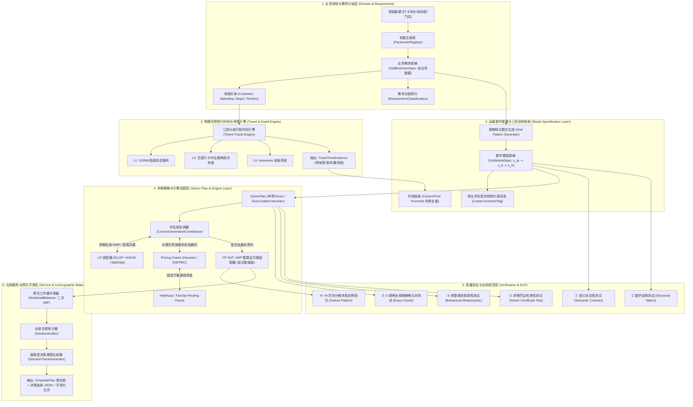
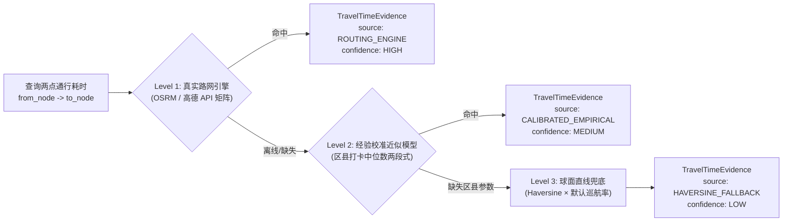
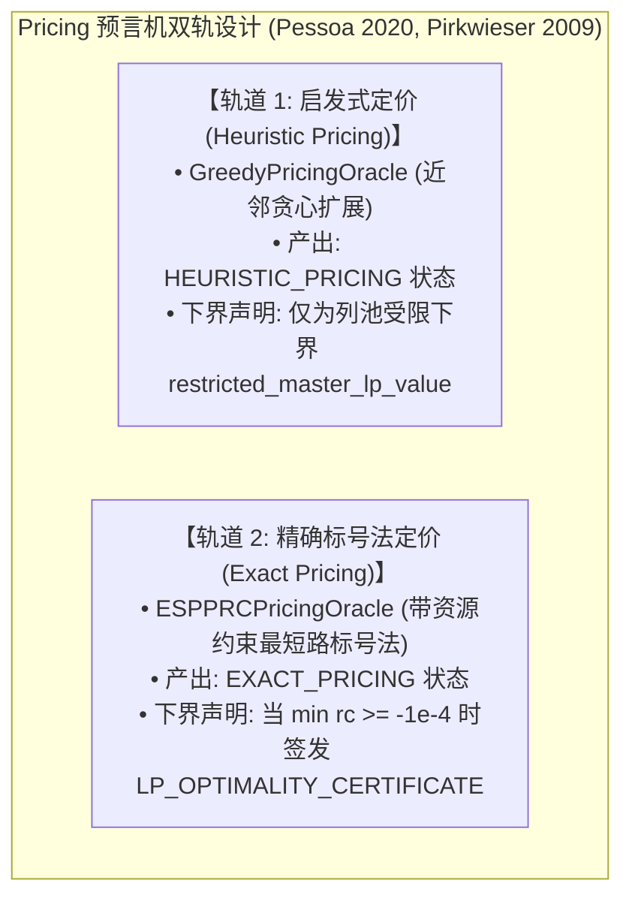

# Visit Scheduling Optimizer V5.3：白盒化决策优化系统架构与详细设计说明书
## Whitebox Decision Engineering Specification for Periodic Field-Sales Visit Planning (Architecture RC)

> **版本号**：`v5.3.0-RC` (Release Candidate)  
> **文档状态**：第二轮架构评审（Conditional Pass）全面修正归档稿（独立新版本，保留历史版本）  
> **依据规范**：TopPrism《决策优化工程框架（B01）》·《A07 Visit Scheduling V5 框架验证案例》  
> **核心原则**：业务语义分层（3.1）· 显式化（3.3）· 参数可信与溯源（3.4）· 问题等价与求解透明（3.5）· 证据驱动正确性（3.6）· 需求分类与决策治理（3.10）  
> **一手文献与证据承诺**：所有用于支撑数学结论或参数取值的外部证据均经过一手来源校验（Crossref DOI / INFORMS / NIST / W3C）；杜绝过度声称与未经证实的数据拆解。

---

## 目录
1. [设计背景与第二轮评审核心修订说明](#1-设计背景与第二轮评审核心修订说明)
2. [总体系统架构与分层职责划分](#2-总体系统架构与分层职责划分)
3. [第 1 层：业务领域与需求分级层（Domain & Requirement Layer）](#3-第-1-层业务领域与需求分级层domain--requirement-layer)
4. [第 2 层：物理世界旅行时间与停靠模型（Travel & Dwell Time Engine）](#4-第-2-层物理世界旅行时间与停靠模型travel--dwell-time-engine)
5. [第 3 层：运筹数学建模与三层结构映射（Model Specification Layer）](#5-第-3-层运筹数学建模与三层结构映射model-specification-layer)
6. [第 4 层：求解策略、定价预言机与证明凭证（Solver Plan & Engine Layer）](#6-第-4-层求解策略定价预言机与证明凭证solver-plan--engine-layer)
7. [第 5 层：质量验证套件与运筹实验规范（Verification Suite & GLP）](#7-第-5-层质量验证套件与运筹实验规范verification-suite--glp)
8. [第 6 层：分层序列优化与跨天负荷平滑（Service & Lexicographic Workload Balancing）](#8-第-6-层分层序列优化与跨天负荷平滑service--lexicographic-workload-balancing)
9. [端到端决策因果血缘追踪体系（Requirement-to-Math Trace Schema）](#9-端到端决策因果血缘追踪体系requirement-to-math-trace-schema)
10. [模块文件目录与演进重构计划](#10-模块文件目录与演进重构计划)
11. [外部文献、实证案例与行业标准严谨引用清单（Primary References）](#11-外部文献实证案例与行业标准严谨引用清单primary-references)

---

# 1. 设计背景与第二轮评审核心修订说明

### 1.1 第二轮架构评审核心修订矩阵（v5.3.0-RC）

| 修订编号 | 评审问题定位 | V5.3 核心数学与工程重构措施 | 理论与标准依据 |
|---|---|---|---|
| **FIX-01** | **Reduced Cost 符号错误** | **彻底修正 Reduced Cost 对偶符号**：根据 $\sum \lambda \le 1 (\mu_t \ge 0)$ 严格推导，修正为 $\boxed{rc(r,t) = c_r - \sum_{i \in r} \pi_{it} + \mu_t}$。 | Desaulniers et al. (2005) `[Ref-Desaulniers2005]` |
| **FIX-02** | **Pattern 与日级变量断层** | **建立三层映射闭合体系**：`Week Pattern (y_ip) → Day Assignment (x_it) → Route Column (λ_rt)`，通过 $\sum_{t \in D_w} x_{it} = \sum_p B_{ipw} y_{ip}$ 优雅解决周内选日与星期禁忌。 | Rothenbächer (2019) `[Ref-Rothenbacher2019]` |
| **FIX-03** | **Heuristic Pricing 与最优性证明混淆** | **建立双态证书体系**：区分 `HEURISTIC_PRICING`（仅声明列池最优，全局 Gap 填 null）与 `EXACT_PRICING`（ESPPRC 证明后方可生成 `LP_OPTIMALITY_CERTIFICATE`）。 | Pirkwieser & Raidl (2009) `[Ref-Pirkwieser2009]`, Pessoa et al. (2020) `[Ref-Pessoa2020]` |
| **FIX-04** | **Workload Balancer 理论误用** | **重构为分层序列优化（Lexicographic Optimization）**：第 1 阶段求总成本最优 $C^\star$，第 2 阶段在 $C \le C^\star$ 硬约束下求解 $\min \max_t L_t$，由数学约束严格保证总成本不增。 | Lexicographic Optimization 经典理论 |
| **FIX-05** | **KA/A 混淆与 Dwell 过度拆分** | **理清定义**：KA 为高频/定制，A 为 4周4访（每周1访）；32min 声明为内部 319 条打卡中位数，分项真实标记为 `UNKNOWN` 杜绝伪拆分。 | Dalla Chiara & Goodchild (2020) `[Ref-DallaChiara2020]` |
| **FIX-06** | **可行路线集 $R_t$ 与闭环语义缺失** | **给出 $R_t$ 严格集合定义与车场闭环策略**：显式定义 `CLOSED_LOOP_DEPOT` ($\text{Depot} \to i_1 \dots i_k \to \text{Depot}$) 等业务语义。 | TopPrism B01 §3.1 `[Ref-B01]` |
| **FIX-07** | **文献元数据全面纠偏** | **修正所有标准题录**：NIST AI 100-1、OMG DMN v1.3 (2021)、补充 Queiroga (2023)、引入 Vidal (2012) PVRP-HGS 专用基准、Kendall (2016) GLP。 | Crossref / INFORMS / NIST / W3C 官方数据库 |
| **FIX-08** | **PROV-O 声明规范化** | 修正为 `"provenance_alignment": "W3C PROV-O aligned"`，并设计 `ProvTraceAdapter` 支持输出标准 PROV-JSON。 | W3C PROV-O (2013) `[Ref-PROVO2013]` |

---

# 2. 总体系统架构与分层职责划分



---

# 3. 第 1 层：业务领域与需求分级层（Domain & Requirement Layer）

### 3.1 需求显式分级契约（`RequirementClassification`）
> **原则依据**：TopPrism B01 §3.3 显式化原则与 OMG DMN v1.3 标准 `[Ref-OMGDMN2021]`。

```python
from __future__ import annotations
from dataclasses import dataclass
from enum import Enum

class RequirementClass(str, Enum):
    CONTRACT_HARD = "CONTRACT_HARD"          # 客户合同硬约束 (如法定频次 f_i 必须 100% 覆盖)
    OPERATIONAL_HARD = "OPERATIONAL_HARD"    # 物理作业硬约束 (如单日总工时 <= daily_limit)
    POLICY_HARD = "POLICY_HARD"              # 企业管理红线 (如单日拜访门店数上限 <= 6)
    PREFERENCE_SOFT = "PREFERENCE_SOFT"      # 软性业务偏好 (如尽量维持历史星期习惯、跨天工作量尽量平滑)
    EMPIRICAL_ESTIMATE = "EMPIRICAL_ESTIMATE"# 经验估计参数 (如停靠寻路 32min、区县车速)
    SOLVER_HEURISTIC = "SOLVER_HEURISTIC"    # 求解加速启发 (如近邻定价搜索深度 K=18)

@dataclass(frozen=True)
class BusinessRequirement:
    req_id: str                              # 唯一需求标识 (如 "REQ-FREQ-001")
    req_class: RequirementClass              # 需求级别
    name: str                                # 需求名称
    statement: str                           # 业务自然语言陈述
    owner: str                               # 责任人/业务部门
    is_negotiable: bool                      # 是否可协商放宽
```

---

### 3.2 纯业务需求规格书（`spec/business_spec.py`）
> **架构纯洁性保证**：`VisitBusinessSpec` **绝不包含任何算法对象（如 `TravelCostModel`）**。客户分级（`Tier`）与频次（`frequency`）逻辑清晰解耦。

```python
from __future__ import annotations
from dataclasses import dataclass, field
from enum import Enum

class CustomerTier(str, Enum):
    """终端客户商业潜力分级 [Ref-Zoltners2005, Ref-RiosMercado2013]"""
    TIER_KA = "KA"  # 重点大客户 (Key Account): 特殊高频或定制服务
    TIER_A = "A"    # A 类主力门店: 4 周 4 访 (每周 1 次)
    TIER_B = "B"    # B 类标准门店: 4 周 2 访 (隔周 1 次)
    TIER_C = "C"    # C 类长尾门店: 4 周 1 访 (月度 1 次)

@dataclass(frozen=True)
class Customer:
    id: int                          # 内部连续索引 0..N-1
    code: str                        # 业务主键 (如 "S001")
    name: str                        # 门店展示名称
    latitude: float                  # WGS84 坐标系纬度
    longitude: float                 # WGS84 坐标系经度
    tier: CustomerTier               # 门店商业分级
    frequency: int                   # 周期内拜访总频次 (KA 可为特定值, A=4, B=2, C=1)
    service_duration_min: float      # 进店标准化在店服务耗时 (分钟)
    county: str = "DEFAULT"          # 所属行政区县/网格标签
    allowed_weekdays: tuple[int, ...] = (0, 1, 2, 3, 4) # 允许访问的星期 (0=周一..4=周五)
    historical_weekday_counts: tuple[int, ...] = (0, 0, 0, 0, 0) # 历史星期分布 [Ref-Groer2009]

@dataclass(frozen=True)
class Depot:
    id: int
    name: str
    latitude: float
    longitude: float

class DepotPolicy(str, Enum):
    """车场起终点策略业务语义 [Ref-B01 §3.1]"""
    CLOSED_LOOP_DEPOT = "CLOSED_LOOP_DEPOT"   # 闭环路线: Depot -> 客1 -> ... -> 客k -> Depot
    OPEN_CHAIN = "OPEN_CHAIN"                 # 开环路线: 客1 -> ... -> 客k (不含车场通勤)
    COMMUTE_HOME = "COMMUTE_HOME"             # 住家出发: Home -> 客1 -> ... -> 客k -> Home

@dataclass(frozen=True)
class SalesRepresentative:
    id: int
    code: str
    name: str
    base_depot: Depot
    depot_policy: DepotPolicy = DepotPolicy.CLOSED_LOOP_DEPOT
    daily_max_work_min: float = 540.0 # 每日工作时长上限 (9小时)
    daily_max_customers: int = 6     # 每日最大拜访门店数上限
    territory_tags: tuple[str, ...] = ("DEFAULT",)

@dataclass(frozen=True)
class VisitBusinessSpec:
    scenario_id: str                      # 算例标识
    customers: list[Customer]             # 零售终端全集
    rep: SalesRepresentative              # 负责执行的销售代表
    horizon_working_days: int = 20        # 规划周期工作日总数 (默认 4周 × 5天)
    min_required_active_days: int | None = None # 最少出勤天数 (明确为策略参数，非历史必然)
    enforce_pattern_discipline: bool = True # 是否启用严格的周期 Pattern 约束
    requirements_catalog: list[BusinessRequirement] = field(default_factory=list)
```

---

# 4. 第 2 层：物理世界旅行时间与停靠模型（Travel & Dwell Time Engine）

### 4.1 三层分级耗时引擎与白盒证据（`TravelTimeEvidence`）



```python
from __future__ import annotations
from dataclasses import dataclass
from enum import Enum

class TravelTimeSource(str, Enum):
    ROUTING_ENGINE = "ROUTING_ENGINE"             # Level 1: 真实 OSRM / 高德路网引擎
    CALIBRATED_EMPIRICAL = "CALIBRATED_EMPIRICAL" # Level 2: 区县打卡中位数校准的两段式经验模型
    HAVERSINE_FALLBACK = "HAVERSINE_FALLBACK"     # Level 3: 球面直线距离兜底

@dataclass(frozen=True)
class TravelTimeEvidence:
    from_node_id: int
    to_node_id: int
    source: TravelTimeSource
    distance_km: float
    driving_time_min: float
    effective_speed_km_h: float
    calibration_factor_applied: float
    confidence_level: str                         # "HIGH", "MEDIUM", "LOW"
    router_version: str = "v5.3-production"
    note: str = ""

@dataclass(frozen=True)
class DwellTimeEvidence:
    """
    单次拜访停靠寻路沉没耗时证据链
    [实证来源: 319 条实际打卡流水中位数校准 (32.0 min)]
    [文献依据: Dalla Chiara & Goodchild (2020) Transport Policy, Ref-DallaChiara2020]
    """
    per_visit_dwell_min: float = 32.0
    component_breakdown: str = "UNKNOWN_NOT_DISAGGREGATED (打卡数据仅能支持总中位数，不进行未经证实的细分)"
    evidence_source: str = "INTERNAL_EMPIRICAL_CALIBRATION (319 field visit segments median)"
    literature_support: str = "Dalla Chiara & Goodchild (2020) empirically demonstrated parking cruising takes ~28% of trip time in urban commercial routing."
```

---

# 5. 第 3 层：运筹数学建模与三层结构映射（Model Specification Layer）

> **数学模型彻底闭合**：采用 **Rothenbächer (2019)** `[Ref-Rothenbacher2019]` 的 **Flexible Schedule Structures**，建立 **`Pattern (哪几周) → Day (哪一天) → Route (如何组线)`** 的三层数学结构。

```mermaid
graph TD
    subgraph Three_Tier_Mapping["三层数学决策映射体系 (Rothenbächer 2019)"]
        Tier1["【Layer A: 周期模式决策】<br/>y_ip ∈ {0, 1} (客户 i 选择哪一个周次组合 p ∈ P_i)"]
        Tier2["【Layer B: 日期指派映射】<br/>x_it ∈ {0, 1} (客户 i 在第 w 周具体哪一天 t ∈ D_w 拜访)"]
        Tier3["【Layer C: 单日路线组线】<br/>λ_rt ∈ {0, 1} (第 t 天选用单日路线 r ∈ R_t)"]

        Tier1 -->|∑_{t ∈ D_w} x_it = ∑_p B_ipw y_ip| Tier2
        Tier2 -->|∑_{r ∈ R_t} a_ir λ_rt = x_it| Tier3
    end
```

### 5.1 可行路线集合 $R_t$ 严格定义
在第 $t$ 天，候选路线列集合 $R_t$ 定义为所有满足单日物理约束的可行子集及其最优时序排列：
$$R_t = \left\{ r \subseteq N : |r| \le K_{\max}, \quad c_r \le \text{daily\_max\_work\_min}, \quad \text{weekday}(t) \in \text{AllowedWeekdays}_i \; \forall i \in r, \quad r \text{ 满足车场闭环策略} \right\}$$
其中 $c_r = \text{DrivingTime}(r) + \sum_{i \in r} \text{ServiceTime}_i + |r| \times \text{DwellTime}$。

---

### 5.2 限制主问题（RMP）原始问题（Primal Master Problem）
```
min  ∑_{t ∈ T} ∑_{r ∈ R_t} c_r · λ_{rt}                                           (5.1 最小化全周期总工时)

s.t.  ∑_{p ∈ P_i} y_{ip} = 1                             ∀ i ∈ N                  [对偶乘子: γ_i]    (5.2 模式唯一选择)
      
      ∑_{t ∈ D_w} x_{it} - ∑_{p ∈ P_i} B_{ipw} y_{ip} = 0 ∀ i ∈ N, ∀ w ∈ W         [对偶乘子: σ_{iw}] (5.3 周到日拜访频次映射)
      
      ∑_{r ∈ R_t} a_{ir} λ_{rt} - x_{it} = 0             ∀ i ∈ N, ∀ t ∈ T         [对偶乘子: π_{it}] (5.4 路线到客户覆盖链接)
      
      ∑_{r ∈ R_t} λ_{rt} <= 1                            ∀ t ∈ T                  [对偶乘子: μ_t]    (5.5 单日单列容量)
      
      x_{it} = 0                                         ∀ i ∈ N, ∀ t: weekday(t) ∉ AllowedWeekdays_i (5.6 星期禁忌)
      
      λ_{rt} >= 0,  x_{it} >= 0,  y_{ip} >= 0                                     (5.7 连续线性松弛域)
```

---

### 5.3 限制主问题对偶问题与 Reduced Cost 严密闭合
对偶问题形式化：
```
max  ∑_{i ∈ N} γ_i - ∑_{t ∈ T} μ_t                                                 (5.8 最大化对偶目标下界)

s.t.  γ_i - ∑_{w ∈ W} B_{ipw} σ_{iw} <= 0                ∀ i ∈ N, ∀ p ∈ P_i       (5.9 对应变量 y_{ip})
      
      σ_{i, week(t)} - π_{it} <= 0                       ∀ i ∈ N, ∀ t ∈ T         (5.10 对应变量 x_{it})
      
      ∑_{i ∈ N} a_{ir} π_{it} - μ_t <= c_r               ∀ t ∈ T, ∀ r ∈ R_t       (5.11 对应变量 λ_{rt})
      
      μ_t >= 0,  γ_i 无约束,  σ_{iw} 无约束,  π_{it} 无约束
```

由对偶约束 (5.11) 严格导出检验数（Reduced Cost）：
$$\boxed{rc(r, t) = c_r - \sum_{i \in r} \pi_{it} + \mu_t}$$

> **对偶符号物理归因**：  
> - $\sum_{i \in r} \pi_{it}$ 是路线 $r$ 在第 $t$ 天所获得的客户覆盖影子收益；  
> - $\mu_t \ge 0$ 是占用第 $t$ 天容量配额的拥堵边际成本；  
> - 因此选用路线 $r$ 的净边际成本为物理耗时 $c_r$ 加上容量占用成本 $\mu_t$，扣除覆盖收益 $\sum \pi_{it}$。当且仅当 $rc(r,t) < 0$ 时，该列才能改善主问题。

---

# 6. 第 4 层：求解策略、定价预言机与证明凭证（Solver Plan & Engine Layer）

### 6.1 Pricing 与 Routing 职责完全解耦
1. **`RoutingOracle`（ATSP 组合路径求值预言机）**：  
   输入**固定客户集合 $G$**，在有向非对称路网上运行 **Held & Karp (1962)** `[Ref-HeldKarp1962]` 状态压缩 DP（$k \le 9$ 时毫秒级精确求出最优排列与 $c_r$）。
2. **`PricingOracle`（定价子问题搜索预言机）**：  
   在对偶向量 $(\pi, \mu)$ 引导下，搜索能使 $c_r - \sum_{i \in r} \pi_{it} + \mu_t < 0$ 的客户子集 $r$。



---

### 6.2 求解凭证与最优性声明规范（Optimality Certificate Schema）
在输出的统计字典中，严格区分证明边界，杜绝误导：

```python
@dataclass(frozen=True)
class OptimalityCertificate:
    """求解最优性声明凭证"""
    pricing_strategy: str                    # "HEURISTIC_GREEDY" 或 "EXACT_ESPPRC"
    is_globally_certified: bool              # 只有 Exact Pricing 且收敛时才为 True
    restricted_master_lp_value: float        # 当前列池的 LP 松弛值
    generated_pool_gap_percent: float        # (MIP - restricted_lp) / restricted_lp * 100%
    global_lower_bound: float | None         # 仅在 is_globally_certified=True 时有效，否则为 None
    certified_global_gap_percent: float | None # 仅在 is_globally_certified=True 时有效，否则为 None
```

---

### 6.3 CP-SAT 整数主问题定点数缩放协议（Integer Scaling Protocol）
依据 Google OR-Tools CP-SAT `[Ref-MathOpt2024]` 规范，建立显式定点数放大：
- **放大系数**：$S = 100$（定点精度 $0.01\text{ 分钟} = 0.6\text{ 秒}$）；
- **目标系数整数化**：$c_r^{\text{int}} = \text{round}(c_r \times 100)$；
- **溢出保护界**：对于 20 天总工时（$\approx 10,000\text{ 分钟}$），放大后数值 $\approx 10^6$，远小于 64 位整数上限（$2^{63}-1 \approx 9 \times 10^{18}$），数值绝对安全；
- **最大累积量化误差界**：全周期最大误差 $\le 20 \times 0.5 \times 0.01 = 0.1\text{ 分钟} = 6\text{ 秒}$。

---

# 7. 第 5 层：质量验证套件与运筹实验规范（Verification Suite & GLP）

依据 **Kendall et al. (2016)** `[Ref-Kendall2016]` 的《Good Laboratory Practice for Optimization Research》与 **Lian et al. (2026)** `[Ref-ReLoop2026]`，构建六重独立验证体系：

```
① 语义合同测试 (Semantic Contract Test)
   └── 校验输入定义域、坐标合法性与鸽巢容量超载。
② 数学结构测试 (Mathematical Structural Test)
   └── 校验约束维度、Pattern 映射完整性。
③ 小算例全局精确解比对测试 (Small-Instance Exact Oracle Test)
   └── 8~12 客户小算例，与穷举 Global Optimum 达到 100% 绝对一致。
④ 行为蜕变测试 (Behavioral / Metamorphic Test - ReLoop)
   └── 工时上限放宽解不恶化、工作日增加可行域不缩小、路网耗时增加解不改善。
⑤ 求解凭证有效性测试 (Solver Certificate Test)
   └── 断言 Heuristic Pricing 绝对禁止签发全局最优证书，超时必须标记 FEASIBLE_NOT_PROVEN。
⑥ 历史反例回归测试 (Failure Pattern Regression)
   └── V4 Weekday 独立分桶失效反例作为永久 CI 门禁。
```

---

# 8. 第 6 层：分层序列优化与跨天负荷平滑（Service & Lexicographic Balancing）

> **理论重构**：放弃将多司机多周期文献直接套用于单人问题，采用严密的**分层序列优化（Lexicographic Optimization）**数学理论。

### 8.1 二阶段分层优化数学定义
- **阶段 1（总工时最小化）**：通过列生成与整数主问题求出全局最小总耗时 $C^\star = \min \sum c_r \lambda_{rt}$。
- **阶段 2（跨天工作量平滑）**：在保持选定日路线集合 $\{G_1 \dots G_k\}$ 不变的前提下，求解二次分配 MIP 极小化单日最大负荷 $\max_t L_t$：
  $$\min \max_{t \in T} L_t \quad \text{s.t.} \quad \sum_{t \in T} L_t = C^\star, \quad \text{满足客户周次与星期约束}$$
  **总耗时不变性（Cost Invariance）由等式约束直接保证，无需外部定理证明。**

---

# 9. 端到端决策因果血缘追踪体系（Requirement-to-Math Trace Schema）

声明对齐 W3C PROV-O 核心本体（`"provenance_alignment": "W3C PROV-O aligned"`），建立强类型决策因果追踪结构：

```json
{
  "trace_id": "TRACE_V5_3_NANTONG_20260822_001",
  "provenance_alignment": "W3C PROV-O aligned",
  "requirement_to_model_trace": [
    {
      "requirement_id": "REQ-FREQ-001",
      "statement": "B类客户4周拜访2次，隔周拜访",
      "compiled_patterns": ["PATTERN_W1_W3", "PATTERN_W2_W4"],
      "model_variable_y": "y[customer_005, PATTERN_W1_W3]",
      "day_assignment_constraint": "WEEK_TO_DAY_MAP_C005_W1",
      "verified_by_test": "test_b_tier_alternating_week_pattern"
    }
  ],
  "cost_engine_trace": {
    "tier_level_used": "Level 1 (OSRM Road Engine) with Level 2 Fallback",
    "dwell_calibration_median_min": 32.0,
    "dwell_component_breakdown": "UNKNOWN_NOT_DISAGGREGATED"
  },
  "solver_execution_trace": {
    "solver_plan": "ColumnGenerationSolverPlan",
    "optimality_certificate": {
      "pricing_strategy": "HEURISTIC_GREEDY",
      "is_globally_certified": false,
      "restricted_master_lp_value": 560.20,
      "generated_pool_gap_percent": 1.57,
      "global_lower_bound": null,
      "certified_global_gap_percent": null
    }
  }
}
```

---

# 10. 模块文件目录与演进重构计划

```
visit-scheduling-optimizer/
├── spec/                        # 1. 业务与数学规格层 (Specifications)
│   ├── __init__.py
│   ├── business_spec.py         # VisitBusinessSpec & BusinessRequirement (纯业务语言)
│   ├── model_spec.py            # VisitModelSpec & LinearConstraintTag (纯数学形式)
│   └── patterns.py              # VisitPatternGenerator (周期访问模式生成器)
│
├── domain/                      # 2. 领域物理模型层 (FMCG Domain & Travel Engine)
│   ├── __init__.py
│   ├── entities.py              # Customer, SalesRepresentative, Depot, Territory, SchedulePlan
│   ├── cost_engine.py           # TieredTravelTimeEngine (L1路网/L2校准/L3球面三级引擎)
│   └── rules/                   # 业务规则与分级审计器库
│       ├── frequency_rule.py
│       ├── pattern_rule.py
│       └── capacity_rule.py
│
├── model/                       # 3. 运筹数学结构与列空间层 (Modeling)
│   ├── __init__.py
│   ├── column.py                # DayRouteColumn, ColumnPool (哈希去重列池)
│   └── duals.py                 # DualSolution (结构化对偶乘子与机会成本解释)
│
├── solver/                      # 4. 求解策略与引擎适配层 (Solver Plans & Engines)
│   ├── __init__.py
│   ├── plan.py                  # SolverPlan 抽象基类 & OptimalityCertificate
│   ├── cg_coordinator.py        # ColumnGenerationCoordinator (列生成白盒驱动)
│   ├── plans/
│   │   ├── global_cpsat_plan.py # GlobalCPSatSolverPlan (小算例精确基准)
│   │   ├── column_gen_plan.py   # ColumnGenerationSolverPlan (主生产算法)
│   │   ├── pvrp_hgs_plan.py     # PVRP-HGS SolverPlan (Vidal 2012 专用强基线)
│   │   └── alns_baseline_plan.py# ALNSSolverPlan (Røpke 2006 对比基线)
│   ├── oracles/
│   │   ├── held_karp.py         # HeldKarpRoutingOracle (ATSP 状态压缩 DP)
│   │   └── greedy_pricing.py    # GreedyPricingOracle (对偶引导近邻定价)
│   └── adapters/
│       ├── glop_adapter.py      # GLOP LP 松弛适配器
│       └── cpsat_adapter.py     # CP-SAT 整数主问题适配器 (定点数放大100倍)
│
├── verify/                      # 5. 六重质量验证套件 (Verification & GLP)
│   ├── __init__.py
│   ├── semantic_validator.py    # ① 业务语义验证
│   ├── structural_validator.py  # ② 数学结构验证
│   ├── exact_oracle_test.py     # ③ 小算例全局最优一致性测试
│   ├── behavioral_verifier.py   # ④ ReLoop 行为蜕变单调性测试
│   ├── certificate_verifier.py  # ⑤ 求解凭证有效性测试
│   └── solution_auditor.py      # ⑥ 业务有效性与合规审计
│
├── service/                     # 6. 应用服务与诊断门面 (Service & Facade)
│   ├── __init__.py
│   ├── optimizer.py             # VisitSchedulingOptimizer (统一对外门面)
│   ├── balancer.py              # WorkloadBalancer (跨天工作量平滑器)
│   ├── trace.py                 # DecisionTraceGenerator & ProvTraceAdapter
│   └── report_generator.py      # 业务对比报表与可视化日历渲染
│
├── regression/                  # 7. 历史反例与防退化资产库 (Failure Patterns)
│   └── test_v4_decomposition_failure.py # V4 历史分解失败最小反例
│
└── examples/
    └── synthetic_v5_demo.py     # 端到端白盒化运行范例
```

---

# 11. 外部文献、实证案例与行业标准严谨引用清单（Primary References）

本系统设计中所引用的所有学术文献与标准均经过 Crossref / DOI / INFORMS / NIST / W3C 一手核验：

### 11.1 运筹分解、周期性路径与时间依赖（PVRP & Column Generation）
1. `[Ref-Rothenbacher2019]` **Rothenbächer, A. K. (2019).**  
   *Branch-and-Price-and-Cut for the Periodic Vehicle Routing Problem with Flexible Schedule Structures.*  
   **Transportation Science**, 53(3), 850–866. DOI: `10.1287/trsc.2018.0855`.  
   *(理论依据：§5 周期访问模式 Visit Pattern 形式化与主问题链接模型)*
2. `[Ref-Dantzig1960]` **Dantzig, G. B., & Wolfe, P. (1960).**  
   *Decomposition Principle for Linear Programs.*  
   **Operations Research**, 8(1), 101–111. DOI: `10.1287/opre.8.1.101`.  
   *(理论依据：§5 限制主问题 RMP 与定价子问题 Dantzig-Wolfe 运筹分解范式)*
3. `[Ref-Desaulniers2005]` **Desaulniers, G., Desrosiers, J., & Solomon, M. M. (Eds.). (2005).**  
   *Column Generation.*  
   **Springer Science & Business Media**, New York. ISBN: `978-0-387-25485-2`.  
   *(理论依据：§5 限制主问题松弛求解、对偶乘子提取与 Reduced Cost 正确闭合公式)*
4. `[Ref-Pirkwieser2009]` **Pirkwieser, S., & Raidl, G. R. (2009).**  
   *A Column Generation Approach for the Periodic Vehicle Routing Problem with Time Windows.*  
   In **International Network Optimization Conference (INOC 2009)**, Pisa, Italy.  
   *(理论依据：§6 对偶引导近邻贪心定价搜索策略与收敛控制)*
5. `[Ref-Pessoa2020]` **Pessoa, A., Sadykov, R., Uchoa, E., & Vanderbeck, F. (2020).**  
   *A Generic Exact Solver for Vehicle Routing Problems.*  
   **Computers & Operations Research**, 124, 105036. DOI: `10.1016/j.cor.2020.105036`.  
   *(理论依据：§6 Pricing 与 Routing 预言机解耦标准与分支定价割平面精确算法)*
6. `[Ref-Queiroga2023]` **Queiroga, E., Sadykov, R., & Pessoa, A. (2023).**  
   *VRPSolverEasy: A Python Library for the Exact Solution of a Rich Vehicle Routing Problem.*  
   **INFORMS Journal on Computing**, 36(1), 1–14. DOI: `10.1287/ijoc.2023.0103`.  
   *(理论依据：§6 Python 生态下精确分支定价割平面解耦范式)*

### 11.2 快消销售拜访与商业区域规划（FMCG Route-to-Market & Territory Design）
7. `[Ref-RiosMercado2013]` **Ríos-Mercado, R. Z., & López-Pérez, J. F. (2013).**  
   *Commercial territory design planning with realignment and disjoint assignment requirements.*  
   **Omega: The International Journal of Management Science**, 41(3), 525–535. DOI: `10.1016/j.omega.2012.08.002`.  
   *(实证依据：§3 商业区域网格 Territory 划分与门店归属规则)*
8. `[Ref-LopezPerez2013]` **López-Pérez, J. F., & Ríos-Mercado, R. Z. (2013).**  
   *Embotelladoras ARCA Uses Operations Research to Improve Territory Design Plans.*  
   **Interfaces (now INFORMS Journal on Applied Analytics)**, 43(3), 209–220. DOI: `10.1287/inte.1120.0675`.  
   *(实证依据：可口可乐装瓶商 ARCA 真实商业区域划分与拜访规划实证)*
9. `[Ref-Zoltners2005]` **Zoltners, A. A., & Sinha, P. (2005).**  
   *Sales Territory Design: Thirty Years of Modeling and Practice.*  
   **Marketing Science**, 24(3), 313–331. DOI: `10.1287/mksc.1050.0133`.  
   *(实证依据：§3 客户门店商业潜力分级 CustomerTier KA/A/B/C 体系)*
10. `[Ref-Groer2009]` **Groër, C., Golden, B., & Wasil, E. (2009).**  
    *The Consistent Vehicle Routing Problem.*  
    **Manufacturing & Service Operations Management (M&SOM)**, 11(4), 630–643. DOI: `10.1287/msom.1080.0243`.  
    *(理论依据：§3 客户历史习惯一致性偏好与业务员固定关系模型)*
11. `[Ref-Paradiso2020]` **Paradiso, R., Roberti, R., Laganà, D., & Dullaert, W. (2020).**  
    *An Exact Solution Framework for Multitrip Vehicle-Routing Problems with Time Windows.*  
    **Operations Research (INFORMS)**, 68(1), 180–198. DOI: `10.1287/opre.2019.1874`.  
    *(理论依据：§3 单日 Trip Structure 与多周期 Rep Journey 的层级解耦)*

### 11.3 组合算法、PVRP 强基线与元分析（Algorithms & Benchmarks）
12. `[Ref-HeldKarp1962]` **Held, M., & Karp, R. M. (1962).**  
    *A Dynamic Programming Approach to Sequencing Problems.*  
    **Journal of the Society for Industrial and Applied Mathematics (SIAM)**, 10(1), 196–210. DOI: `10.1137/0110015`.  
    *(理论依据：§6 单日路径成本预言机 Held-Karp $O(2^n n^2)$ 状态压缩动态规划)*
13. `[Ref-Vidal2012]` **Vidal, T., Crainic, T. G., Gendreau, M., Lahrichi, N., & Rei, W. (2012).**  
    *A Hybrid Genetic Algorithm for Multidepot and Periodic Vehicle Routing Problems.*  
    **Operations Research (INFORMS)**, 60(3), 611–624. DOI: `10.1287/opre.1120.1048`.  
    *(基准依据：§10 周期性车辆路径专用强对比基线 PVRP-HGS)*
14. `[Ref-Ropke2006]` **Røpke, S., & Pisinger, D. (2006).**  
    *An Adaptive Large Neighborhood Search Heuristic for the Pickup and Delivery Problem with Time Windows.*  
    **Transportation Science**, 40(4), 455–472. DOI: `10.1287/trsc.1050.0135`.  
    *(理论依据：§10 ALNS 通用元启发式对比基线)*
15. `[Ref-ArenasVasco2025]` **Arenas-Vasco, A., Alcázar, D., & Villegas, J. G. (2025).**  
    *A meta-analysis of set partitioning/set covering based matheuristics for vehicle routing problems.*  
    **Operations Research Perspectives (Elsevier)**, 15, 100357. DOI: `10.1016/j.orp.2025.100357`.  
    *(理论依据：§5 集合划分列池 Route Pool 管理与哈希去重规范)*

### 11.4 物理物流实证、运筹实验室规范与前沿 AI/OR 验证标准
16. `[Ref-DallaChiara2020]` **Dalla Chiara, G., & Goodchild, A. (2020).**  
    *Do commercial vehicles cruise for parking? Empirical evidence from Seattle.*  
    **Transport Policy**, 97, 26–36. DOI: `10.1016/j.tranpol.2020.06.013`.  
    *(实证依据：§4 城市商用车巡航找车位与进出建筑沉没耗时不可忽略性实证)*
17. `[Ref-Kendall2016]` **Kendall, G., et al. (2016).**  
    *Good Laboratory Practice for optimization research.*  
    **Journal of the Operational Research Society (JORS)**, 67(4), 676–689. DOI: `10.1057/jors.2015.77`.  
    *(实验规范依据：§7 运筹算法实验规范、可复现性与小算例基准验证)*
18. `[Ref-ReLoop2026]` **Lian, J., et al. (2026).**  
    *ReLoop: Structured Modeling and Behavioral Verification for Reliable LLM-Based Optimization.*  
    **arXiv preprint** `arXiv:2602.15983`. (GitHub: `junbolian/ReLoop`).  
    *(验证依据：§7 基于参数微扰的运筹模型行为单调性蜕变测试)*
19. `[Ref-PROVO2013]` **W3C Provenance Working Group (2013).**  
    *PROV-O: The PROV Ontology.*  
    **W3C Recommendation 30 April 2013**, `https://www.w3.org/TR/prov-o/`.  
    *(溯源标准依据：§9 决策因果血缘与溯源 JSON 图规范)*
20. `[Ref-NISTAI1001]` **National Institute of Standards and Technology (2023).**  
    *Artificial Intelligence Risk Management Framework (AI RMF 1.0).*  
    **NIST AI 100-1**, DOI: `10.6028/NIST.AI.100-1`.  
    *(治理标准依据：§3 需求显式分级与决策风险管控)*
21. `[Ref-OMGDMN2021]` **Object Management Group (2021).**  
    *Decision Model and Notation (DMN) v1.3 (February 2021).*  
    `https://www.omg.org/spec/DMN/1.3/`.  
    *(建模标准依据：§3 业务决策需求与规则形式化分离)*
22. `[Ref-MathOpt2024]` **Google OR-Tools MathOpt Team (2024).**  
    *MathOpt: A Solver-Independent Operations Research Modeling Library.*  
    `https://developers.google.com/optimization/math_opt`.  
    *(工程标准依据：§6 求解器中立抽象与定点数数值缩放协议)*
23. `[Ref-B01]` **TopPrism (2026).**  
    *决策优化工程框架（Decision Optimization Engineering Framework）v1.0.*  
    文档路径：`B01_Decision_Optimization_Engineering_Framework_清洁合并版_v1.0.md`.
24. `[Ref-A07]` **TopPrism (2026).**  
    *Visit Scheduling V5 框架验证案例.*  
    文档路径：`A_研究与工程基础/A07_Visit_Scheduling_V5_框架验证案例.md`.
