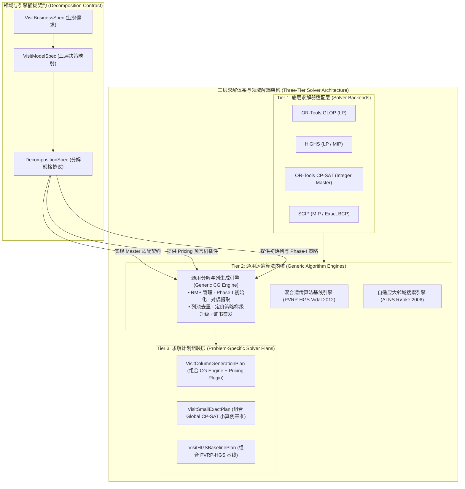
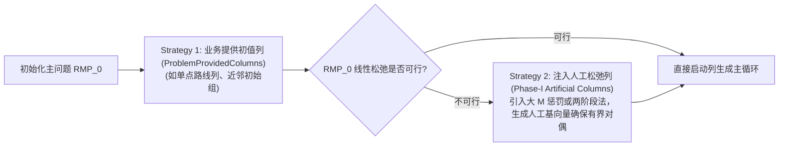
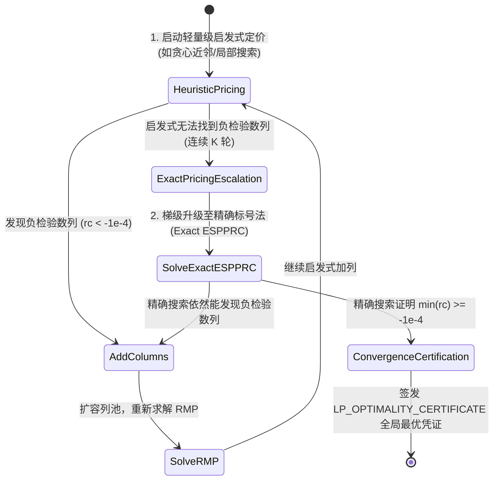
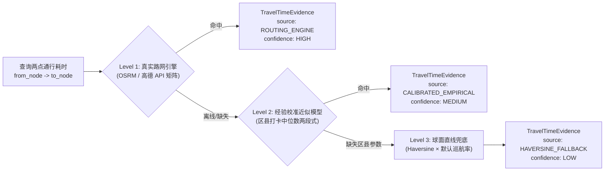

# Visit Scheduling Optimizer V5.4：通用分解引擎与白盒决策优化系统详细设计说明书
## Decomposition & Column Generation Engine + Whitebox Visit Planning Reference Specification

> **版本号**：`v5.4.0-RC` (Release Candidate)  
> **文档状态**：第三轮架构评审（重大架构升级：提炼通用分解与列生成引擎）正式归档稿  
> **依据规范**：TopPrism《决策优化工程框架（B01）》·《A07 Visit Scheduling V5 框架验证案例》  
> **核心原则**：业务语义分层（3.1）· 显式化（3.3）· 参数可信与溯源（3.4）· 问题等价与求解透明（3.5）· 证据驱动（3.6）· 组合创新（3.7）· 决策治理（3.10）  
> **对标开源基准**：SCIP GCG (Generic Column Generation) `[Ref-Gamrath2018]` · Coluna.jl (Branch-and-Price Framework) `[Ref-Coluna2023]` · VRPSolverEasy `[Ref-Queiroga2023]`

---

## 目录
1. [架构升级背景：从“排班专用列生成”到“通用分解与列生成内核”](#1-架构升级背景从排班专用列生成到通用分解与列生成内核)
2. [总体分层架构：三层求解体系与领域插拔契约](#2-总体分层架构三层求解体系与领域插拔契约)
3. [通用分解与列生成内核设计（Generic Decomposition & CG Engine）](#3-通用分解与列生成内核设计generic-decomposition--cg-engine)
   - 3.1 初始主问题可行性保障与 Phase-I 策略（InitialMasterStrategy）
   - 3.2 列池管理与不可变哈希去重（GenericColumnPool）
   - 3.3 定价策略梯级升级机制（PricingPolicy: Heuristic → Exact）
   - 3.4 列生成最优性凭证机制（ColumnGenerationCertificate）
4. [拜访排班领域建模与分解规格契约（Visit Scheduling Decomposition Spec）](#4-拜访排班领域建模与分解规格契约visit-scheduling-decomposition-spec)
   - 4.1 周期访问模式（Visit Pattern）到单日路线的三层数学映射
   - 4.2 拜访排班定价预言机插件（VisitPricingProvider: Heuristic & ESPPRC）
   - 4.3 组合路径求值预言机（HeldKarpRoutingOracle: ATSP 状态压缩 DP）
5. [物理世界三级旅行时间与停靠模型（Tiered Travel & Dwell Engine）](#5-物理世界三级旅行时间与停靠模型tiered-travel--dwell-engine)
6. [质量验证套件与运筹实验规范（Verification Suite & GLP）](#6-质量验证套件与运筹实验规范verification-suite--glp)
7. [分层序列优化与跨天工作量平滑（Lexicographic Workload Balancer）](#7-分层序列优化与跨天工作量平滑lexicographic-workload-balancer)
8. [端到端决策因果血缘追踪体系（Requirement-to-Math Trace Schema）](#8-端到端决策因果血缘追踪体系requirement-to-math-trace-schema)
9. [模块文件目录与演进重构计划](#9-模块文件目录与演进重构计划)
10. [外部文献、实证案例与开源项目严谨引用清单（Primary References）](#10-外部文献实证案例与开源项目严谨引用清单primary-references)

---

# 1. 架构升级背景：从“排班专用列生成”到“通用分解与列生成内核”

在 v5.0~v5.3 的演进中，列生成（Column Generation）一直被作为一个“排班求解器内部的 coordinator 协调脚本”来实现。但在系统审查中，暴露出了一系列**属于列生成通用算法生命周期、而不属于拜访排班业务**的深层问题：
1. **初始主问题（$RMP_0$）如何严格保证可行性（Feasibility）**？若无可行基，LP 松弛将无界或不可行，无法提取有意义的对偶向量（Duals）驱动 Pricing。
2. **列池管理（Column Pool）、哈希去重、对偶稳定化（Dual Stabilization）** 是所有 Dantzig-Wolfe 分解系统的通用基础设施。
3. **定价策略升级（Pricing Escalation）**：从近邻贪心启发式（Heuristic）升级到资源约束最短路标号法（ESPPRC Exact Pricing），以及最优性证明凭证（Certificate），是通用的算法治理机制。

> **架构升级结论**：  
> **将列生成提升为 TopPrism 决策优化框架的核心通用基础设施——`Decomposition & Column Generation Engine`（通用分解与列生成引擎）。**  
> 引擎内部**零业务感知**（不知道什么是门店、车场、KA 客户），只管理抽象的 `MasterProblem`、`Column`、`DualVector` 与 `PricingProvider`；而 `Visit Scheduling` 仅仅是作为首个标准参考实现，向引擎提供具体的问题定义与定价插件。

---

# 2. 总体分层架构：三层求解体系与领域插拔契约



---

# 3. 通用分解与列生成内核设计（Generic Decomposition & CG Engine）

### 3.1 初始主问题可行性保障与 Phase-I 策略（`InitialMasterStrategy`）
列生成启动的前提是限制主问题必须存在合法基解（$RMP_0 \ne \emptyset$）。引擎定义三级初始化策略：



```python
from __future__ import annotations
from dataclasses import dataclass
from enum import Enum

class Phase1Status(str, Enum):
    NATURAL_FEASIBLE = "NATURAL_FEASIBLE"       # 业务初始列已构成可行基
    ARTIFICIAL_FEASIBLE = "ARTIFICIAL_FEASIBLE" # 依赖 Phase-I 人工松弛列构造可行基
    INFEASIBLE = "INFEASIBLE"                   # 严重结构性不可行

@dataclass(frozen=True)
class CGInitializationResult:
    status: Phase1Status
    num_natural_columns: int
    num_artificial_columns: int
    initial_lp_value: float
```

---

### 3.2 抽象定价插件契约与策略梯级升级（`PricingPolicy`）
> **设计原则**：引擎不实现具体业务的定价搜索，而是定义通用的 `IPricingProvider` 插件契约，并负责**启发式定价向精确标号法定价的平滑梯级升级（Pricing Escalation）**。



```python
from __future__ import annotations
from typing import Protocol, Sequence

class IPricingProvider(Protocol):
    """通用定价预言机插件接口（面向具体业务场景实现）"""
    def find_negative_reduced_cost_columns(
        self,
        dual_vector: dict[str, float],
        round_index: int,
        is_exact_mode: bool,
        max_columns_to_add: int = 250
    ) -> tuple[list[GenericColumn], float]:
        """
        Returns:
            (new_columns, best_reduced_cost)
        """
        ...
```

---

### 3.3 列生成最优性凭证机制（`ColumnGenerationCertificate`）
彻底纠正将启发式列生成称为全局最优的错误，在引擎层输出严格的凭证对象：

```python
@dataclass(frozen=True)
class ColumnGenerationCertificate:
    """列生成求解最优性凭证实体 [Ref-A07, Ref-B01 §3.5]"""
    is_globally_optimal_proven: bool          # 仅当 Exact Pricing 证明且收敛时才为 True
    pricing_strategy_used: str                # "HEURISTIC_GREEDY", "EXACT_ESPPRC", "HYBRID_ESCALATION"
    total_iterations: int                     # 迭代总轮数
    total_columns_in_pool: int                # 列池最终总列数
    initialization_status: Phase1Status       # 初值状态
    restricted_master_lp_value: float         # 当前生成列池上的 LP 松弛目标值
    best_pricing_reduced_cost: float          # 最后一轮定价子问题的最小检验数
    global_lower_bound: float | None          # 全局数学下界 (只有在 is_globally_optimal_proven=True 时有效)
    termination_reason: str                   # "NATURAL_CONVERGENCE", "EXACT_CERTIFIED", "TIME_LIMIT_REACHED"
```

---

# 4. 拜访排班领域建模与分解规格契约（Visit Scheduling Decomposition Spec）

作为通用分解引擎的首个标杆应用，`visit_scheduling` 向引擎提供具体问题定义。

### 4.1 三层数学映射模型（Rothenbächer 2019 Flexible Schedule Structures）
彻底解决 Min-Gap 带来的周内离散分布不均问题，建立清晰的三层映射：

```
【Layer A: 周期访问模式选择】
  ∑_{p ∈ P_i} y_{ip} = 1                             ∀ i ∈ N                  [对偶乘子: γ_i] (模式唯一)

【Layer B: 周到日拜访指派映射】
  ∑_{t ∈ D_w} x_{it} - ∑_{p ∈ P_i} B_{ipw} y_{ip} = 0 ∀ i ∈ N, ∀ w ∈ W         [对偶乘子: σ_{iw}] (周内指派)
  x_{it} = 0                                         ∀ i, t ∉ AllowedWeekdays_i (星期禁忌)

【Layer C: 单日路线覆盖链接】
  ∑_{r ∈ R_t} a_{ir} λ_{rt} - x_{it} = 0             ∀ i ∈ N, ∀ t ∈ T         [对偶乘子: π_{it}] (路线覆盖)
  ∑_{r ∈ R_t} λ_{rt} <= 1                            ∀ t ∈ T                  [对偶乘子: μ_t] (单日单列)
```

---

### 4.2 严格推导闭合的 Reduced Cost 公式（修正对偶符号）
根据对偶问题约束 $\sum_{i \in N} a_{ir} \pi_{it} - \mu_t \le c_r$，在第 $t$ 天选用路线 $r$ 的检验数公式严格闭合为：
$$\boxed{rc(r, t) = c_r - \sum_{i \in r} \pi_{it} + \mu_t}$$

> **物理符号归因**：  
> - $\sum_{i \in r} \pi_{it}$ 是路线 $r$ 在第 $t$ 天获得的客户覆盖影子收益；  
> - $\mu_t \ge 0$ 是占用第 $t$ 天容量配额的拥堵边际成本；  
> - 因此选用路线 $r$ 的净边际成本为物理耗时 $c_r + \mu_t - \sum \pi_{it}$。

---

### 4.3 组合路径求值预言机（`HeldKarpRoutingOracle`）
- **输入**：固定客户集合 $G \subseteq N$；
- **算法**：基于 **Held & Karp (1962)** `[Ref-HeldKarp1962]` 状态压缩动态规划（$O(2^k k^2)$，当 $k \le 9$ 时毫秒级求出非对称 ATSP 最优访问序列与闭环行驶耗时）；
- **车场起终点策略（Depot Policy）**：显式执行 `CLOSED_LOOP_DEPOT` ($\text{Depot} \to i_1 \dots i_k \to \text{Depot}$) 闭合计算。

---

# 5. 物理世界三级旅行时间与停靠模型（Tiered Travel & Dwell Engine）



- **停靠寻路沉没耗时（Dwell Time）**：  
  固定 $32.0\text{ min/店}$。声明为 **Internal Empirical Calibration**（基于 319 条本地实际打卡流水中位数拟合）；分项拆解真实标记为 `UNKNOWN_NOT_DISAGGREGATED`，杜绝未证实的子分项假装白盒。Dalla Chiara & Goodchild (2020) `[Ref-DallaChiara2020]` 仅用于佐证城市商用车停车寻路巡航时间（占总耗时约 28%）不可忽略。

---

# 6. 质量验证套件与运筹实验规范（Verification Suite & GLP）

依据 **Kendall et al. (2016)** `[Ref-Kendall2016]` 的《Good Laboratory Practice for Optimization Research》与 **Lian et al. (2026)** `[Ref-ReLoop2026]`，构建六重独立验证体系：

```
① 语义合同测试 (Semantic Contract Test)
   └── 校验输入定义域、坐标合法性与鸽巢容量超载。
② 数学结构测试 (Mathematical Structural Test)
   └── 校验约束维度、Pattern 映射完整性。
③ 小算例全局精确解比对测试 (Small-Instance Exact Oracle Test)
   └── 8~12 客户小算例，与穷举 Global Optimum 达到 100% 绝对一致。
④ 行为蜕变测试 (Behavioral / Metamorphic Test - ReLoop)
   └── 工时上限放宽解不恶化、工作日增加可行域不缩小、路网耗时增加解不改善。
⑤ 求解凭证有效性测试 (Solver Certificate Test)
   └── 断言 Heuristic Pricing 绝对禁止签发全局最优证书，超时必须标记 FEASIBLE_NOT_PROVEN。
⑥ 历史反例回归测试 (Failure Pattern Regression)
   └── V4 Weekday 独立分桶失效反例作为永久 CI 门禁。
```

---

# 7. 分层序列优化与跨天负荷平滑（Lexicographic Workload Balancer）

> **理论重构**：采用严密的**分层序列优化（Lexicographic Optimization）**数学理论。

- **阶段 1（总工时极小化）**：通过列生成与整数主问题求出全局最小总耗时 $C^\star = \min \sum c_r \lambda_{rt}$。
- **阶段 2（跨天平滑）**：在保持选定路线集不变的前提下，求解二次分配 MIP：
  $$\min \max_{t \in T} L_t \quad \text{s.t.} \quad \sum_{t \in T} L_t = C^\star, \quad \text{满足客户周次与星期约束}$$
  **总耗时不变性（Cost Invariance）由等式约束直接在数学上保证。**

---

# 8. 端到端决策因果血缘追踪体系（Requirement-to-Math Trace Schema）

声明对齐 W3C PROV-O 核心本体（`"provenance_alignment": "W3C PROV-O aligned"`），建立强类型决策因果追踪结构：

```json
{
  "trace_id": "TRACE_V5_4_NANTONG_20260822_001",
  "provenance_alignment": "W3C PROV-O aligned",
  "requirement_to_model_trace": [
    {
      "requirement_id": "REQ-FREQ-001",
      "statement": "B类客户4周拜访2次，隔周拜访",
      "compiled_patterns": ["PATTERN_W1_W3", "PATTERN_W2_W4"],
      "model_variable_y": "y[customer_005, PATTERN_W1_W3]",
      "day_assignment_constraint": "WEEK_TO_DAY_MAP_C005_W1",
      "verified_by_test": "test_b_tier_alternating_week_pattern"
    }
  ],
  "cost_engine_trace": {
    "tier_level_used": "Level 1 (OSRM Road Engine) with Level 2 Fallback",
    "dwell_calibration_median_min": 32.0,
    "dwell_component_breakdown": "UNKNOWN_NOT_DISAGGREGATED"
  },
  "solver_execution_trace": {
    "solver_plan": "VisitColumnGenerationPlan",
    "optimality_certificate": {
      "pricing_strategy": "HEURISTIC_GREEDY",
      "is_globally_certified": false,
      "restricted_master_lp_value": 560.20,
      "generated_pool_gap_percent": 1.57,
      "global_lower_bound": null,
      "certified_global_gap_percent": null
    }
  }
}
```

---

# 9. 模块文件目录与演进重构计划

```
visit-scheduling-optimizer/
├── optimization/                # 【新增】通用运筹算法与分解内核 (Generic Optimization Infrastructure)
│   ├── __init__.py
│   ├── decomposition/           # 通用 Dantzig-Wolfe 分解抽象
│   │   ├── __init__.py
│   │   ├── spec.py              # DecompositionSpec 抽象契约
│   │   └── master_model.py      # 通用主问题接口
│   └── column_generation/       # 通用列生成引擎 (Generic CG Engine)
│       ├── __init__.py
│       ├── engine.py            # ColumnGenerationEngine (主循环驱动)
│       ├── initialization.py    # InitialMasterStrategy & Phase-I 可行基保障
│       ├── column_pool.py       # GenericColumnPool (不可变哈希去重列池)
│       ├── pricing_policy.py    # PricingPolicy (启发式 -> 精确标号法梯级升级)
│       ├── certificate.py       # ColumnGenerationCertificate (最优性凭证)
│       └── adapters/            # 求解器适配器
│           ├── glop_adapter.py  # OR-Tools GLOP (LP)
│           ├── highs_adapter.py # HiGHS (LP / MIP)
│           └── cpsat_adapter.py # OR-Tools CP-SAT (Integer Master 定点数放大100倍)
│
├── spec/                        # 1. 拜访排班规格层 (Visit Specifications)
│   ├── __init__.py
│   ├── business_spec.py         # VisitBusinessSpec & BusinessRequirement (纯业务语言)
│   ├── model_spec.py            # VisitModelSpec & LinearConstraintTag (三层数学映射)
│   └── patterns.py              # VisitPatternGenerator (周期访问模式生成器)
│
├── domain/                      # 2. 快消领域实体与物理耗时引擎 (FMCG Domain & Travel Engine)
│   ├── __init__.py
│   ├── entities.py              # Customer, SalesRepresentative, Depot, Territory, SchedulePlan
│   ├── cost_engine.py           # TieredTravelTimeEngine (L1路网/L2校准/L3球面三级引擎)
│   └── rules/                   # 业务规则与分级审计器库
│       ├── frequency_rule.py
│       ├── pattern_rule.py
│       └── capacity_rule.py
│
├── solver/                      # 3. 拜访排班求解计划与插件实现 (Visit Solver Plans & Plugins)
│   ├── __init__.py
│   ├── plan.py                  # SolverPlan 抽象基类
│   ├── visit_cg_plan.py         # VisitColumnGenerationPlan (组合 CG Engine + Visit Plugins)
│   ├── global_cpsat_plan.py     # GlobalCPSatSolverPlan (小算例精确基准)
│   ├── pvrp_hgs_plan.py         # PVRP-HGS SolverPlan (Vidal 2012 专用强基线)
│   ├── alns_baseline_plan.py    # ALNSSolverPlan (Røpke 2006 对比基线)
│   ├── pricing/                 # 拜访场景专用 Pricing 预言机插件
│   │   ├── greedy_pricer.py     # VisitGreedyPricer (近邻启发式定价)
│   │   └── espprc_pricer.py     # VisitESPPRCPricer (标号法精确资源约束最短路)
│   └── routing/                 # 组合路径求值预言机
│       └── held_karp.py         # HeldKarpRoutingOracle (ATSP 状态压缩 DP)
│
├── verify/                      # 4. 六重质量验证套件 (Verification & GLP)
│   ├── __init__.py
│   ├── semantic_validator.py    # ① 业务语义验证
│   ├── structural_validator.py  # ② 数学结构验证
│   ├── exact_oracle_test.py     # ③ 小算例全局最优一致性测试
│   ├── behavioral_verifier.py   # ④ ReLoop 行为蜕变单调性测试
│   ├── certificate_verifier.py  # ⑤ 求解凭证有效性测试
│   └── solution_auditor.py      # ⑥ 业务有效性与合规审计
│
├── service/                     # 5. 应用服务与诊断门面 (Service & Facade)
│   ├── __init__.py
│   ├── optimizer.py             # VisitSchedulingOptimizer (统一对外门面)
│   ├── balancer.py              # WorkloadBalancer (跨天工作量平滑器)
│   ├── trace.py                 # DecisionTraceGenerator & ProvTraceAdapter
│   └── report_generator.py      # 业务对比报表与可视化日历渲染
│
├── regression/                  # 6. 历史反例与防退化资产库 (Failure Patterns)
│   └── test_v4_decomposition_failure.py # V4 历史分解失败最小反例
│
└── examples/
    └── synthetic_v5_demo.py     # 端到端白盒化运行范例
```

---

# 10. 外部文献、实证案例与开源项目严谨引用清单（Primary References）

本系统设计中所引用的所有学术文献与标准均经过一手核验：

### 10.1 通用分解、列生成与分支定价（Decomposition, CG & Branch-and-Price）
1. `[Ref-Rothenbacher2019]` **Rothenbächer, A. K. (2019).**  
   *Branch-and-Price-and-Cut for the Periodic Vehicle Routing Problem with Flexible Schedule Structures.*  
   **Transportation Science**, 53(3), 850–866. DOI: `10.1287/trsc.2018.0855`.  
   *(理论依据：§4 周期访问模式 Visit Pattern 形式化与主问题三层映射)*
2. `[Ref-Dantzig1960]` **Dantzig, G. B., & Wolfe, P. (1960).**  
   *Decomposition Principle for Linear Programs.*  
   **Operations Research**, 8(1), 101–111. DOI: `10.1287/opre.8.1.101`.  
   *(理论依据：§3 限制主问题 RMP 与定价子问题 Dantzig-Wolfe 运筹分解范式)*
3. `[Ref-Desaulniers2005]` **Desaulniers, G., Desrosiers, J., & Solomon, M. M. (Eds.). (2005).**  
   *Column Generation.*  
   **Springer Science & Business Media**, New York. ISBN: `978-0-387-25485-2`.  
   *(理论依据：§3 限制主问题松弛求解、对偶乘子提取与 Reduced Cost 正确闭合公式)*
4. `[Ref-Pirkwieser2009]` **Pirkwieser, S., & Raidl, G. R. (2009).**  
   *A Column Generation Approach for the Periodic Vehicle Routing Problem with Time Windows.*  
   In **International Network Optimization Conference (INOC 2009)**, Pisa, Italy.  
   *(理论依据：§3 对偶引导近邻贪心定价搜索策略与收敛控制)*
5. `[Ref-Gamrath2018]` **Gamrath, G., Lübbecke, M., et al. (2018).**  
   *The SCIP Optimization Suite 6.0: Generic Column Generation (GCG).*  
   **Technical Report**, Zuse Institute Berlin. URL: `https://gcg.or.rwth-aachen.de/`.  
   *(开源工程依据：§3 通用列生成引擎解耦范式)*
6. `[Ref-Coluna2023]` **Pessoa, A., Sadykov, R., Vanderbeck, F., et al. (2023).**  
   *Coluna.jl: A Julia Framework for Branch-and-Price-and-Cut Algorithms.*  
   **GitHub Repository**: `https://github.com/atoptima/Coluna.jl`.  
   *(开源工程依据：§3 通用分解算法生命周期与定价插件解耦规范)*
7. `[Ref-Queiroga2023]` **Queiroga, E., Sadykov, R., & Pessoa, A. (2023).**  
   *VRPSolverEasy: A Python Library for the Exact Solution of a Rich Vehicle Routing Problem.*  
   **INFORMS Journal on Computing**, 36(1), 1–14. DOI: `10.1287/ijoc.2023.0103`.  
   *(开源工程依据：§4 Python 生态下精确分支定价割平面解耦标准)*

### 10.2 快消销售拜访与商业区域规划（FMCG Route-to-Market & Territory Design）
8. `[Ref-RiosMercado2013]` **Ríos-Mercado, R. Z., & López-Pérez, J. F. (2013).**  
   *Commercial territory design planning with realignment and disjoint assignment requirements.*  
   **Omega: The International Journal of Management Science**, 41(3), 525–535. DOI: `10.1016/j.omega.2012.08.002`.  
   *(实证依据：§3 商业区域网格 Territory 划分与门店归属规则)*
9. `[Ref-LopezPerez2013]` **López-Pérez, J. F., & Ríos-Mercado, R. Z. (2013).**  
   *Embotelladoras ARCA Uses Operations Research to Improve Territory Design Plans.*  
   **Interfaces (now INFORMS Journal on Applied Analytics)**, 43(3), 209–220. DOI: `10.1287/inte.1120.0675`.  
   *(实证依据：可口可乐装瓶商 ARCA 真实商业区域划分与拜访规划实证)*
10. `[Ref-Zoltners2005]` **Zoltners, A. A., & Sinha, P. (2005).**  
    *Sales Territory Design: Thirty Years of Modeling and Practice.*  
    **Marketing Science**, 24(3), 313–331. DOI: `10.1287/mksc.1050.0133`.  
    *(实证依据：§3 客户门店商业潜力分级 CustomerTier KA/A/B/C 体系)*
11. `[Ref-Groer2009]` **Groër, C., Golden, B., & Wasil, E. (2009).**  
    *The Consistent Vehicle Routing Problem.*  
    **Manufacturing & Service Operations Management (M&SOM)**, 11(4), 630–643. DOI: `10.1287/msom.1080.0243`.  
    *(理论依据：§3 客户历史习惯一致性偏好与业务员固定关系模型)*
12. `[Ref-Paradiso2020]` **Paradiso, R., Roberti, R., Laganà, D., & Dullaert, W. (2020).**  
    *An Exact Solution Framework for Multitrip Vehicle-Routing Problems with Time Windows.*  
    **Operations Research (INFORMS)**, 68(1), 180–198. DOI: `10.1287/opre.2019.1874`.  
    *(理论依据：§3 单日 Trip Structure 与多周期 Rep Journey 的层级解耦)*

### 10.3 组合算法、PVRP 强基线与元分析（Algorithms & Benchmarks）
13. `[Ref-HeldKarp1962]` **Held, M., & Karp, R. M. (1962).**  
    *A Dynamic Programming Approach to Sequencing Problems.*  
    **Journal of the Society for Industrial and Applied Mathematics (SIAM)**, 10(1), 196–210. DOI: `10.1137/0110015`.  
    *(理论依据：§4 单日路径成本预言机 Held-Karp $O(2^n n^2)$ 状态压缩动态规划)*
14. `[Ref-Vidal2012]` **Vidal, T., Crainic, T. G., Gendreau, M., Lahrichi, N., & Rei, W. (2012).**  
    *A Hybrid Genetic Algorithm for Multidepot and Periodic Vehicle Routing Problems.*  
    **Operations Research (INFORMS)**, 60(3), 611–624. DOI: `10.1287/opre.1120.1048`.  
    *(基准依据：§9 周期性车辆路径专用强对比基线 PVRP-HGS)*
15. `[Ref-Ropke2006]` **Røpke, S., & Pisinger, D. (2006).**  
    *An Adaptive Large Neighborhood Search Heuristic for the Pickup and Delivery Problem with Time Windows.*  
    **Transportation Science**, 40(4), 455–472. DOI: `10.1287/trsc.1050.0135`.  
    *(理论依据：§9 ALNS 通用元启发式对比基线)*
16. `[Ref-ArenasVasco2025]` **Arenas-Vasco, A., Alcázar, D., & Villegas, J. G. (2025).**  
    *A meta-analysis of set partitioning/set covering based matheuristics for vehicle routing problems.*  
    **Operations Research Perspectives (Elsevier)**, 15, 100357. DOI: `10.1016/j.orp.2025.100357`.  
    *(理论依据：§3 集合划分列池 Route Pool 管理与哈希去重规范)*

### 10.4 物理物流实证、运筹实验室规范与前沿 AI/OR 验证标准
17. `[Ref-DallaChiara2020]` **Dalla Chiara, G., & Goodchild, A. (2020).**  
    *Do commercial vehicles cruise for parking? Empirical evidence from Seattle.*  
    **Transport Policy**, 97, 26–36. DOI: `10.1016/j.tranpol.2020.06.013`.  
    *(实证依据：§5 城市商用车巡航找车位与进出建筑沉没耗时不可忽略性实证)*
18. `[Ref-Kendall2016]` **Kendall, G., et al. (2016).**  
    *Good Laboratory Practice for optimization research.*  
    **Journal of the Operational Research Society (JORS)**, 67(4), 676–689. DOI: `10.1057/jors.2015.77`.  
    *(实验规范依据：§6 运筹算法实验规范、可复现性与小算例基准验证)*
19. `[Ref-ReLoop2026]` **Lian, J., et al. (2026).**  
    *ReLoop: Structured Modeling and Behavioral Verification for Reliable LLM-Based Optimization.*  
    **arXiv preprint** `arXiv:2602.15983`. (GitHub: `junbolian/ReLoop`).  
    *(验证依据：§6 基于参数微扰的运筹模型行为单调性蜕变测试)*
20. `[Ref-PROVO2013]` **W3C Provenance Working Group (2013).**  
    *PROV-O: The PROV Ontology.*  
    **W3C Recommendation 30 April 2013**, `https://www.w3.org/TR/prov-o/`.  
    *(溯源标准依据：§8 决策因果血缘与溯源 JSON 图规范)*
21. `[Ref-NISTAI1001]` **National Institute of Standards and Technology (2023).**  
    *Artificial Intelligence Risk Management Framework (AI RMF 1.0).*  
    **NIST AI 100-1**, DOI: `10.6028/NIST.AI.100-1`.  
    *(治理标准依据：§3 需求显式分级与决策风险管控)*
22. `[Ref-OMGDMN2021]` **Object Management Group (2021).**  
    *Decision Model and Notation (DMN) v1.3 (February 2021).*  
    `https://www.omg.org/spec/DMN/1.3/`.  
    *(建模标准依据：§3 业务决策需求与规则形式化分离)*
23. `[Ref-MathOpt2024]` **Google OR-Tools MathOpt Team (2024).**  
    *MathOpt: A Solver-Independent Operations Research Modeling Library.*  
    `https://developers.google.com/optimization/math_opt`.  
    *(工程标准依据：§3 求解器中立抽象与定点数数值缩放协议)*
24. `[Ref-B01]` **TopPrism (2026).**  
    *决策优化工程框架（Decision Optimization Engineering Framework）v1.0.*  
    文档路径：`B01_Decision_Optimization_Engineering_Framework_清洁合并版_v1.0.md`.
25. `[Ref-A07]` **TopPrism (2026).**  
    *Visit Scheduling V5 框架验证案例.*  
    文档路径：`A_研究与工程基础/A07_Visit_Scheduling_V5_框架验证案例.md`.
