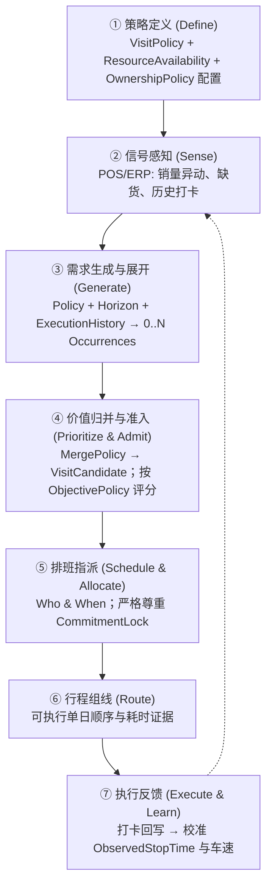

# A03: 通用销售拜访领域本体、决策全生命周期与边界说明书 (v6.1)
## Sales Visit Domain Ontology — Domain-Contract-v1.0 FROZEN

> **文档标识**：`A03-DOMAIN-ONTOLOGY-V1.0.1`（base V6.1.1 + DCR-SA-001-R patch）  
> **版本状态**：**`Domain-Contract-v1.0.1 FROZEN`**（基线 v1.0 2026-08-22 Sign-off；v1.0.1 2026-08-22 经 DCR-SA-001-R 变更控制并入：BusinessRequirement 增加可选 exception_handling_policy_ref）  
> **冻结基线日期**：2026-08-22（Sign-off）· **下次复审**：2026-11-22  
> **设计第一铁律（Pure & Closed Business Semantics）**：  
> 领域本体 100% 封闭纯粹：**本规范类图中引用的每一个类型，均必须在本章 §2 拥有正式结构定义，不存在悬空引用**；严禁出现数学索引（`day_index`）、算法名（`ATSP/CG`）、求解器词（`non_assignment_cost`）或未拆分的经验常数（`32min Dwell`）。

---

## 目录
1. [通用销售拜访领域本体全景类图（Closed Domain Ontology）](#1-通用销售拜访领域本体全景类图closed-domain-ontology)
2. [核心实体、值对象与治理规范详细定义（全部闭合）](#2-核心实体值对象与治理规范详细定义全部闭合)
   - 2.1 基础时间值对象（DateRange, TimeWindow, WorkingCalendar）
   - 2.2 物理世界实体（GeoLocation, WeeklyAvailabilityRule, TargetAvailability, VisitTarget）
   - 2.3 资源主体与按日可用性（ResourceDayProfile, ResourceAvailability, SalesResource, StartEndPolicy）
   - 2.4 政策作用域与频次/节奏（PolicyScope, FrequencySpec, CadenceSpec, VisitPolicy）
   - 2.5 需求、发生项与多动因归并（DemandReason, FulfillmentClass, VisitDemand, VisitOccurrence, ExecutionHistory, MergePolicy, VisitCandidate）
   - 2.6 归属、替补、适格与延期四轴（OwnershipPolicy, SubstitutionPolicy, EligibilityPolicy, DeferralPolicy）
   - 2.7 承诺与状态机双轨（ExistingCommitment, LifecycleState, CommitmentLock）
   - 2.8 成本指标与路线结构分离（RouteMetrics, ObservedStopTime, PlannedVisit, Route）
   - 2.9 需求与参数治理（RequirementStrength, RequirementAuthority, ParameterEvidenceType, ParameterDescriptor, ParameterRegistry, BusinessRequirement, RequirementRegistry）
   - 2.10 规划策略与多目标（PlanningPolicy, ObjectivePolicy, PlanningHorizon, SalesVisitPlanningScenario）
3. [销售拜访决策七步全生命周期](#3-销售拜访决策七步全生命周期)
4. [建模工程层职责边界](#4-建模工程层职责边界)
5. [领域边界与相邻系统协作](#5-领域边界与相邻系统协作)

---

# 1. 通用销售拜访领域本体全景类图（Closed Domain Ontology）

```mermaid
classDiagram
    class SalesVisitPlanningScenario {
        +str scenario_id
        +PlanningHorizon horizon
        +PlanningPolicy planning_policy
        +ObjectivePolicy objective_policy
        +list visit_targets
        +list sales_resources
        +list visit_policies
        +list ownership_policies
        +list substitution_policies
        +list eligibility_policies
        +list existing_commitments
        +ExecutionHistory execution_history
        +list deferral_policies
        +RequirementRegistry requirement_registry
        +ParameterRegistry parameter_registry
    }
    class PlanningHorizon {
        +DateRange date_range
        +WorkingCalendar calendar
        +int working_days_count
    }
    class PlanningPolicy {
        +PlanningMode mode
        +int freeze_days_count
        +float max_reassignment_ratio
    }
    class PlanningMode {
        <<enumeration>>
        TACTICAL_PJP
        WEEKLY_ROLLING
        DAILY_EXECUTION
        INTRADAY_REPAIR
    }
    class ObjectivePolicy {
        +ObjectiveProfile profile
        +dict profile_weights
    }
    class ObjectiveProfile {
        <<enumeration>>
        VALUE_IMPACT_FIRST
        MAX_THROUGHPUT
        BALANCED_STABILITY
        COST_EFFICIENCY_FIRST
    }
    class DateRange {
        +date start_date
        +date end_date
        +contains(date) bool
    }
    class TimeWindow {
        +time start_time
        +time end_time
    }
    class WorkingCalendar {
        +list working_dates
        +list holiday_dates
        +is_working_day(date) bool
        +get_weekday(date) int
    }
    class GeoLocation {
        +float latitude
        +float longitude
        +str formatted_address
    }
    class WeeklyAvailabilityRule {
        +dict weekday_to_time_windows
        +list date_exceptions
        +list blackout_dates
        +is_available(date, TimeWindow) bool
    }
    class TargetAvailability {
        +WeeklyAvailabilityRule weekly_rule
    }
    class VisitTarget {
        +str target_id
        +str code
        +str name
        +GeoLocation location
        +str territory_id
        +TargetAvailability availability
        +dict business_attributes
    }
    class StartEndPolicy {
        <<enumeration>>
        BASE_DEPOT
        HOME_LOCATION
        DYNAMIC_DAILY
    }
    class ResourceDayProfile {
        +date service_date
        +list working_windows
        +float capacity_min
        +GeoLocation day_start_location
        +GeoLocation day_end_location
        +bool is_absent
    }
    class ResourceAvailability {
        +StartEndPolicy default_policy
        +GeoLocation default_start
        +GeoLocation default_end
        +dict date_profiles
        +get_day_profile(date) ResourceDayProfile
    }
    class SalesResource {
        +str resource_id
        +str code
        +str name
        +ResourceAvailability availability
        +int max_daily_targets
        +tuple territory_tags
        +dict qualifications
    }
    class PolicyScope {
        +list scope_conditions
        +matches(VisitTarget) bool
    }
    class FrequencySpec {
        +FrequencySemantics semantics
        +int target_occurrences
        +int reference_period_days
        +int min_occurrences
        +int max_occurrences
    }
    class FrequencySemantics {
        <<enumeration>>
        EXACT
        RANGE
        TARGET
    }
    class CadenceSpec {
        +int min_spacing_days
        +int max_spacing_days
    }
    class VisitPolicy {
        +str policy_id
        +PolicyScope scope
        +FrequencySpec frequency_spec
        +CadenceSpec cadence_spec
        +float standard_service_duration_min
    }
    class DemandReason {
        <<enumeration>>
        COVERAGE_POLICY
        CONTRACT_SLA
        SALES_SIGNAL
        OUT_OF_STOCK
        CAMPAIGN
        CUSTOMER_REQUEST
    }
    class FulfillmentClass {
        <<enumeration>>
        REQUIRED
        COMMITTED
        OPTIONAL
    }
    class VisitDemand {
        +str demand_id
        +str target_id
        +DemandReason reason
        +FulfillmentClass fulfillment_class
        +float expected_duration_min
        +DateRange requested_date_range
        +dict metadata
    }
    class VisitOccurrence {
        +str occurrence_id
        +str demand_id
        +str target_id
        +int occurrence_index
        +DateRange eligible_date_range
        +float expected_service_min
    }
    class ExecutionHistory {
        +list completed_visits
        +list missed_visits
        +date last_visit_date
        +get_last_visit(target_id) date
    }
    class MergePolicy {
        +bool allow_same_day_consolidation
        +float max_consolidated_service_min
        +consolidate(list) list
    }
    class VisitCandidate {
        +str candidate_id
        +VisitTarget target
        +list source_occurrences
        +list combined_reasons
        +float priority_score
        +FulfillmentClass fulfillment_class
        +tuple eligible_resource_ids
        +float consolidated_service_min
    }
    class OwnershipPolicy {
        +str target_id
        +tuple primary_resource_ids
        +bool allow_shared_pool
    }
    class SubstitutionPolicy {
        +bool allow_backup
        +tuple backup_resource_ids
        +dict conditions
    }
    class EligibilityPolicy {
        +dict required_qualifications
        +dict required_territory_tags
    }
    class LifecycleState {
        <<enumeration>>
        PROPOSED
        PLANNED
        COMMITTED
        IN_PROGRESS
        COMPLETED
        MISSED
        CANCELLED
    }
    class CommitmentLock {
        <<enumeration>>
        FREE
        RESOURCE_LOCKED
        DAY_LOCKED
        SEQUENCE_LOCKED
        COMPLETELY_LOCKED
    }
    class ExistingCommitment {
        +str commitment_id
        +str target_id
        +str resource_id
        +date committed_date
        +TimeWindow committed_time_window
        +CommitmentLock lock_level
    }
    class RouteMetrics {
        +float driving_time_min
        +float total_distance_km
        +float total_work_time_min
    }
    class ObservedStopTime {
        +float median_stop_time_min
        +str breakdown
    }
    class PlannedVisit {
        +str visit_id
        +str candidate_id
        +str resource_id
        +date service_date
        +TimeWindow planned_time_window
        +float service_time_estimate_min
        +LifecycleState lifecycle_state
        +CommitmentLock commitment_lock
    }
    class Route {
        +str route_id
        +str resource_id
        +date service_date
        +tuple ordered_visits
        +RouteMetrics metrics
    }
    class RequirementStrength {
        <<enumeration>>
        HARD
        SOFT
        ADVISORY
    }
    class RequirementAuthority {
        <<enumeration>>
        LEGAL
        CONTRACT
        COMPANY_POLICY
        MANAGER_RULE
        USER_PREFERENCE
    }
    class ParameterEvidenceType {
        <<enumeration>>
        MEASURED
        CALIBRATED
        EMPIRICAL
        EXTERNAL_REFERENCE
        DEFAULT
    }
    class ParameterDescriptor {
        +str parameter_id
        +str name
        +ParameterEvidenceType evidence_type
        +str source_description
        +date verified_at
    }
    class ParameterRegistry {
        +dict descriptors
        +register(ParameterDescriptor) void
        +get(parameter_id) ParameterDescriptor
    }
    class BusinessRequirement {
        +str requirement_id
        +str statement
        +RequirementStrength strength
        +RequirementAuthority authority
        +PolicyScope applies_to
        +tuple parameter_refs
        +str source_ref
        +str exception_handling_policy_ref
    }
    class RequirementRegistry {
        +dict requirements
        +register(BusinessRequirement) void
        +get(requirement_id) BusinessRequirement
        +by_authority(RequirementAuthority) list
    }
    class DeferralPolicy {
        +bool deferrable
        +int max_deferral_days
        +str escalation_rule
        +str unmet_consequence
    }

    SalesVisitPlanningScenario *-- PlanningHorizon
    SalesVisitPlanningScenario *-- PlanningPolicy
    SalesVisitPlanningScenario *-- ObjectivePolicy
    SalesVisitPlanningScenario *-- RequirementRegistry
    SalesVisitPlanningScenario *-- ExecutionHistory
    SalesVisitPlanningScenario *-- DeferralPolicy
    SalesVisitPlanningScenario *-- ParameterRegistry
    PlanningPolicy --> PlanningMode
    ObjectivePolicy --> ObjectiveProfile
    PlanningHorizon *-- DateRange
    PlanningHorizon *-- WorkingCalendar
    TargetAvailability *-- WeeklyAvailabilityRule
    WeeklyAvailabilityRule *-- TimeWindow
    VisitTarget *-- GeoLocation
    VisitTarget *-- TargetAvailability
    ResourceAvailability *-- ResourceDayProfile
    ResourceAvailability --> StartEndPolicy
    ResourceDayProfile *-- TimeWindow
    ResourceDayProfile *-- GeoLocation
    SalesResource *-- ResourceAvailability
    VisitPolicy *-- PolicyScope
    VisitPolicy *-- FrequencySpec
    VisitPolicy *-- CadenceSpec
    FrequencySpec --> FrequencySemantics
    VisitDemand *-- DemandReason
    VisitDemand *-- FulfillmentClass
    VisitDemand --> VisitOccurrence
    VisitCandidate *-- VisitOccurrence
    OwnershipPolicy --> SubstitutionPolicy
    PlannedVisit *-- VisitCandidate
    PlannedVisit --> LifecycleState
    PlannedVisit --> CommitmentLock
    PlannedVisit *-- TimeWindow
    Route *-- PlannedVisit
    Route *-- RouteMetrics
    ParameterRegistry *-- ParameterDescriptor
    ParameterDescriptor --> ParameterEvidenceType
    RequirementRegistry *-- BusinessRequirement
    BusinessRequirement --> RequirementStrength
    BusinessRequirement --> RequirementAuthority
    BusinessRequirement *-- PolicyScope
```



---

# 2. 核心实体、值对象与治理规范详细定义（全部闭合）

### 2.1 基础时间值对象
```python
@dataclass(frozen=True)
class DateRange:
    """闭区间日期范围"""
    start_date: date
    end_date: date
    def contains(self, d: date) -> bool: ...

@dataclass(frozen=True)
class TimeWindow:
    """单日内时间窗 [start_time, end_time]"""
    start_time: time
    end_time: time

@dataclass(frozen=True)
class WorkingCalendar:
    """企业/个人工作日历：哪些日期工作、哪些公休"""
    working_dates: tuple[date, ...]
    holiday_dates: tuple[date, ...]
    def is_working_day(self, d: date) -> bool: ...
    def get_weekday(self, d: date) -> int: ...
```

### 2.2 物理世界实体（含按星期分化的可用性规则）
```python
@dataclass(frozen=True)
class GeoLocation:
    latitude: float
    longitude: float
    formatted_address: str

@dataclass(frozen=True)
class WeeklyAvailabilityRule:
    """
    按星期分化的可服务时段规则。
    解决“周二上午、周四下午”这类不同星期对应不同时间窗的真实业务。
    weekday_to_time_windows: {0: [TimeWindow(9,12)], 3: [TimeWindow(14,18)]}
    """
    weekday_to_time_windows: dict[int, tuple[TimeWindow, ...]]
    date_exceptions: dict[date, tuple[TimeWindow, ...]]   # 特定日期覆盖
    blackout_dates: tuple[date, ...]                       # 完全不可服务日期
    def is_available(self, d: date, tw: TimeWindow) -> bool: ...

@dataclass(frozen=True)
class TargetAvailability:
    weekly_rule: WeeklyAvailabilityRule

@dataclass(frozen=True)
class VisitTarget:
    target_id: str
    code: str
    name: str
    location: GeoLocation
    territory_id: str
    availability: TargetAvailability
    business_attributes: dict      # customer_segment 等仅作为属性，不再绑定 Policy
```

### 2.3 资源主体与按日可用性（`ResourceAvailability / ResourceDayProfile`）
```python
class StartEndPolicy(str, Enum):
    BASE_DEPOT = "BASE_DEPOT"        # 默认办事处车场
    HOME_LOCATION = "HOME_LOCATION"  # 默认员工住址
    DYNAMIC_DAILY = "DYNAMIC_DAILY"  # 每日动态指定（由 DayProfile 决定）

@dataclass(frozen=True)
class ResourceDayProfile:
    """
    资源在特定日期的完整作业画像：
    工作时段窗 + 当日容量 + 当日起止位置 + 缺勤标记。
    解决“周一9-18从家出发、周二10-16培训半天从办事处出发”的真实场景。
    """
    service_date: date
    working_windows: tuple[TimeWindow, ...]   # 当日可工作时段（可为空=休息）
    capacity_min: float                        # 当日工时容量（分钟）
    day_start_location: GeoLocation            # 当日出发位置
    day_end_location: GeoLocation              # 当日返回位置
    is_absent: bool                            # 请假/培训等不可派工标记

@dataclass(frozen=True)
class ResourceAvailability:
    """资源可用性聚合根：默认策略 + 按日覆盖档案"""
    default_policy: StartEndPolicy
    default_start: GeoLocation
    default_end: GeoLocation
    date_profiles: dict[date, ResourceDayProfile]   # 例外日覆盖
    def get_day_profile(self, d: date) -> ResourceDayProfile:
        """返回当日画像；无例外时按默认策略构造"""

@dataclass(frozen=True)
class SalesResource:
    resource_id: str
    code: str
    name: str
    availability: ResourceAvailability
    max_daily_targets: int
    territory_tags: tuple[str, ...]
    qualifications: dict        # 如 {"cold_chain": true}，供 EligibilityPolicy 匹配
```

### 2.4 政策作用域与频次/节奏
```python
@dataclass(frozen=True)
class PolicyScope:
    """
    政策适用对象选择器（对齐 Salesforce Dataset / SAP Sales Area 抽象）。
    customer_segment 只是其中一种条件；支持渠道、城市、销量阈值等任意组合。
    scope_conditions 示例:
      [{"field": "segment", "op": "==", "value": "B"},
       {"field": "channel", "op": "==", "value": "MODERN_TRADE"},
       {"field": "city_tier", "op": "==", "value": "T1"}]
    """
    scope_conditions: list[dict]
    def matches(self, t: VisitTarget) -> bool: ...

class FrequencySemantics(str, Enum):
    EXACT = "EXACT"      # 恰好 target_occurrences 次（=min=max）
    RANGE = "RANGE"      # [min_occurrences, max_occurrences] 区间内
    TARGET = "TARGET"    # 目标 target 次，min 为底线（低于则违规），max 为上限

@dataclass(frozen=True)
class FrequencySpec:
    """频次规格：与规划时域无关，锚定 reference_period_days（如 28 天）"""
    semantics: FrequencySemantics
    target_occurrences: int
    reference_period_days: int     # 频次参考周期，独立于当前 PlanningHorizon
    min_occurrences: int
    max_occurrences: int

@dataclass(frozen=True)
class CadenceSpec:
    min_spacing_days: int
    max_spacing_days: int

@dataclass(frozen=True)
class VisitPolicy:
    policy_id: str
    scope: PolicyScope                       # 替代 customer_segment 硬绑定
    frequency_spec: FrequencySpec
    cadence_spec: CadenceSpec
    standard_service_duration_min: float
```

### 2.5 需求、发生项与多动因归并
```python
class DemandReason(str, Enum):
    COVERAGE_POLICY = "COVERAGE_POLICY"
    CONTRACT_SLA = "CONTRACT_SLA"
    SALES_SIGNAL = "SALES_SIGNAL"
    OUT_OF_STOCK = "OUT_OF_STOCK"
    CAMPAIGN = "CAMPAIGN"
    CUSTOMER_REQUEST = "CUSTOMER_REQUEST"

class FulfillmentClass(str, Enum):
    REQUIRED = "REQUIRED"      # 业务期望必须安排（资源不足时输出 shortage + escalation）
    COMMITTED = "COMMITTED"    # 业务重要承诺
    OPTIONAL = "OPTIONAL"      # 商业机会，可延期

@dataclass(frozen=True)
class VisitDemand:
    demand_id: str
    target_id: str
    reason: DemandReason
    fulfillment_class: FulfillmentClass
    expected_duration_min: float
    requested_date_range: DateRange
    metadata: dict

@dataclass(frozen=True)
class VisitOccurrence:
    occurrence_id: str
    demand_id: str
    target_id: str
    occurrence_index: int
    eligible_date_range: DateRange
    expected_service_min: float

@dataclass(frozen=True)
class ExecutionHistory:
    """执行历史（OccurrenceGenerator 的关键输入之一）"""
    completed_visits: tuple       # 已完成拜访记录（target_id, date）
    missed_visits: tuple          # 漏访记录
    def get_last_visit(self, target_id: str) -> date | None: ...

@dataclass(frozen=True)
class MergePolicy:
    allow_same_day_consolidation: bool
    max_consolidated_service_min: float
    def consolidate(self, occurrences: list) -> list: ...

@dataclass(frozen=True)
class VisitCandidate:
    candidate_id: str
    target: VisitTarget
    source_occurrences: list
    combined_reasons: list
    priority_score: float
    fulfillment_class: FulfillmentClass
    eligible_resource_ids: tuple   # 由 Ownership/Substitution/Eligibility 三轴派生
    consolidated_service_min: float
```

### 2.6 归属、替补与适格三轴解耦（非互斥枚举）
```python
@dataclass(frozen=True)
class OwnershipPolicy:
    """归属轴：客户由谁主要负责"""
    target_id: str
    primary_resource_ids: tuple[str, ...]   # 可多个共同负责
    allow_shared_pool: bool                  # 是否允许网格共享池人员服务

@dataclass(frozen=True)
class SubstitutionPolicy:
    """替补轴：primary 不可用时谁可代访"""
    allow_backup: bool
    backup_resource_ids: tuple[str, ...]
    conditions: dict   # 如 {"trigger": "PRIMARY_ABSENT", "same_territory": true}

@dataclass(frozen=True)
class EligibilityPolicy:
    """适格轴：服务该客户需要的资质/辖区条件"""
    required_qualifications: dict    # {"cold_chain": true}
    required_territory_tags: dict    # {"region": "SUZHOU_WEST"}

# 三轴组合派生 eligible_resource_ids：
# Ownership(primary) ∪ (Substitution.backup | allow_shared_pool) 过滤 Eligibility

@dataclass(frozen=True)
class DeferralPolicy:
    """
    第四轴：资源不足时的延期政策（§2.6 唯一 authoritative definition）。
    表达"能否延期、最多延多久、升级规则、未履约后果"——均为稳定业务语义；
    数学映射（penalty_i(1-z_i) / escalation 逻辑）属于建模工程层。
    """
    deferrable: bool                    # 是否允许延期
    max_deferral_days: int              # 最长延期天数（超出即升级）
    escalation_rule: str                # 升级规则标识（如 NOTIFY_REGION_MANAGER）
    unmet_consequence: str              # 未履约后果语义标识（如 SLA_BREACH_REPORT / OPPORTUNITY_LOSS）
```

### 2.7 承诺与状态机双轨
```python
class LifecycleState(str, Enum):
    PROPOSED, PLANNED, COMMITTED, IN_PROGRESS, COMPLETED, MISSED, CANCELLED

class CommitmentLock(str, Enum):
    FREE, RESOURCE_LOCKED, DAY_LOCKED, SEQUENCE_LOCKED, COMPLETELY_LOCKED

@dataclass(frozen=True)
class ExistingCommitment:
    commitment_id: str
    target_id: str
    resource_id: str
    committed_date: date
    committed_time_window: TimeWindow
    lock_level: CommitmentLock
```

### 2.8 成本指标与路线结构分离
```python
@dataclass(frozen=True)
class RouteMetrics:
    """路线级指标（不含访问顺序——顺序属于 Route 结构）"""
    driving_time_min: float
    total_distance_km: float
    total_work_time_min: float

@dataclass(frozen=True)
class ObservedStopTime:
    """
    实证观察的门店停留总耗时证据。
    当前：median 32.0 min（319 条打卡），breakdown = UNKNOWN_NOT_DISAGGREGATED。
    只有获得独立停车/进楼分项证据后才升级为 AccessAndParkingTime 分解。
    """
    median_stop_time_min: float
    breakdown: str

@dataclass(frozen=True)
class PlannedVisit:
    visit_id: str
    candidate_id: str
    resource_id: str
    service_date: date
    planned_time_window: TimeWindow
    service_time_estimate_min: float    # 仅店内服务估计；不做未证实的 access 拆分
    lifecycle_state: LifecycleState
    commitment_lock: CommitmentLock

@dataclass(frozen=True)
class Route:
    route_id: str
    resource_id: str
    service_date: date
    ordered_visits: tuple[PlannedVisit, ...]   # 访问顺序属于结构
    metrics: RouteMetrics
```

### 2.9 四轴需求与参数治理
```python
class RequirementStrength(str, Enum):
    HARD, SOFT, ADVISORY          # 业务规则强制级别（Rule Enforcement Strength）
    #   HARD     = 不允许违反
    #   SOFT     = 允许有代价地偏离
    #   ADVISORY = 建议性规则
    # Compiler 层映射：HARD -> hard constraint; SOFT -> soft constraint; ADVISORY -> objective preference

class RequirementAuthority(str, Enum):
    LEGAL, CONTRACT, COMPANY_POLICY, MANAGER_RULE, USER_PREFERENCE

class ParameterEvidenceType(str, Enum):
    MEASURED, CALIBRATED, EMPIRICAL, EXTERNAL_REFERENCE, DEFAULT

@dataclass(frozen=True)
class ParameterDescriptor:
    parameter_id: str
    name: str
    evidence_type: ParameterEvidenceType
    source_description: str
    verified_at: date

@dataclass(frozen=True)
class ParameterRegistry:
    descriptors: dict[str, ParameterDescriptor]
    def register(self, d: ParameterDescriptor) -> None: ...
    def get(self, parameter_id: str) -> ParameterDescriptor: ...

@dataclass(frozen=True)
class BusinessRequirement:
    """
    业务需求条目（Requirement Governance 的附着实体）。
    示例： "门店每 14 天至少拜访一次"
      strength=SOFT, authority=COMPANY_POLICY,
      parameter_refs=("param.min_spacing_days",), source_ref="policy-doc-2026-014"
    """
    requirement_id: str
    statement: str                      # 业务自然语言陈述
    strength: RequirementStrength       # 业务规则强制级别
    authority: RequirementAuthority     # 权威源头
    applies_to: PolicyScope             # 适用对象范围
    parameter_refs: tuple[str, ...]     # 引用 ParameterRegistry 中的参数
    source_ref: str                     # 制度文档/合同/法规编号
    exception_handling_policy_ref: str | None = None
    # DCR-SA-001-R: 引用 DeferralPolicy registry 键（Requirement 未满足时的业务处理语义：
    # defer / escalate / substitute / manual review / drop / transfer 等皆由此策略承载）。
    # 语义归属：Requirement Fulfillment 层（非 Policy 层）——Visit 只是满足 Requirement 的执行载体。
    # 冲突解析（多条带 ref 的 Requirement 同时命中同一未满足 occurrence 时选哪条）：
    #   不在领域层定义全局排序；由各 Scenario 的 ConflictResolutionStrategy 配置声明，
    #   编译层读取该配置（authority/strength 仅为可选排序键，企业可自定义 Business Governance 规则）。

@dataclass(frozen=True)
class RequirementRegistry:
    """白盒链路源头：Requirement → Parameter/Evidence → Formulation → ConstraintTag → Result"""
    # DCR-SA-001-R 追加审计链（Exception Audit Trace，白盒治理必需）:
    #   Unfulfilled Requirement
    #     → Applied Exception Policy (exception_handling_policy_ref 解析结果)
    #     → Action (defer / escalate / substitute / ...)
    #     → Reason (如 Resource capacity shortage)
    # 该四段链必须出现在 DecisionTrace 中且机读可检索（Scenario A Gate A2 验证项）。
    requirements: dict[str, BusinessRequirement]
    def register(self, r: BusinessRequirement) -> None: ...
    def get(self, requirement_id: str) -> BusinessRequirement: ...
    def by_authority(self, a: RequirementAuthority) -> list[BusinessRequirement]: ...

# DeferralPolicy：正式定义见 §2.6（唯一 authoritative definition，此处不重复声明）。
# 其数学映射（如 penalty_i(1-z_i) / escalation 逻辑）属于建模工程层，不在本域承诺。
```

### 2.10 规划策略与多目标
```python
class PlanningMode(str, Enum):
    # 注：Territory Design 属上游相邻决策域，不设 STRATEGIC 模式
    TACTICAL_PJP, WEEKLY_ROLLING, DAILY_EXECUTION, INTRADAY_REPAIR

@dataclass(frozen=True)
class PlanningPolicy:
    mode: PlanningMode
    freeze_days_count: int            # 前 N 天冻结不可重排
    max_reassignment_ratio: float     # 单轮重排允许调整比例上限

class ObjectiveProfile(str, Enum):
    VALUE_IMPACT_FIRST, MAX_THROUGHPUT, BALANCED_STABILITY, COST_EFFICIENCY_FIRST

@dataclass(frozen=True)
class ObjectivePolicy:
    profile: ObjectiveProfile
    profile_weights: dict             # 各目标项权重（供 Compiler 映射）
```

---

# 3. 销售拜访决策七步全生命周期



---

# 4. 建模工程层职责边界

```
业务领域层 (Domain, 本规范)
    VisitBusinessSpec = Scenario 实体聚合 (纯业务)
        ▼
建模工程层 (Modeling Engineering)
    DecisionScenarioAssembler: 汇聚 Facts&Signals + Policy&Config 两面 → DecisionScenario
    ProblemProfiler → SolverStrategySelector → 针对性触发单一 Compiler
    ApproximationDeclaration: 显式记录每次离散化/估计/松弛
        ▼
求解引擎层 (Solver & Engine)
    成熟 Backend Adapter (MathOpt / CP-SAT native / PyVRP / GCG / Coluna)
```

---

# 5. 领域边界与相邻系统协作

```
上游相邻域: 商业区域设计 (Territory Design, Ríos-Mercado 2013 / PTV xTerritory)
    ↓ 输入 Territory 划分
本域 IN SCOPE: 多周期需求生成、优先级、准入经济学、日历/工时调度、
    行程耗时联合优化、承诺锁定与稳定性控制
    ↓ 输出 SchedulePlan (PlannedVisits + Routes + Audit)
下游相邻域: SFA 移动执行 (签到/表单/拍照) · Last-Mile 实物配送
```
