# A04: 成熟运筹技术能力知识库与自研/复用硬门禁规范 (v5.0)
## Optimization Capabilities Dossier & Mandatory Build-vs-Reuse Gate Specification (v6.1.1 Cleanup)

> **文档标识**：`A04-OPTIMIZATION-BUILD-VS-REUSE-V6.1.1`  
> **所属资产组**：TopPrism 决策优化工程框架治理资产库  
> **版本状态**：`Technology-Evidence-Baseline-v1.0`（技术证据基线：最后核验日期 2026-08-22，下次复审日期 2026-11-22）  
> **核心铁律（The Build-vs-Reuse Discipline）**：  
> **严禁因为团队具备算法实现能力就选择自研！** 对任何底层运筹求解器、分支定价框架与通用元启发式，默认执行 **REUSE / ADAPT**，自研投资必须 100% 聚焦于业务信号感知、决策编译器与领域白盒验证。

---

## 目录
1. [成熟开源与商业运筹引擎全景评估矩阵（2026年最新技术事实）](#1-成熟开源与商业运筹引擎全景评估矩阵2026年最新技术事实)
2. [八大主流运筹求解技术深度事实卡片](#2-八大主流运筹求解技术深度事实卡片)
3. [TopPrism 强制性自研 vs 复用六道把关门禁（Build-vs-Reuse Gate）](#3-topprism-强制性自研-vs-复用六道把关门禁build-vs-reuse-gate)
4. [核心自研与成熟复用边界决议表](#4-核心自研与成熟复用边界决议表)

---

# 1. 成熟开源与商业运筹引擎全景评估矩阵（2026年最新技术事实）

| 求解引擎 / 框架 | 核心支持问题类型 | 算法性质与证明能力 | Python 原生支持与版本状态 | 开源协议 / 商业许可 | 生产成熟度与活跃度 (2026) | 作为 TopPrism Backend 评级 |
|---|---|---|---|---|---|---|
| **Google OR-Tools (MathOpt/CP-SAT/GLOP)** | LP, MIP, CP, Routing (SAT 约束极强) | CP-SAT 在状态为 OPTIMAL 时提供整数最优证明; GLOP/HiGHS 为数值 LP 求解 | ⭐⭐⭐⭐⭐ (官方一级支持, 9.15 [2026-01-12]) | Apache 2.0 (商业友好) | ⭐⭐⭐⭐⭐ (Google 核心维护; MathOpt 持续演进) | **首选主力 (Primary Backend)** |
| **HiGHS** | LP, MIP, QP (现代顶尖 C++ 求解器) | 精确分支定界割平面 (受数值容差约束) | ⭐⭐⭐⭐⭐ (`highspy` 官方原生; HiGHS 1.15.1 [2026-07]) | MIT License (极度宽松) | ⭐⭐⭐⭐⭐ (ERC / 国际权威支持) | **首选通用 LP/MIP 备用引擎** |
| **SCIP & GCG** | 复杂混合整数非线性、通用 Dantzig-Wolfe 分解 | 精确 Branch-Cut-and-Price | ⭐⭐⭐⭐ (`PySCIPOpt`; SCIP 10.0.2 / GCG 4.0.2 [2026-04]) | Apache 2.0 (v8.0+ 宽松商用) | ⭐⭐⭐⭐⭐ (ZIB 柏林研究所维护) | **通用分解验证基准 (Generic Decomposition)** |
| **Coluna.jl** | 通用 Branch-and-Price-and-Cut 框架 | 精确分支定价割平面 | ⭐⭐ (Julia 原生, Python 需胶水) | MPL 2.0 | ⭐⭐⭐⭐ (INRIA / Atoptima 维护) | **通用分解框架参考 (Generic Decomposition)** |
| **VRPSolverEasy** | 富车辆路径简化 Python 接口 (包装 VRPSolver) | 精确 Branch-Price-and-Cut (ESPPRC+Labeling) | ⭐⭐⭐⭐⭐ (官方原生 Python 库) | **MIT License** (官方声明为研究原型) | ⭐⭐⭐⭐ (**官方标明 R&D/教学原型，非生产就绪**) | **专用精确路径预言机 (Specialized Exact VRP Oracle)** |
| **PyVRP (Wouda 2024)** | 富车辆路径 (CVRP, VRPTW, Multi-trip) | **迭代局部搜索 (ILS)** 启发式 (v0.13.0+ 切换自 HGS) | ⭐⭐⭐⭐⭐ (C++ 核心 + Pybind11) | **MIT License** (GitHub pyproject) | ⭐⭐⭐⭐⭐ (Wouda, Lan, Kool 2024; PVRP 在 issue #441 进行中；当前稳定版 0.13.4) | **首选单日/富路径启发式基准** |
| **Timefold (OptaPlanner)** | 复杂业务排程、员工排班、富 VRP | 局部搜索 + 模拟退火 + 禁忌搜索 | ⭐⭐ (**Python 版于 2025 年归档**; 主力为 Java/Kotlin 原生引擎与 Timefold Platform 托管 REST API) | Apache 2.0 (Solver) | ⭐⭐⭐⭐⭐ (Timefold 2.3.0 商业公司维护) | **外部独立微服务选项** |
| **Gurobi / COPT** | 全能型 LP, MIP, QP, MIQP | 国际工业界最高标准 | ⭐⭐⭐⭐⭐ (官方深度支持) | 商业收费 (需要 License) | ⭐⭐⭐⭐⭐ (工业界事实标准) | **企业级商用可选插件** |

---

# 2. 八大主流运筹求解技术深度事实卡片

### 2.1 Google OR-Tools MathOpt & CP-SAT
```
【技术评估卡片：Google OR-Tools MathOpt】
─────────────────────────────────────────────────────────────────────────────
• 官方定位: 求解器中立的现代运筹建模抽象层 + 顶尖 CP-SAT 整数约束求解器。
• 核心优势: MathOpt 提供统一的 API 支持 GLOP、CP-SAT、HiGHS、Gurobi；原生暴露对偶光线、
  基状态、Warm-start 与精确终止原因；CP-SAT 在离散时序与互斥逻辑上性能无敌。
• 局限与边界: MathOpt Python API 截至当前公开 issue #5144 尚未原生暴露 CP-SAT 的 interval/no-overlap
  等排程原语，因此对于紧凑型排程在需要时仍直接调用原生 `cp_model`。
• 证明能力澄清: CP-SAT 在状态为 OPTIMAL 时提供整数最优性证明；求解浮点耗时需定点数缩放 (Scaling)。
• TopPrism 决议: ✅ 确立为 TopPrism 最核心的底层求解器中立门面与整数主问题适配器。
─────────────────────────────────────────────────────────────────────────────
```

### 2.2 PyVRP (INFORMS Journal on Computing, 2024)
```
【技术评估卡片：PyVRP】
─────────────────────────────────────────────────────────────────────────────
• 证据元数据: 官方开源库 `https://github.com/PyVRP/PyVRP` | 检索日期: 2026-08
• 算法与协议澄清: 经官方文档与 pyproject.toml 核验，PyVRP 为 **MIT License**，自 v0.13.0
  起核心算法已切换为**迭代局部搜索 (Iterated Local Search, ILS)**。
• 正式论文引用: Wouda, N. A., Lan, L., & Kool, W. (2024). "PyVRP: A High-Performance VRP Solver Package",
  INFORMS Journal on Computing, DOI: 10.1287/ijoc.2023.0055.
• 功能状态: 原生支持 CVRP, VRPTW, Multi-trip 等；PVRP (多周期路径) 截至 2026 年 8 月
  在官方 issue #441 中处于 open 状态，故目前作为单日/富路径启发式基准，非多周期完整规划器。
• TopPrism 决议: ✅ 确立为 TopPrism 单日及富路径对比实验的标准基线库。
─────────────────────────────────────────────────────────────────────────────
```

### 2.3 VRPSolverEasy (INFORMS Journal on Computing, 2023)
```
【技术评估卡片：VRPSolverEasy】
─────────────────────────────────────────────────────────────────────────────
• 证据元数据: 官方仓库 `https://github.com/inria-UFF/VRPSolverEasy` | 检索日期: 2026-08
• 协议澄清: 经官方仓库核验证实为 **MIT License**。
• 生产成熟度澄清: 官方文档明确声明其定位为 **"Research / Testing / Teaching Prototype, not suited for production"**。
• TopPrism 决议: ✅ 确立为 Exact Oracle（小算例全局精确下界比对）的实验验证工具，
  绝不直接将其作为高可用生产微服务依赖。
─────────────────────────────────────────────────────────────────────────────
```

### 2.4 Timefold (OptaPlanner)
```
【技术评估卡片：Timefold Solver & Platform】
─────────────────────────────────────────────────────────────────────────────
• 证据元数据: 官方仓库 `https://github.com/TimefoldAI/timefold-solver` | 检索日期: 2026-08
• 版本与架构澄清: Timefold Solver 2.3.0 为开源 Java/Kotlin 运筹引擎；Timefold Platform 为
  提供 Field Service Routing 的托管 REST API 产品层；`timefold-solver-python` 已于 2025 年正式归档。
• TopPrism 决议: ✅ Python 原生层不强行引入废弃的 Python 绑定，保持通过 HTTP/REST 独立对接。
─────────────────────────────────────────────────────────────────────────────
```

---

# 3. TopPrism 强制性自研 vs 复用六道把关门禁（Build-vs-Reuse Gate）

```mermaid
graph TD
    Q1["1. 是否存在成熟开源/工业级方案?<br/>(MathOpt, HiGHS, PyVRP, VRPSolverEasy)"]
    Q1 -- 是 --> Q2["2. 成熟方案能否通过 Adapter 适配满足当前业务?"]
    Q1 -- 否 --> BUILD["评估自研投入与长期维护成本"]
    
    Q2 -- 能适配 --> Q3["3. 该组件是否构成 TopPrism 的核心业务差异化壁垒?"]
    Q2 -- 存在严重阻碍 --> BUILD
    
    Q3 -- 是壁垒 --> Q4["4. 自研成本是否显著低于'适配成熟方案 + 定制扩展'?"]
    Q3 -- 非壁垒 (纯底层算力) --> REUSE["【强制结论: REUSE / ADAPT】<br/>直接封装 Adapter, 绝对禁止自研造轮子"]
    
    Q4 -- 自研更划算且有长期收益 --> Q5["5. 是否承诺提供与成熟组件对齐的完整测试与文档?"]
    Q4 -- 自研容易踩坑 (如自研 Solver/BCP) --> REUSE
    
    Q5 -- 承诺并通过评审 --> PROCEED["批准极少数核心领域自研"]
    Q5 -- 无法保障维护 --> REUSE
```



---

# 4. 核心自研与成熟复用边界决议表

| 系统功能模块 | 拟采用方案 | 决策性质 | 决策依据与理由 |
|---|---|---|---|
| **底层连续 LP 松弛求解器** | **OR-Tools GLOP / HiGHS** | **100% REUSE** | 顶尖开源线性规划引擎，具备极佳的基解与对偶提取能力，严禁自研 Simplex。 |
| **整数规划与主问题求解器** | **OR-Tools CP-SAT / SCIP** | **100% REUSE** | 工业级 SAT/MIP 求解器，具有世界顶级的割平面与分支定界算力，严禁自研 Branch-and-Bound。 |
| **通用分支定价割平面框架** | **SCIP/GCG / Coluna.jl** | **100% REUSE** | 通用 Dantzig-Wolfe 分解框架，严禁自研通用 BCP 框架。 |
| **专用精确路径分支定价预言机** | **VRPSolverEasy** | **100% REUSE** | 官方 R&D 原型，作为小算例 Exact Oracle 验证基准。 |
| **单日路径元启发式基线引擎** | **PyVRP (ILS Wouda 2024)** | **100% REUSE** | 国际学术公认的最强 VRP 启发式开源包，直接调用作为单日/富路径 Benchmark。 |
| **真实路网通行距离与耗时** | **OSRM / 高德开放平台 API** | **100% REUSE** | 真实道路拓扑与交通图层，直接通过 Level 1 Routing Adapter 接入。 |
| **销售拜访决策本体与需求引擎** | **TopPrism 核心自研** | **100% BUILD (Own)** | **核心业务壁垒**：从 ERP/POS 业务信号生成 `VisitDemand`（Reason + FulfillmentClass）。 |
| **业务需求到运筹数学模型编译器** | **TopPrism 核心自研** | **100% BUILD (Own)** | **核心业务壁垒**：将业务规格显式可追溯、多后端地编译为数学规格（`DecisionModelCompiler` + `ApproximationDeclaration`）。 |
| **拜访场景专属近邻贪心 Pricing** | **TopPrism 条件自研** | **CONDITIONAL BUILD** | 仅当选定分解求解策略且现有工具无法满足快消空间特性时定制实现。 |
| **四层质量与 ReLoop 行为测试套件**| **TopPrism 核心自研** | **100% BUILD (Own)** | 基于参数微扰与反例资产化的模型可信度验证体系。 |
| **强类型全生命周期决策因果溯源** | **TopPrism 核心自研** | **100% BUILD (Own)** | 对齐 W3C PROV-O 的**可审计**决策因果图（auditable provenance graph；防篡改需独立 append-only/签名存储机制，不在本层承诺）。 |
