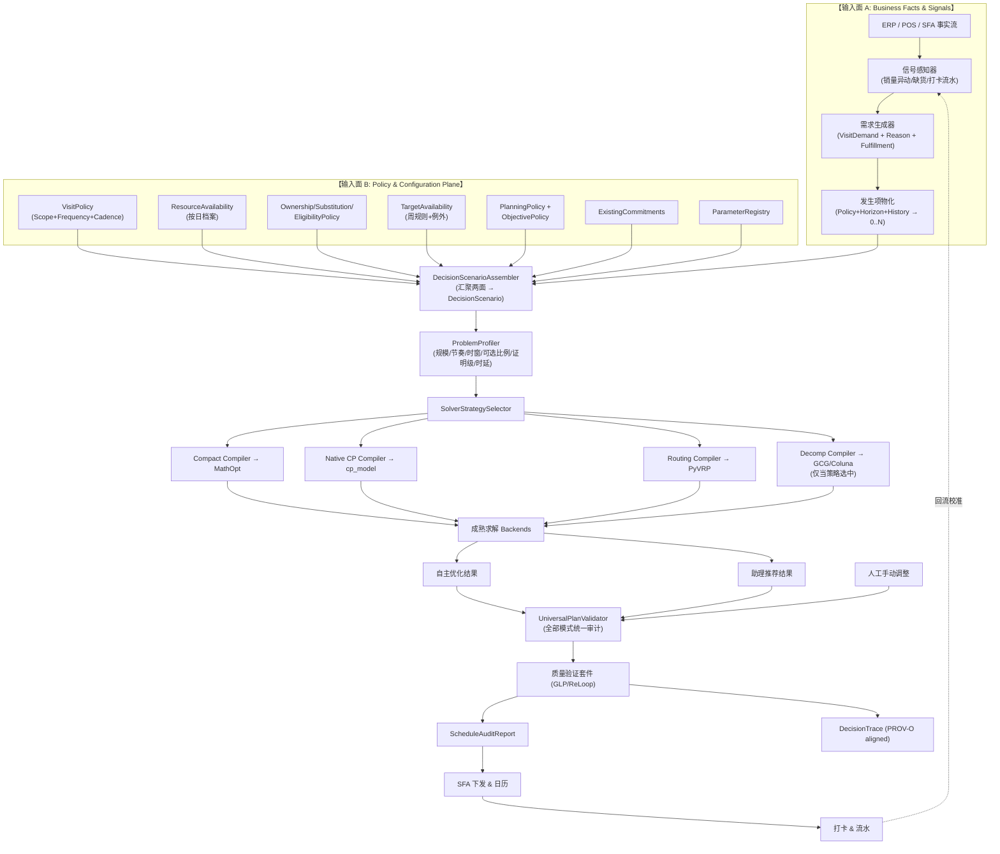

# A05: TopPrism 通用销售拜访决策系统参考架构说明书 (v6.1)
## TopPrism Generic Sales Visit Decision Intelligence Reference Architecture — Reference-Architecture-v1.0 (v6.1.1)

> **文档标识**：`A05-SALES-VISIT-REFERENCE-ARCHITECTURE-V6.1.1`  
> **版本状态**：**`Reference-Architecture-v1.0 FROZEN`**（2026-08-22 随 A03 Domain Contract Sign-off 同步转正；词汇与 A03 v6.1.1 完全一致）  
> **基线日期**：2026-08-22 · **下次复审**：2026-11-22  
> **架构核心原则**：业务语义在上（双输入面），建模工程居中（显式可追溯编译），求解引擎在下（可插拔算力）。

---

## 目录
1. [总体参考架构全景蓝图（双输入面 + 统一校验）](#1-总体参考架构全景蓝图双输入面--统一校验)
2. [六大核心分层详细设计](#2-六大核心分层详细设计)
3. [多模式规划调度机制（全部经统一 Validator）](#3-多模式规划调度机制全部经统一-validator)
4. [五大参考验证场景（Candidate Strategies to Benchmark）](#4-五大参考验证场景candidate-strategies-to-benchmark)

---

# 1. 总体参考架构全景蓝图（双输入面 + 统一校验）

**关键设计点**：
1. **双输入面**：业务事实流（Facts & Signals）与政策配置流（Policy & Configuration）分离汇聚于 `DecisionScenarioAssembler`——这是“数据触发路线算法”与“真正 Decision Engine”的分水岭。
2. **正确编译时序**：`Assembler → Profiler → Selector → 针对性触发单一 Compiler → Backend`，绝不同时编译四套模型再选。
3. **业务层零数学词**：准入层使用 `BusinessValue / FulfillmentConsequence / DeferralPolicy`；`non_assignment_cost` 等罚分形式仅在 Compiler 层由数学映射产生（$\text{penalty}_i(1-z_i)$）。

---

# 2. 六大核心分层详细设计

### 2.1 商业世界感知与需求生成层
- `SignalSensor`：感知销量异常、缺货、促销。
- `OccurrenceGenerator`：`Policy + Horizon + ExecutionHistory → 0..N VisitOccurrence`（支持“距上次27–30天”“活动期内一次”“漏访重生”）。
- `DemandConsolidator`（MergePolicy）：同店多动因归并为一个 `VisitCandidate`。

### 2.2 决策准入与联合调度层（业务语言）
- **联合准入**：将**商业价值**（business value）、**未履约业务后果**（fulfillment consequence）、行车耗时与资源容量**共同**送入规划决策（均为描述性概念，非 A03 正式实体；正式类型为 DeferralPolicy 等），不做前置贪心过滤。
- 严格遵守 `CommitmentLock`。

### 2.3 建模工程层
- `DecisionScenarioAssembler` → `ProblemProfiler` → `SolverStrategySelector` → 单目标 Compiler（MathOpt / cp_model / PyVRP / GCG）。
- `ApproximationDeclaration`：显式记录每次近似（时间离散化、参数估计、松弛），**绝不使用“无损编译”表述**。

### 2.4 求解引擎层
- 纯可插拔算力，详见 A04 基线。

### 2.5 质量验证与证据治理层
- **全模式统一审计**：Manual / Assistant / Autonomous 产出全部流经 `UniversalPlanValidator`（人工拖到休息日立即提示违规）。
- `DecisionTrace`：`"provenance_alignment": "W3C PROV-O aligned"`（auditable，不声称“不可篡改”——防篡改需独立存储机制）。

### 2.6 执行闭环层
- 打卡流水回写 → 持续校准 `ObservedStopTime` 中位数与区县车速。

---

# 3. 多模式规划调度机制（全部经统一 Validator）

| 模式 | 交互方式 | 校验路径 |
|---|---|---|
| Manual | 甘特图自由拖拽 | → UniversalPlanValidator（实时合规提示） |
| Assistant | 点击高价值门店，系统推荐“周二上午最顺路” | → UniversalPlanValidator |
| Autonomous | 批量触发引擎求解 | → UniversalPlanValidator → Verifier |

---

# 4. 五大参考验证场景（Candidate Strategies to Benchmark）

> **原则**：以下仅列**待基准测试的候选策略**，每个场景至少跑 2 个候选，产出 `quality / proof / runtime / scale / model complexity / integration cost`；`SolverStrategySelector` 的最终规则来自**实验事实**，而非架构先验。

| 场景 | 业务特征 | 验证的领域契约 | **Candidate Strategies to Benchmark** |
|---|---|---|---|
| **A: FMCG 4周常态 PJP** | KA/A/B/C 分级、W1+W3 模式、单日 6 家/540min | PolicyScope、FrequencySpec(EXACT)、CadenceSpec | ① Compact MathOpt ② Decomposition (GCG) ③ CP-SAT native |
| **B: 动态商机 + 日内插入** | 销量骤降紧急补访、当日容量已紧 | DemandReason(SALES_SIGNAL)、FulfillmentClass(OPTIONAL)、DeferralPolicy (A03 §2.6, v6.1.1 正式契约) | ① Assistant 单点插入 ② CP-SAT 日内修复 ③ PyVRP 重排 |
| **C: 柔性节奏 + 时间窗** | 28 天 2 访（RANGE）、Min Gap 7 天、仅周二/四下午 | FrequencySemantics(RANGE)、WeeklyAvailabilityRule、ResourceDayProfile | ① CP-SAT native(interval) ② Compact MathOpt(big-M 时窗) |
| **D: 多人 + 归属替补** | Primary Rep 请假 → 同区 backup 代访；共享池 | OwnershipPolicy + SubstitutionPolicy + EligibilityPolicy 三轴派生 | ① Compact MathOpt(多资源) ② SCIP 多商品流 |
| **E: 滚动重排 + 锁定承诺** | 周度滚动、明日 COMPLETELY_LOCKED、前周冻结 | ExistingCommitment、CommitmentLock、PlanningPolicy(freeze_days) | ① 增量 CP-SAT ② 全量重排对照（度量稳定性收益） |
