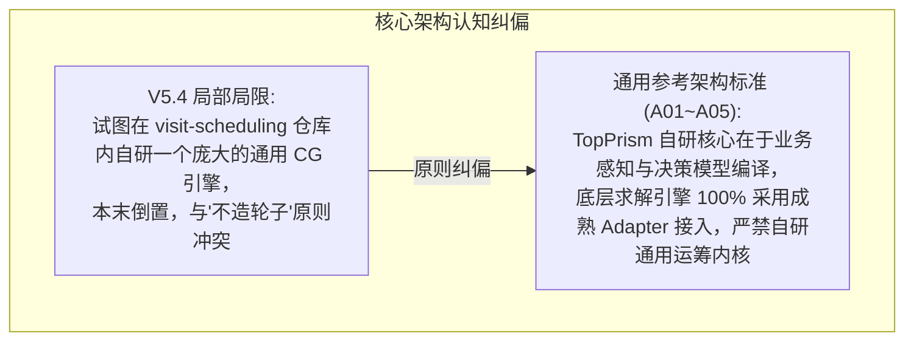
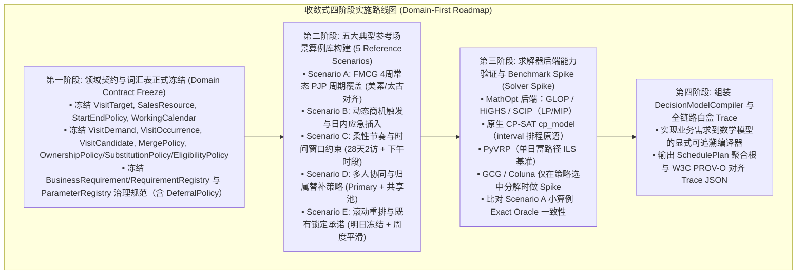

# A06: V5.4 差异分析、组件分类与迁移审查报告 (v5.0)
## V5.4 Gap Analysis, Component Classification & Phased Roadmap (v6.1.1 Cleanup)

> **文档标识**：`A06-V54-GAP-MIGRATION-REVIEW-V6.1.1`  
> **所属资产组**：TopPrism 决策优化工程框架治理资产库  
> **版本状态**：`IMPLEMENTATION-GATE: READY FOR REFERENCE SCENARIO SPIKE`（待五大场景可执行规格与 Solver 基准完成后，由人工授权解锁代码工程）  
> **当前执行状态（Execution Status）**：**`NO-GO FOR IMPLEMENTATION`（严格保持代码重构锁定）**  
> 本报告作为架构演进蓝图，待 A01~A05 领域模型、建模工程编译器契约与五大参考算例完全通过终审后，方可由人工授权启动代码工程。

---

## 目录
1. [V5.4 设计与通用参考架构核心差异总览](#1-v54-设计与通用参考架构核心差异总览)
2. [V5.4 现有组件严格六分类审查矩阵（v5.0 终审版）](#2-v54-现有组件严格六分类审查矩阵v50-终审版)
3. [基于五大参考场景的四阶段平滑实施路线图](#3-基于五大参考场景的四阶段平滑实施路线图)

---

# 1. V5.4 设计与通用参考架构核心差异总览

---

# 2. V5.4 现有组件严格六分类审查矩阵（v5.0 终审版）

依据评审规范，对 V5.4 文档及代码库中所有涉及的模块与类进行严格分类审查：

| V5.4 组件 / 类名 | 当前所在位置 | 审查分类结论 | 处置动作与目标位置 | 理论与架构依据 |
|---|---|---|---|---|
| **`Customer`** | `domain/entities.py` | **MOVE-UP** | 继承并特化自通用领域实体 `VisitTarget` | 实体属于通用业务层 |
| **`SalesRepresentative`** | `domain/entities.py` | **MOVE-UP** | 继承并特化自通用领域实体 `SalesResource` | 资源属于通用业务层 |
| **`CustomerTier`** | `domain/entities.py` | **SPLIT** | 抽象通用客群分级 `CustomerSegment`；保留 `KA/A/B/C` 为场景特例 | 标签值是快消特有属性 |
| **`VisitPattern`** (W1+W3 等) | `spec/patterns.py` | **REUSABLE MATH PATTERN** | 作为可复用数学建模模式（Mathematical Formulation Pattern） | 周期性拜访是通用数学形式 |
| **`VisitDemand / Occurrence`** | *(V5.4 缺失)* | **MOVE-UP (新增)** | 新增并作为领域层第一等公民 | 统一需求与发生项语义 |
| **`TieredTravelTimeEngine`** | `domain/cost_engine.py` | **SPLIT / HYBRID** | L1 路网复用 OSRM Adapter；L2 中位数拟合自研；L3 直线兜底自研 | 三级证据链分层设计 |
| **`32min Dwell Time`** | `domain/cost_engine.py` | **REFERENCE-ONLY** | 归入内部实证校准参数，明确标记分项 `UNKNOWN` | 杜绝未经证实的伪拆分 |
| **`HeldKarpRoutingOracle`** | `solver/oracles/` | **REFERENCE / TEST UTILITY** | 保留作为小算例精确 DP 测试工具，非通用引擎 | 仅用于小规模 ATSP 验证 |
| **`WorkloadBalancer`** (二次 MIP) | `service/balancer.py` | **SPLIT / HYBRID** | 平滑逻辑提升为 `ObjectivePolicy`，特定 Plan 保留作为后处理器 | 严格数学分层序列优化 |
| **`GenericCGEngine`** | *(拟自研)* | **REMOVE FROM MANDATORY ARCH** | **从必选架构中移除**；仅当 ProblemProfile + Benchmark 证明需要 decomposition 时，通过 Adapter 使用 **GCG / Coluna**（通用 CG/BCP 框架）。MathOpt/HiGHS/GLOP 是 LP/MIP backend，**不是** CG 框架 | 恪守不造轮子铁律；GCG 即通用 column-generation framework |
| **`PyVRP (ILS Wouda 2024)`** | `solver/plans/` | **REUSE** | 封装官方 `pyvrp` 库作为单日/富路径启发式对比基准 (非多周期完整规划器) | 开源成熟基线 |
| **`DecisionTraceGenerator`** | `service/trace.py` | **KEEP** | 规范对齐 W3C PROV-O 声明，提供强类型因果图 | 核心决策白盒化资产 |
| **`V4 Weekday 分桶代码`** | `src/core/` 历史代码 | **REMOVE** | 彻底移除，仅保留最小反例于 `regression/` 测试库 | 消除破坏可行域历史设计 |

---

# 3. 基于五大参考场景的四阶段平滑实施路线图

