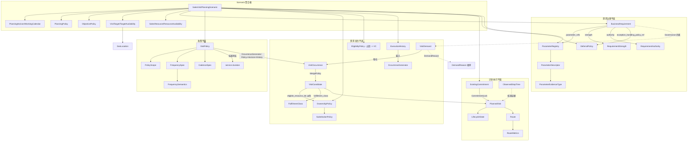

# Domain Validation Report — Generic Sales Visit Domain Contract v1.0.1
## Domain Coverage Review · Relationship Closure · Glossary Freeze · Scenario Mapping · Entity Audit

> **文档标识**：`DVR-DOMAIN-VALIDATION-V1.0`  
> **所属阶段**：Domain Validation Sprint（位于 A03 v1.0.1 FROZEN 之后、Executable Scenario Validation 与 GT-Micro 之前）  
> **验证对象**：`03_A03_domain_ontology_v1_0_1.md`（Domain-Contract-v1.0.1 FROZEN）  
> **纪律**：禁止引入新 Domain Entity（除非附 Failure Evidence 的 DCR）；本报告只审不改，输出候选 DCR 供裁定。

---

## 目录
1. [五类业务问题表达验证（Coverage Cases 1–5）](#1-五类业务问题表达验证)
2. [Domain Relationship Graph 与闭合审计](#2-domain-relationship-graph-与闭合审计)
3. [Domain Term Glossary 冻结](#3-domain-term-glossary-冻结)
4. [Domain → Scenario A–E 覆盖映射矩阵](#4-domain--scenario-ae-覆盖映射矩阵)
5. [Unused / Ambiguous Entity Review](#5-unused--ambiguous-entity-review)
6. [Domain Maturity Gate DG1–DG5 判定](#6-domain-maturity-gate-dg1dg5-判定)
7. [Candidate DCR List](#7-candidate-dcr-list)

---

# 1. 五类业务问题表达验证

## Case 1 — 周期拜访（"KA 每 28 天 2 次，至少间隔 7 天"）

| 业务要素 | 承载对象 | 表达 | 判定 |
|---|---|---|---|
| KA 群体界定 | `PolicyScope` | `{segment==KA}` 条件组合 | ✅ |
| 每 28 天 2 次 | `FrequencySpec` | EXACT, target=2, ref=28d | ✅ |
| 间隔 ≥7 天 | `CadenceSpec` | min_spacing=7d | ✅ |
| 生成需求 | `VisitDemand`(COVERAGE_POLICY, REQUIRED) → `OccurrenceGenerator` → 2×`VisitOccurrence` | Policy+Horizon+History 物化 | ✅ |
| 强度/权威 | `BusinessRequirement`(strength/authority) | ✅ |

**结论：✅ 完整表达，无需 DCR。**

## Case 2 — 合同要求 vs 运营建议（MRE-1 场景）

| 业务要素 | 承载对象 | 判定 |
|---|---|---|
| 双来源需求 | 2×`BusinessRequirement`(authority=CONTRACT / COMPANY_POLICY) 同 `PolicyScope` | ✅ |
| 差异化异常处理 | `exception_handling_policy_ref` → DP-SLA / DP-STD（DCR-SA-001-R, v1.0.1） | ✅ |
| 冲突解析 | 场景级 `ConflictResolutionStrategy` 配置（不入领域层） | ✅ |

**结论：✅ 完整表达（恰为 DCR-SA-001-R 落地后的回归验证）。**

## Case 3 — 人员归属变化（"业务员离职，区域共享池接管"）

| 业务要素 | 承载对象 | 表达 | 判定 |
|---|---|---|---|
| 原归属 | `OwnershipPolicy.primary=(R001)` | ✅ |
| 共享池接管 | `OwnershipPolicy.allow_shared_pool=True`（重装配） | ✅ |
| 替补代访 | `SubstitutionPolicy(allow_backup, backup_ids, conditions)` | ✅ |
| 资质过滤 | `EligibilityPolicy(required_qualifications/tags)` | ✅ |
| 离职者日历 | `ResourceAvailability.date_profiles → is_absent`（逐日缺勤） | ⚠️ 见 5.2-A |

**结论：✅ 表达成立。⚠️ 一个生命周期细节待裁（见 §5.2-A，候选 DCR-3）。**

## Case 4 — 执行反馈（"上周期漏访，调整下周期"）

| 业务要素 | 承载对象 | 判定 |
|---|---|---|
| 漏访记录 | `ExecutionHistory.missed_visits` | ✅ |
| 漏访重生 | OccurrenceGenerator(Policy+Horizon+**History**) → eligible 前移 | ✅ |
| 完成抵扣 | 同上（History 输入） | ✅ |
| 重生升优 | `BusinessRequirement`(REQ-A-006 型: SOFT, COMPANY_POLICY) | ✅ |
| 结果回溯 | Requirement Fulfillment + Audit Trace 四段链 | ✅ |

**结论：✅ 完整表达。**

## Case 5 — 人工调整（"经理锁定拜访，禁止移动"）

| 业务要素 | 承载对象 | 判定 |
|---|---|---|
| 锁定记录 | `ExistingCommitment(lock_level=COMPLETELY_LOCKED/DAY_LOCKED)` | ✅ |
| 重排冻结 | `PlanningPolicy.freeze_days_count / max_reassignment_ratio` | ✅ |
| 人/自同规 | Manual/Assistant/Autonomous → `UniversalPlanValidator`（A05，架构层；领域侧 LifecycleState 承载状态） | ✅ |
| 溯源 | DecisionTrace（A05 治理层） | ✅ |

**结论：✅ 完整表达。**

**五案例总判定：5/5 可表达；2 个非阻塞性观察进入 §5/§7。**

---

# 2. Domain Relationship Graph 与闭合审计

## 闭合审计结论

| 检查项 | 结果 |
|---|---|
| 孤儿对象（无入边/无出边且不在聚合内） | **0** —— 全部 31 个对象均挂接于聚合或主链 |
| 双向重复关系 | **0** —— ownership 三轴为单向组合；MergePolicy 单向 |
| 隐式 metadata hack | **1 处受控残留**：`VisitDemand.metadata.policy_ref`（PROOF-E1 中已裁定为**纯追溯指针**，不参与决策语义）——记录为 Glossary 附注 G-07，非违规 |
| 关系方向正确性 | ✅ Requirement 治理不持有选择逻辑；PolicyScope 匹配留在装配器；DeferralPolicy 被引用而非自选对象 |
| 跨平面泄漏 | ✅ 数学/求解词汇（x_it、λ、penalty、CG）未出现于任何领域对象字段 |

---

# 3. Domain Term Glossary 冻结

| # | Term（冻结名） | 唯一定义 | 明确不是 | 验证场景 |
|---|---|---|---|---|
| G-01 | **VisitTarget** | 被拜访的物理门店实体（地理+属性） | ❌ 不是任务、不是需求 | A |
| G-02 | **VisitDemand** | 单一业务动因产生的拜访需求（含 Reason+FulfillmentClass） | ❌ 不是排班结果 | A |
| G-03 | **VisitOccurrence** | Demand 经 OccurrenceGenerator 物化的可排实例（第 k 次） | ❌ 不是 Demand 本身 | A |
| G-04 | **VisitCandidate** | MergePolicy 归并后的排程输入单元（可含多 occurrence/多 reason） | ❌ 不是 Occurrence | A |
| G-05 | **PlannedVisit** | 优化/指派输出的计划拜访（date+window+state+lock） | ❌ 不是实际发生 | A/E |
| G-06 | **ExecutionVisit**（ExecutionHistory 记录） | 现场实际发生的拜访结果（completed/missed） | ❌ 不是计划 | A/E |
| G-07 | **VisitPolicy** | 覆盖政策模板（Scope+Frequency+Cadence+时长） | ❌ 不含异常处理（已移至 Requirement 级，DCR-SA-001-R） | A |
| G-08 | **DeferralPolicy** | Requirement 未满足处理策略的内容定义 | ❌ 不自带绑定/选择逻辑 | A |
| G-09 | **ObservedStopTime** | 实证门店停留总耗时中位数（32.0min，分项 UNKNOWN） | ❌ 不是停车时间、不与 service 叠加 | A |
| G-10 | **Ownership/Substitution/EligibilityPolicy** | 归属/替补/适格三轴（非互斥枚举） | ❌ 不是单一 ServiceOwnershipType | D |

**附注 G-07a**：`VisitDemand.metadata.policy_ref` 仅为溯源指针（PROOF-E1 裁定），任何实现不得从中读取决策语义。

---

# 4. Domain → Scenario A–E 覆盖映射矩阵

| Domain Entity | A 周期PJP | B 动态/日内 | C 柔性cadence/时窗 | D 多人/归属 | E 滚动/锁定 | 未覆盖即候选问题 |
|---|:---:|:---:|:---:|:---:|:---:|---|
| VisitTarget / GeoLocation / TargetAvailability / WeeklyAvailabilityRule | ✅ | ✅ | ✅✅(周分化核心) | ✅ | ✅ | |
| SalesResource / ResourceAvailability / ResourceDayProfile | ✅ | ✅ | ✅ | ✅✅ | ✅ | |
| VisitPolicy / PolicyScope / FrequencySpec(EXACT) / CadenceSpec | ✅✅ | ✅ | ✅ | ✅ | ✅ | |
| FrequencySpec(RANGE) | ✅(B底线/stretch) | ✅ | ✅ | | | |
| VisitDemand / DemandReason / FulfillmentClass | ✅ | ✅✅(SALES_SIGNAL核心) | ✅ | ✅ | ✅ | |
| VisitOccurrence / OccurrenceGenerator / ExecutionHistory | ✅ | ✅ | ✅ | ✅ | ✅✅(抵扣核心) | |
| MergePolicy / VisitCandidate | ✅ | ✅✅(多动因核心) | | ✅ | | |
| OwnershipPolicy / SubstitutionPolicy / EligibilityPolicy | ◻(单人恒真) | ◻ | ◻ | ✅✅核心 | ✅(backup 代访) | ◻=被动使用，有效 |
| DeferralPolicy + exception_handling_policy_ref | ✅✅(TA-CAP核心) | ✅ | | ✅ | | |
| ExistingCommitment / CommitmentLock | ✅(1条) | ✅ | ✅ | ✅ | ✅✅核心 | |
| LifecycleState（含 IN_PROGRESS/COMPLETED/MISSED 全链） | ◻(至 PLANNED) | ✅(执行中) | ◻ | ◻ | ✅✅ | ◻=B/E 验证 |
| PlanningPolicy(freeze/reassign) | ◻(无冻结) | ✅(repair) | ◻ | ◻ | ✅✅ | |
| ObjectivePolicy 四 profile | ✅(BALANCED) | ✅(VALUE) | ◻ | ◻ | ✅(stability) | |
| BusinessRequirement / RequirementRegistry / Strength / Authority | ✅✅ | ✅ | ✅ | ✅ | ✅ | |
| ParameterRegistry / ParameterDescriptor / EvidenceType | ✅✅ | ✅ | ✅ | ✅ | ✅ | |
| Route / RouteMetrics / ObservedStopTime | ✅ | ✅ | ✅ | ✅ | ✅ | |
| PlanningHorizon / WorkingCalendar | ✅ | ✅ | ✅ | ✅ | ✅ | |
| DateRange / TimeWindow | ✅ | ✅ | ✅✅ | ✅ | ✅ | |

**矩阵结论**：31 个领域对象中 **31/31 至少被一个场景主用（✅✅）或被动使用（◻）**；无"零验证实体"。被动使用（◻）均为合法退化（如单人场景 ownership 恒真），非设计缺陷。

---

# 5. Unused / Ambiguous Entity Review

## 5.1 Unused Entity 审计
**结果：0 个未使用实体。**（对照 §4 矩阵，DG5 判据满足）

## 5.2 Ambiguity / 生命周期观察（非阻塞，2 项）

**A. `ResourceAvailability` 的"离职"表达**
- 现状：离职 = 逐日 `is_absent=True`（可行但笨拙）；或重装配 Ownership（Case 3 主路径）。
- 判定：**表达力足够，工程略糙**。属实现便利性问题，**不构成 DCR**（无 Failure Evidence：业务语义无歧义，只是装配操作量）。登记为观察项 OBS-1，若 Scenario D 实际装配出现真实失败再升级。

**B. `LifecycleState.MISSED` 与 `ExecutionHistory.missed_visits` 的双记录**
- 现状：MISSED 是 PlannedVisit 的终态；ExecutionHistory.missed_visits 是跨周期输入。二者是**计划态 vs 历史事实**的分界，Glossary G-05/G-06 已冻结区分。
- 判定：**无歧义**（分界清晰），登记 OBS-2 供 Compiler 实现时注意映射方向（MISSED 态 → 写入下周期 History）。

---

# 6. Domain Maturity Gate DG1–DG5 判定

| Gate | 判据 | 证据 | 判定 |
|---|---|---|---|
| **DG1 Vocabulary Stable** | 核心术语唯一含义、冻结 | §3 Glossary 10 条 + G-07a 附注 | ✅ PASS |
| **DG2 Relationship Closed** | 无孤儿、无重复关系、无隐式 hack | §2 审计：孤儿 0 / 重复 0 / hack 1 处受控登记 | ✅ PASS |
| **DG3 Scenario Coverage** | 每实体至少被 1 场景验证 | §4 矩阵 31/31 | ✅ PASS |
| **DG4 Trace Complete** | Requirement→Param→Formulation→Result 链 + Exception 四段链 | v1.0.1 patch 内嵌规范 + S-A TRACE-1..4 | ✅ PASS（Spike 中机读验证） |
| **DG5 No Unused Entity** | 无零验证实体 | §5.1：0 个 | ✅ PASS |

**Domain Validation Sprint 总判定：DG1–DG5 全 PASS。Domain 层具备进入 Executable Scenario Validation → GT-Micro 的条件。**

---

# 7. Candidate DCR List

| ID | 内容 | 状态 |
|---|---|---|
| ~~DCR-SA-001~~ | Scoped Deferral Policy Binding | SUPERSEDED |
| ~~DCR-SA-001-R~~ | Requirement-Level Exception Policy Binding | **APPROVED & LANDED (v1.0.1)** |
| **无新候选** | OBS-1（离职表达）、OBS-2（MISSED 映射）均为观察项，**无 Failure Evidence，不满足 DCR 门槛** | — |

**本 Sprint 零新 DCR**——验证期未发现冻结契约的表达力缺口。
